# COMP2300 — Set 1 笔记

> **课程**:Computer Organisation and Program Execution(ANU,Convener: Shoaib Akram)
> **主题**:课程导论 + 信息表示(数制/补码) + 计算机构建块(晶体管/CMOS/逻辑门)

---

## 一、课程导论：分层抽象（PDF P11–P104）

### 1. Transformation Hierarchy（变换层级）— 全课骨架

计算机系统从抽象到具体分层，每一层都有选择:

| 层级 | 说明 / 例子 |
|------|------------|
| Problem | 要解决的问题 |
| Algorithm | 算法 |
| Program（高级语言） | Java / Python / C++ / Rust… |
| **ISA** | **ARM / x86 / RISC-V**（软硬件边界） |
| Microarchitecture | Intel / AMD / Apple… |
| Circuits | 电路 |
| Devices | 晶体管等器件 |

核心论点:**忽略任何一层，就无法最优地使用计算机系统。**

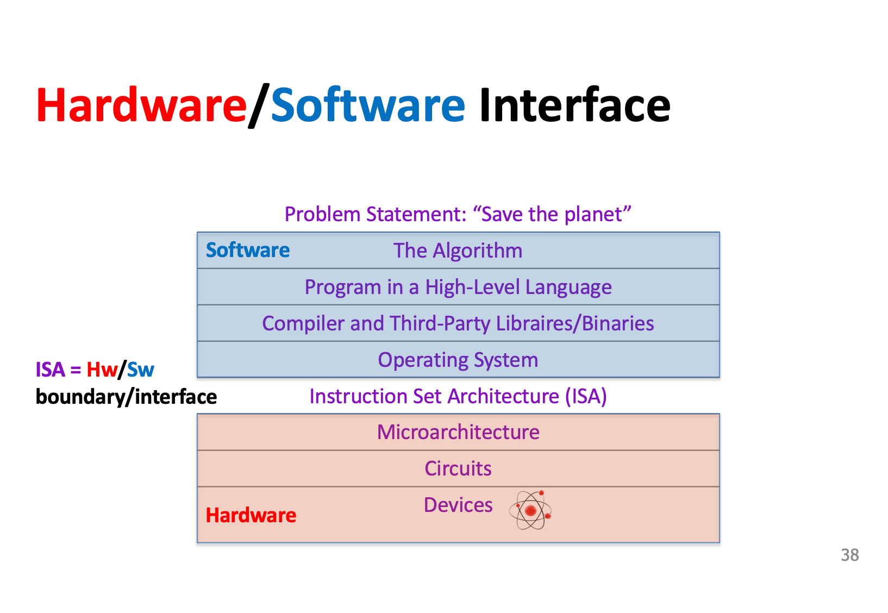

### 2. 两个反复出现的主题

- **抽象（Abstraction）**:从高层视角看组件，不必关心底层细节。没有人能手动追踪 Apple M1 里的上百亿晶体管——计算机系统能工作，全靠抽象。
- **软硬件协同（Hardware-Software Interplay）**:软件与硬件互相影响、协同设计。

### 3. ISA vs. 微架构（核心区分，必考概念）

- **ISA(Instruction Set Architecture)**:CPU 能执行的基本指令的**规范/清单**(ADD、MULTIPLY、DIVIDE、MOVE、BRANCH…)。它是**软硬件之间的边界 / 契约**。不同厂商可能采用不同的指令集。
- **微架构(Microarchitecture)**:用**电路去实现**这套 ISA。同一个 ISA 可以有完全不同的微架构实现。

> 一句话:ISA 说「做什么」，微架构说「怎么做」。

### 4. 两个关键命题

- **核心组件相同**:从 Google 数据中心(11.5 万平方英尺)到 94 毫瓦的纳米无人机，关键组件是一样的。
- **通用计算设备(Universal Computational Device)**:凡可计算者皆可由计算机计算。源于 Alan Turing(1937)的图灵机数学描述——某种特定机器(图灵机)能完成所有计算。

### 5. Course Plan：一行 C 代码如何落到硬件

`int z = z + 1;` → 编译器(compiler) → 汇编(Assembly) → 汇编器(assembler) → 机器码(Machine Code，0/1) → 存入内存 → CPU **取指/译码/执行(fetch / decode / execute)**，每个时钟周期执行一条指令。ISA 是这条链路上软硬件的边界。

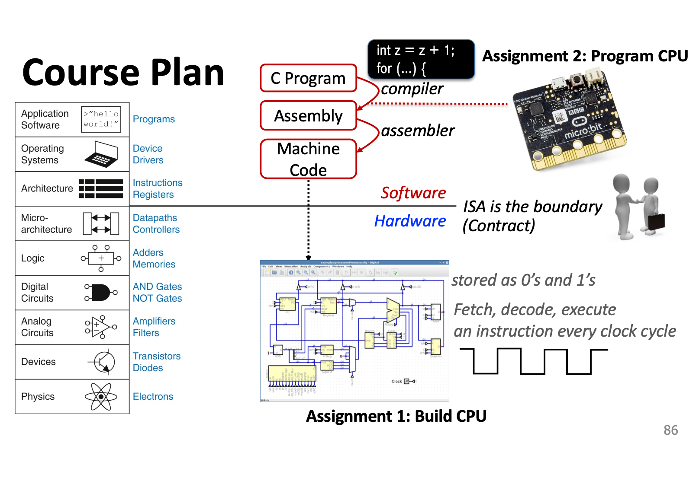

---

## 二、信息表示：数制与补码（PDF P106–P176）

> ⚠️ 本 set 最硬核、考点最密集的部分。

### 1. 为什么用数字而非模拟

模拟信号受噪声、衰减影响，误差会**累积**;数字方式只区分 0/1 两个电压档位，抗噪声、可靠。本课全程采用数字(二进制)方式。

### 2. 术语

- **bit**:1 位
- **nibble**:4 bit
- **byte**:8 bit(0–255)
- **word**:机器相关。低端设备 8–16 bit，高端 32–64 bit
- **MSB**(Most Significant Bit):最高位 / **LSB**(Least Significant Bit):最低位

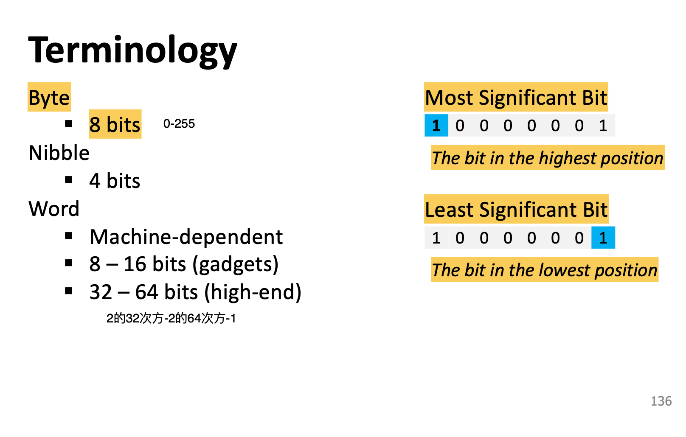

### 3. 进制与转换

- **二进制**:逢二进一
- **十六进制(base 16)**:4 bit 一组，16 种可能;数字 0–9 + A–F;列权 1, 16, 256, 4096。动机:长二进制串写起来繁琐易错，用 hex 缩短。
- 掌握:十进制↔二进制、二进制↔十六进制 的互转。

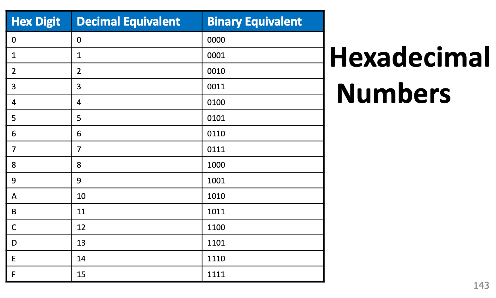

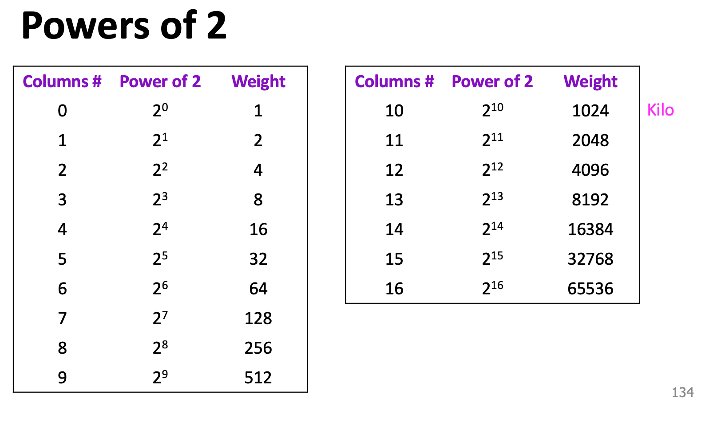

### 4. 二进制加法与溢出

- 逐位相加、逢二进位。
- **溢出(Overflow)**:结果太大，超出可用位宽能表示的范围。

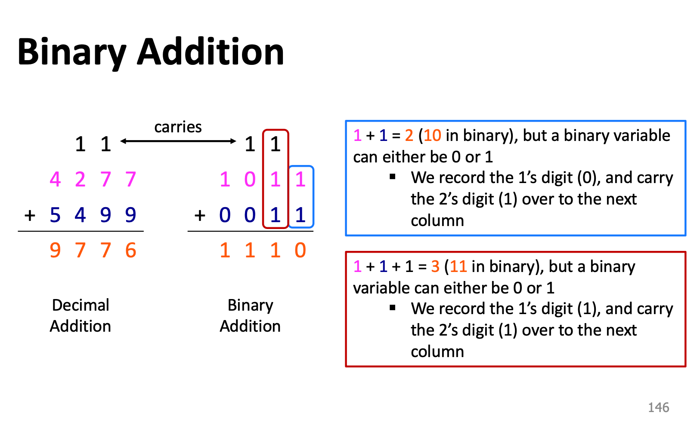

### 5. 有符号数的三种表示（重点）

| 表示法 | 要点 |
|--------|------|
| **Sign/Magnitude**（原码） | 最高位作符号位，其余为数值。缺点:零有两种表示，加法不通用 |
| **One's Complement**（反码） | 取反得到负数 |
| **Two's Complement**（补码） | **现代计算机几乎全部采用** |

**补码(Two's Complement)的优点**:

- 普通加法直接通用(不需要为减法做特殊处理)
- 零只有**唯一**一种表示
- 正数 MSB = 0，负数 MSB = 1(符号性质仍保留)

**补码的由来逻辑**:

- 若 A + B = 0 且 A = +5，则 B 必为 −5 → 找到了负数的新表示。
- 把 A 变成 B(即 +5 → −5):先取 **1's complement(反码)**，再 **+1**。这就是「B 是 A 的补码」。

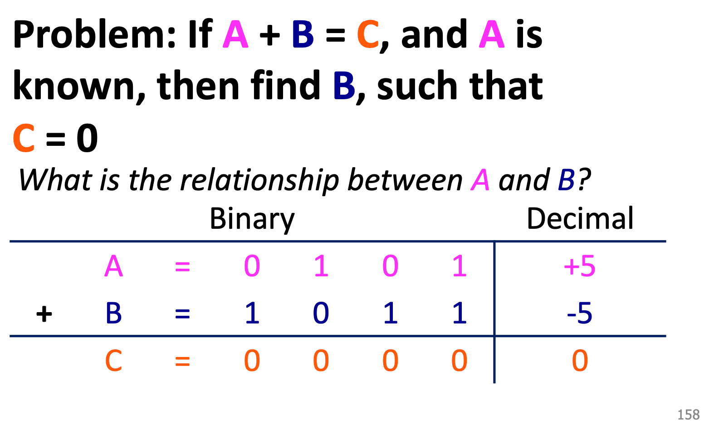

### 6. 补码溢出

- 两个正数相加却得到负数 = **溢出**(结果超出位宽)。
- 例:5 位补码，A = 01001(+9)，B = 01011(+11)，相加得 10100(−12)→ 溢出。

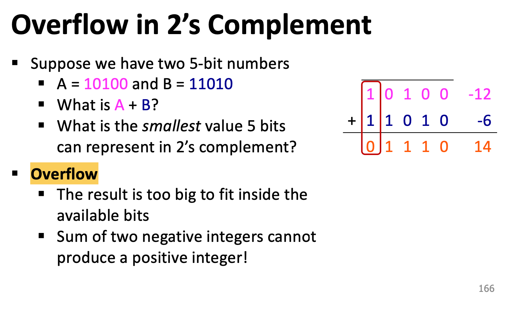

### 7. 各数制的范围（公式必记）

| Number System | Minimum | Maximum |
|---------------|---------|---------|
| Unsigned | 0 | 2ᴺ − 1 |
| Sign/Magnitude | −2ᴺ⁻¹ + 1 | 2ᴺ⁻¹ − 1 |
| Two's Complement | −2ᴺ⁻¹ | 2ᴺ⁻¹ − 1 |

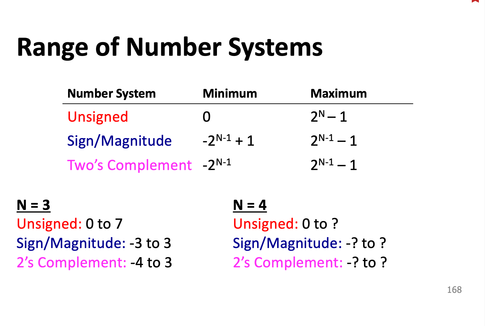

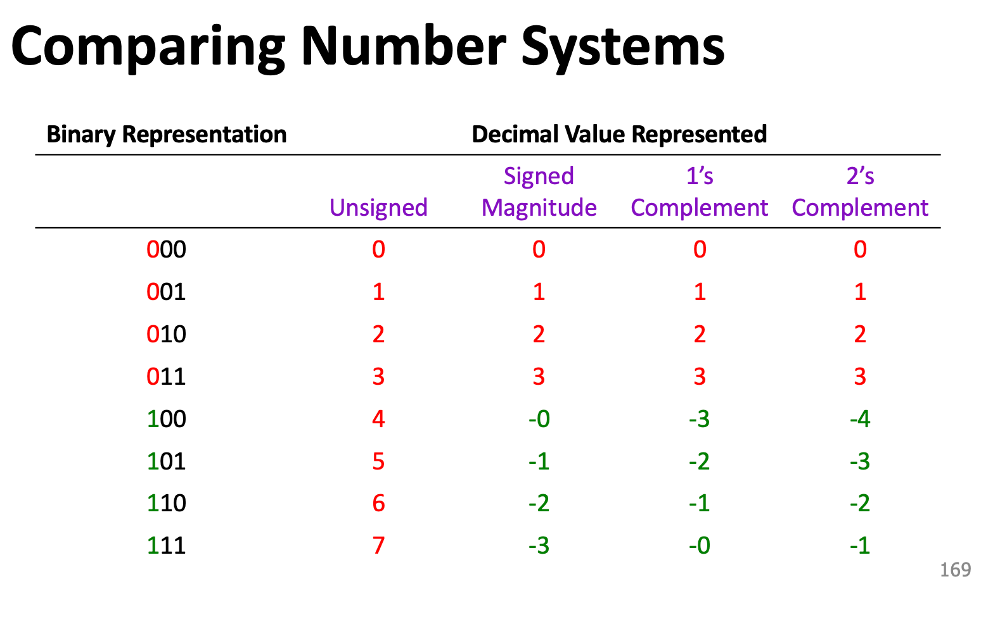

### 8. 符号扩展（Sign Extension）

- 把窄位宽补码扩成宽位宽时，用**符号位**去填充高位(正数补 0、负数补 1)，数值不变。
- 例:4 位 `0101` 和 16 位 `0000000000000101` 都表示 +5——前导 0 不影响数值。

---

## 三、计算机的构建块：晶体管 → CMOS → 逻辑门（PDF P177–P248）

### 1. MOS 晶体管

- **MOS** = Metal(金属/导体)+ Oxide(氧化物/绝缘体)+ Semiconductor(半导体)。
- 三端子:**Gate(栅)、Source(源)、Drain(漏)**。
- 本质 = **电控开关**。用「墙壁开关 + 灯泡」类比:要灯亮，电子必须流动;要电子流动，必须有闭合回路;开关控制回路通断。
- 晶体管的电学细节**低于本课最低抽象层**，不要求掌握。

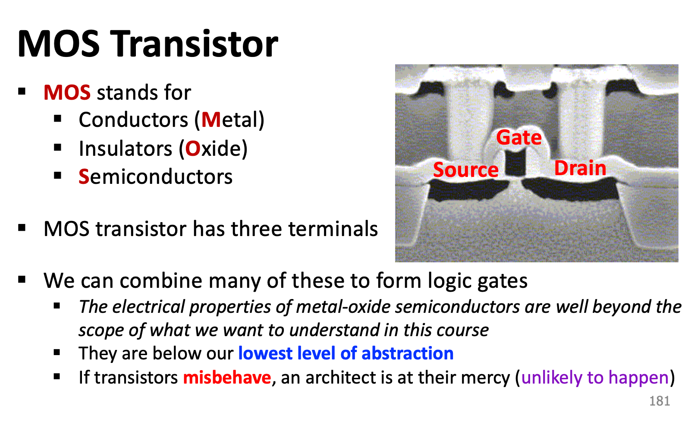

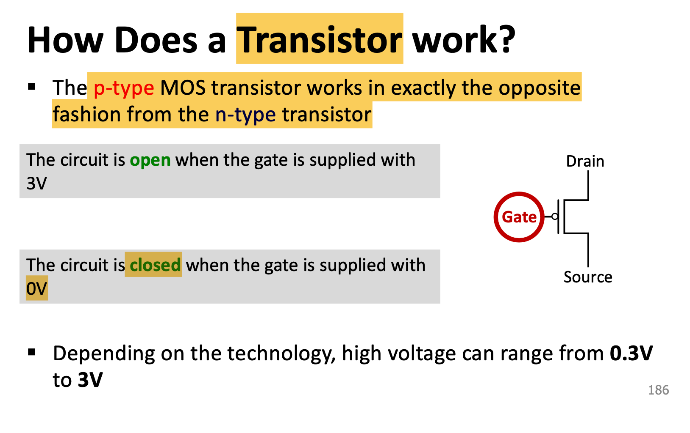

### 2. CMOS 门电路

- **CMOS** = nMOS + pMOS(Complementary MOS)，现代计算机两种晶体管都用。
- 电压约定:0V = 逻辑 0，3V = 逻辑 1。
- **通用结构**:
  - **pull-up 网络**(pMOS):负责把输出拉到 3V(逻辑 1)
  - **pull-down 网络**(nMOS):负责把输出拉到 0V(逻辑 0)
  - **并联**:任一晶体管导通 → 网络导通
  - **串联**:全部导通 → 网络才导通
- CMOS 天然实现**反相(inverting)**逻辑，所以 NOT / NAND / NOR 比 AND / OR 更「原生」。

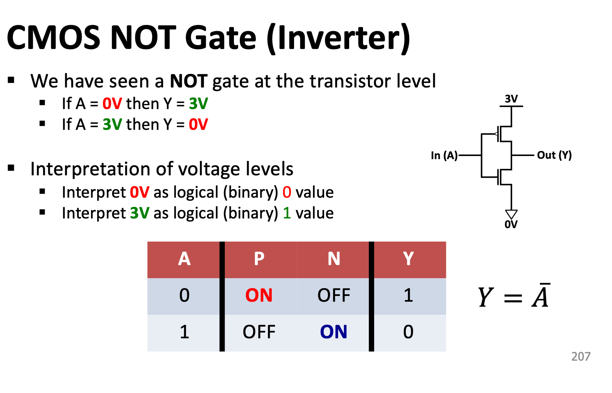

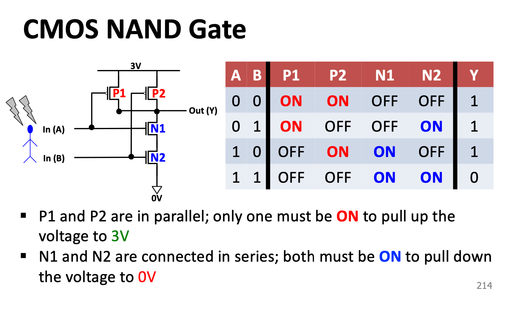

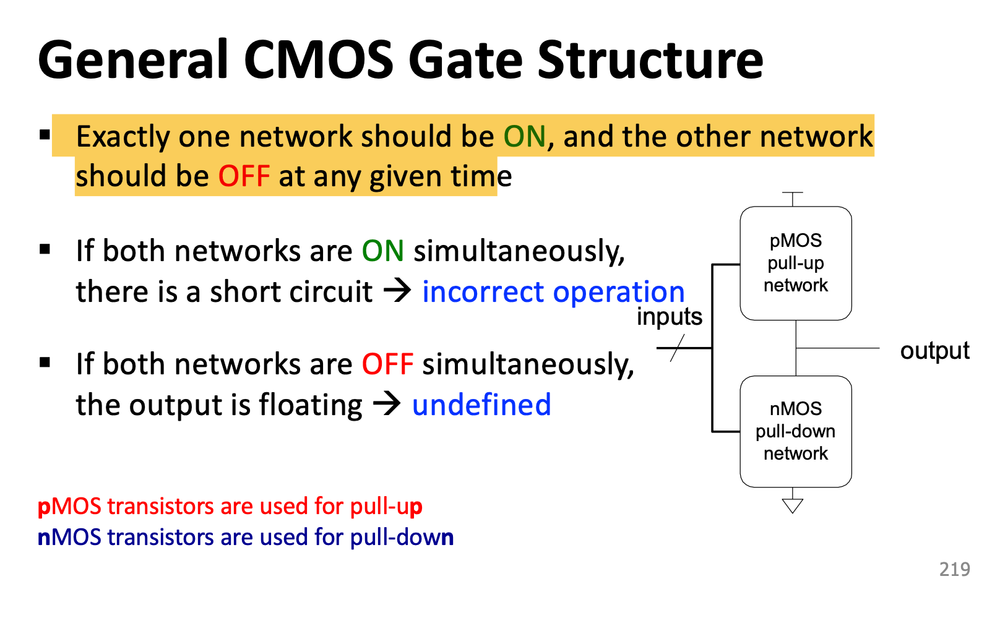

### 3. 布尔逻辑与逻辑门

- George Boole 的布尔代数 → 用**真值表**描述逻辑函数 → 逻辑门实现这些函数。
- 基本门:**AND / OR / XOR / NOT / NAND / NOR / XNOR / BUF**，各有符号与真值表。
- XOR 与 XNOR 是特殊的逻辑函数(「奇偶 / 相同性」判断)。
- 多输入门(Multiple-Input Gates)。

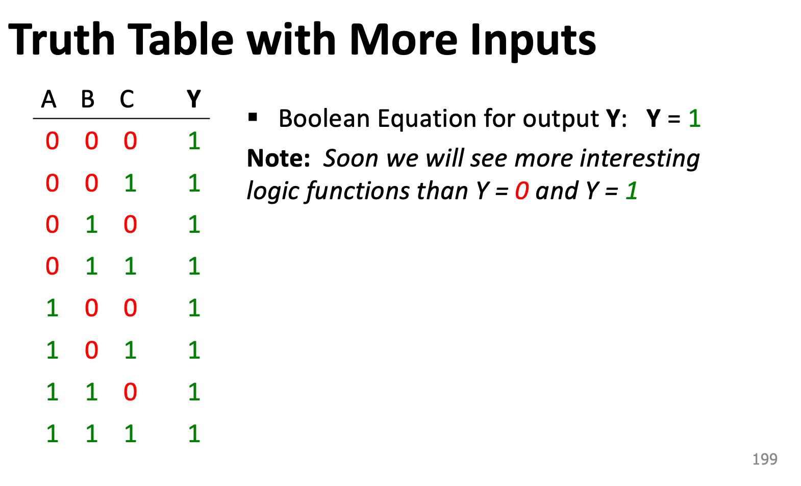

### 4. 位运算与位掩码

- **位运算(Bitwise)**:逐位 AND / OR / XOR，作用于 m 位的 bit vector，对每一对 bit 独立运算。两个 8 位输入做 AND/OR，结果也是 8 位。
- **位掩码(Bit Mask)**:用 mask 选择性地清零 / 置位某些位。
  - 例:数据包里有 passwd 位和 user id 位;用 mask 把 passwd 位清零、保留 user id。

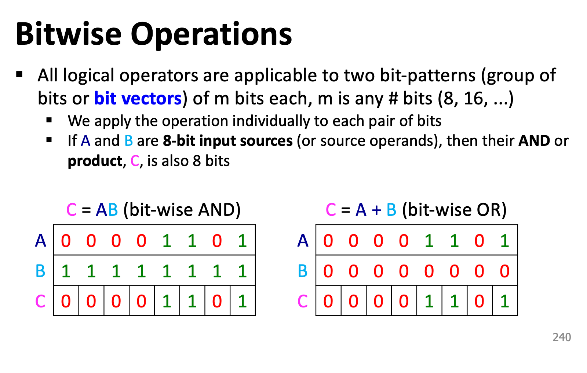

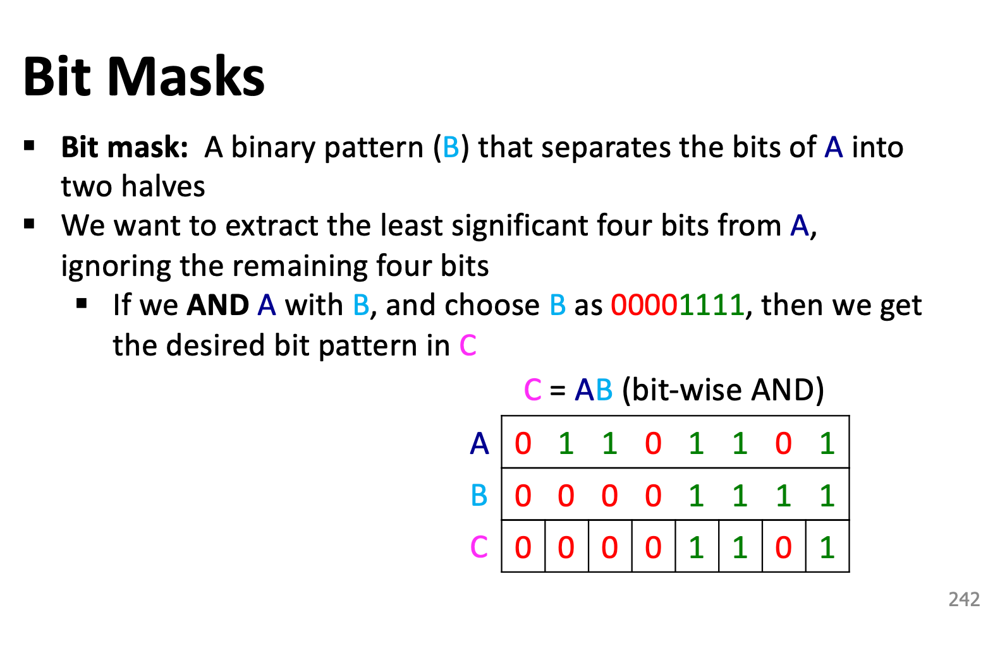