# COMP2300 Set 2 笔记:组合电路（Combinational Circuits）

> **课程**：ANU COMP2300 — Computer Organisation and Program Execution
> **讲师**：Shoaib Akram　**教材对应**：H&H（Harris & Harris）Ch.2、5.2、5.6
> **本 set 主题一句话**：用「真值表 → 布尔方程 → 门电路」这条流水线把任意逻辑规格落地成无记忆的组合电路，并认识现代计算机的标准构建块（Mux / 加法器 / 译码器 / PLA / ALU / 三态缓冲），同时掌握布尔代数化简来压缩面积与延迟。

---

## 0. 起点：组合 vs 时序

数字电路分两类，这是后面所有内容的分水岭：

| 类型 | 输出取决于 | 关键特征 |
|---|---|---|
| **组合电路 Combinational** | **仅**当前输入组合 | **无记忆（memory-less）**，所有逻辑门都是组合的 |
| 时序电路 Sequential | 当前输入 **+ 输入历史** | 有**状态/记忆**，输入随时间的序列决定输出（例：电梯控制器） |

> 考点：「memory-less」是组合电路的定义性特征。判断一个电路是不是组合的，最终就是看它有没有引入记忆/反馈（见第 12 节）。

**实现组合逻辑的标准流水线**（贯穿整个 set）：
**规格 Spec → 真值表 Truth Table → 布尔方程 Boolean Eq → 门电路 Schematic**

---

## 1. 真值表与布尔方程

- **真值表是布尔函数的唯一签名**（unique signature）——同一个函数只有一张真值表。
- 构造真值表先定**接口**（输入/输出），接口可能是隐含的，需要从自然语言规格里抠出来。

**Minterm / Maxterm（必记区分）**：
- **Minterm**：n 个变量的 **AND** 项。某变量在该行为 **0 → 取反（加 prime）**，为 1 → 原值。每个 minterm 只在真值表某一行为 1。
- **Maxterm**：n 个变量的 **OR** 项。某变量为 **1 → 取反**，为 0 → 原值。

**运算优先级（必记）**：`NOT > AND > OR`。

---

## 2. SOP（Sum of Products，积之和）

- **SOP = 析取范式（disjunctive normal form）= minterm expansion**。
- **核心思想**：把输出为 1 的每一行对应的 **minterm 全部 OR 起来**。这是一个**两级（two-level）**表达式：第一级 AND，第二级 OR。
- **标准简写记号**：`F(A,B,C) = Σm(3,4,5,6,7)` —— Σm 后面列出输出为 1 的 minterm 编号。
- **规范形式 ≠ 最简形式**（canonical ≠ minimal）：SOP 规范式覆盖所有 1 的组合，但通常不是门数最少的实现。化简见第 13 节。

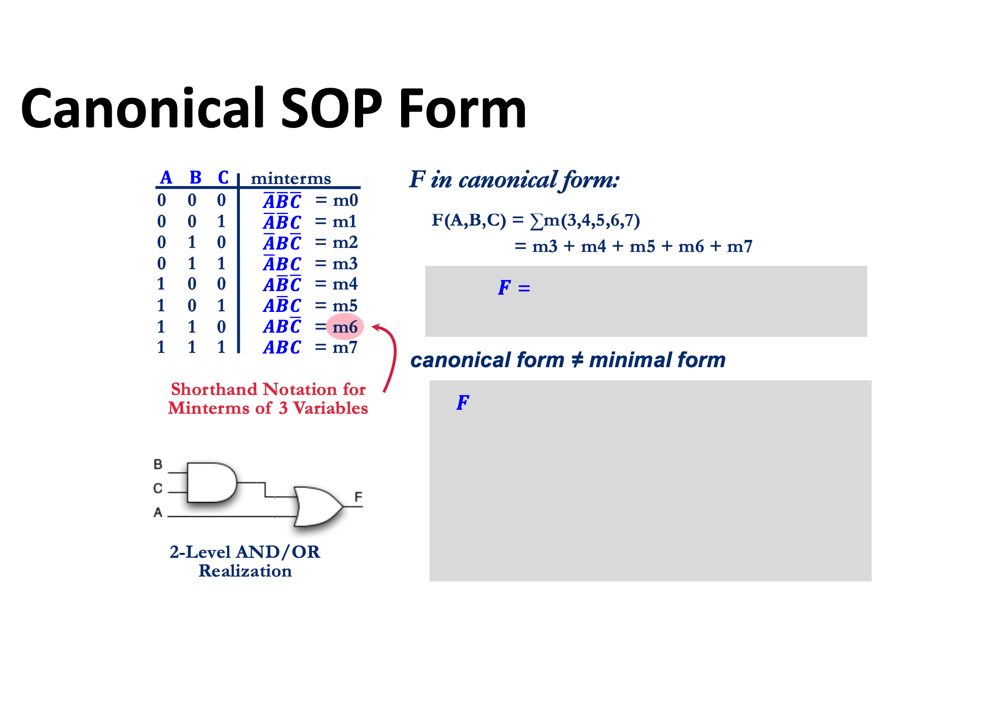

**SOP 流程小结**：真值表 → 对每个输出为 1 的行写出 minterm → 全部相加（OR）→ 得到代数表达式 → 落成两级 AND/OR 门电路。

---

## 3. 方程 → 门电路（Schematic）

- Schematic = 用门（gate）和连线（wire）画出的电路图，是布尔方程的物理对应。
- **关键洞察（易考）**：一个两级表达式有时会**坍缩成单个整体门（monolithic gate）**。

**Happiness Detector 范例**（贯穿用例，务必吃透三件套）：
规格：Mr. X 在「有 assignment ddl」**或**「常去的 bar 关门」时不开心；设计电路只在他开心时输出 1。
- 真值表 → `H = D'B'`（D=ddl，B=bar 关门）→ 即 `(D)' AND (B)'`
- 这恰好就是一个 **NOR 门**：`D'B' = (D + B)'`。

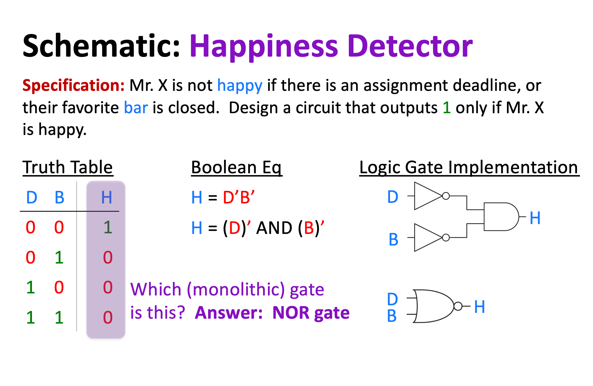

---

## 4. 组合构建块（一）：多路选择器 Mux

**2:1 Mux**：两个数据输入 D0/D1，一个 **select 信号 S**，输出 `Y = S'D0 + SD1`（S=0 选 D0，S=1 选 D1）。

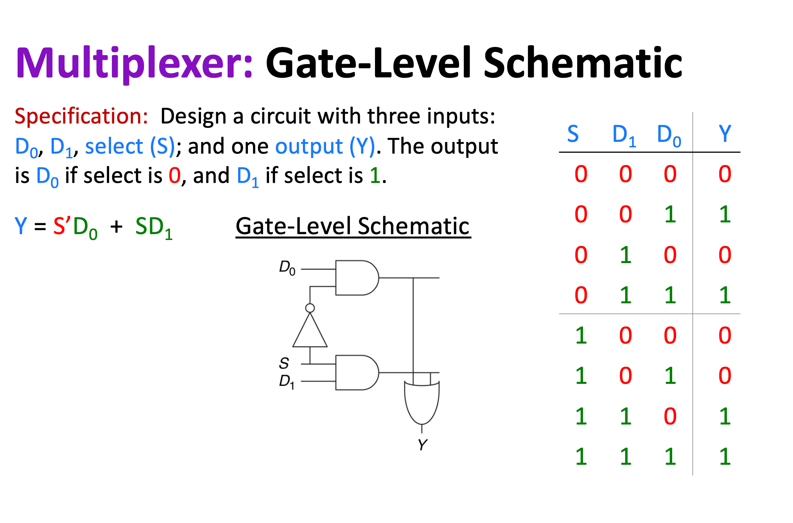

**宽 Mux 与 select 位数（必记公式）**：
- 选 4 个输入需要 **2** 个 select；选 n 个输入需要 **log₂n** 个 select 位。
- 4:1 Mux 可由 **三个 2:1 Mux** 层级搭成。

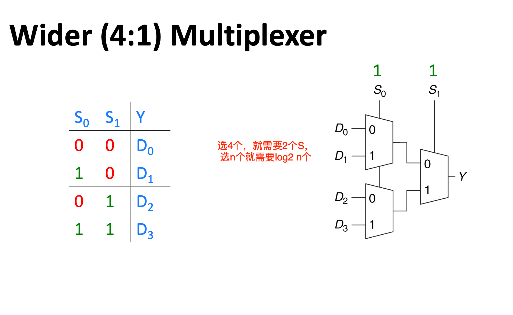

**Mux 当查找表（LUT）用（易考转换）**：
- 任意真值表都可看成一张**查找表**：把数据输入直接接到 0/1 常量，把电路输入（A/B…）当 **select**，Mux 就「查」出对应输出。
- 例：用 4:1 Mux 实现 2 输入 AND，只有 11 这一项接 1，其余接 0，即 `Y = AB`。

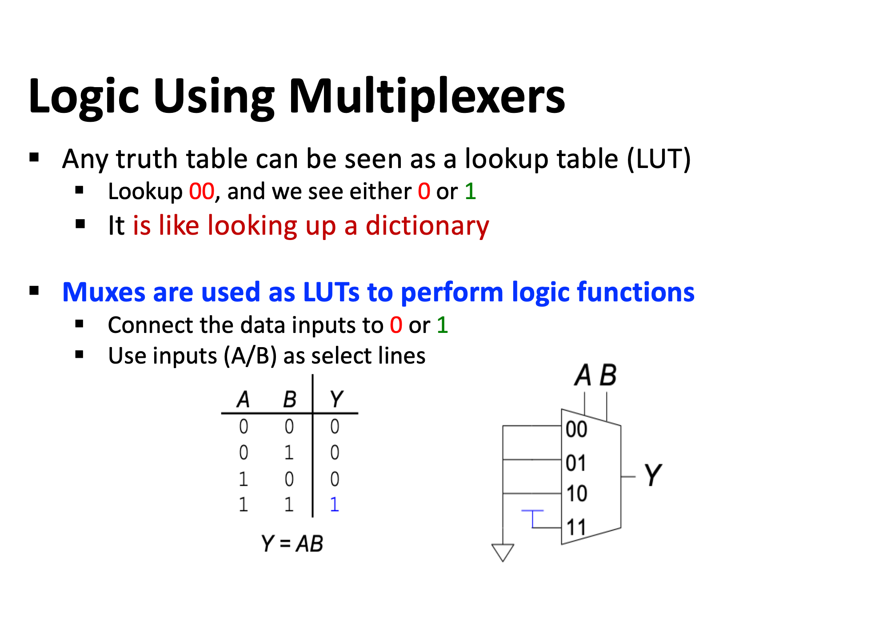

**3-LUT 与 FPGA（核心概念）**：
- 3-bit 输入 LUT = 8 个**配置存储位（configuration memory）** + 一个 8:1 Mux，输入的 3 位当 select 去查出 1 位输出。
- LUT 是 **FPGA 的基本构建块**；现代 FPGA 由大量 LUT 互连路由而成，每个 3-LUT 实现 N 输入逻辑函数的一个子集。

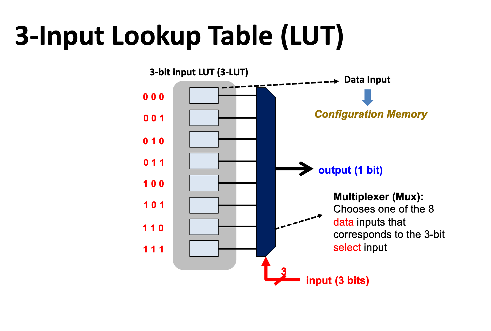

---

## 5. 组合构建块（二）：加法器 Adder 与时序/延迟

**半加器 Half Adder**（无进位输入）：
`S = A ⊕ B`，`Cout = AB`

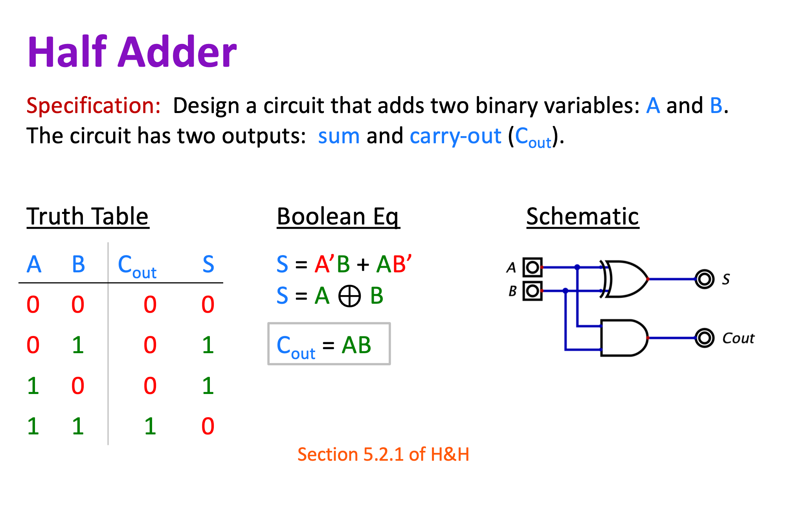

**全加器 Full Adder**（有进位输入 Cin，半加器无法处理进位是它的局限）：
`S = A ⊕ B ⊕ Cin`，`Cout = Cin(A ⊕ B) + AB`
- 实现 = **两个半加器 + 一个 OR 门**。

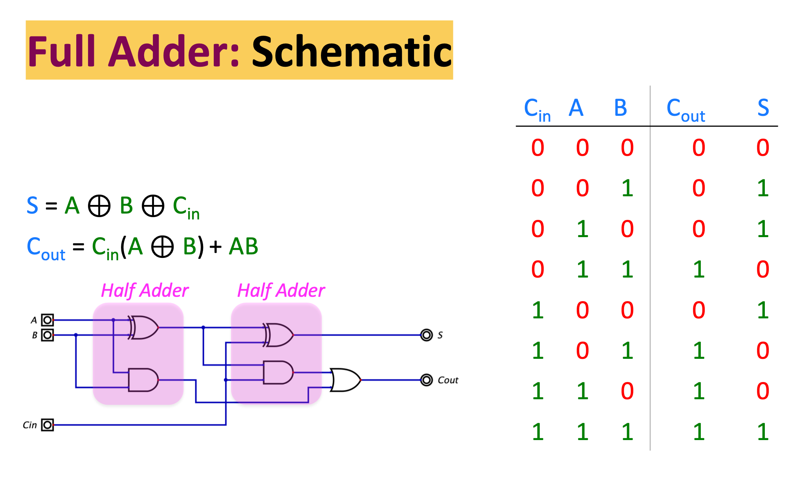

**行波进位加法器 Ripple Carry Adder（RCA）**：
- 加两个 N 位数：把 N 个全加器**从右到左链接**，进位逐级传递。
- **致命缺点（考点）**：延迟随位数 **线性增长**——进位要一级一级 ripple 到最高位才稳定。

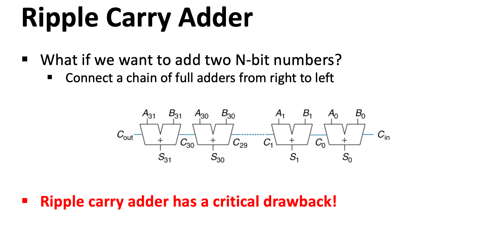

### 时序 / 延迟（Timing）
- **每个组合电路都有传播延迟**（propagation delay，单位秒/皮秒 ps = 10⁻¹² s）。
- 门链的延迟 = **链上各门延迟之和**。
- 多条输入→输出路径中：
  - **关键路径 Critical Path** = 最长路径，**决定整个电路的速度**。
  - **最短路径 Shortest Path** = 最短延迟。
- 电路传播延迟 = 沿**关键路径**各元件延迟之和。

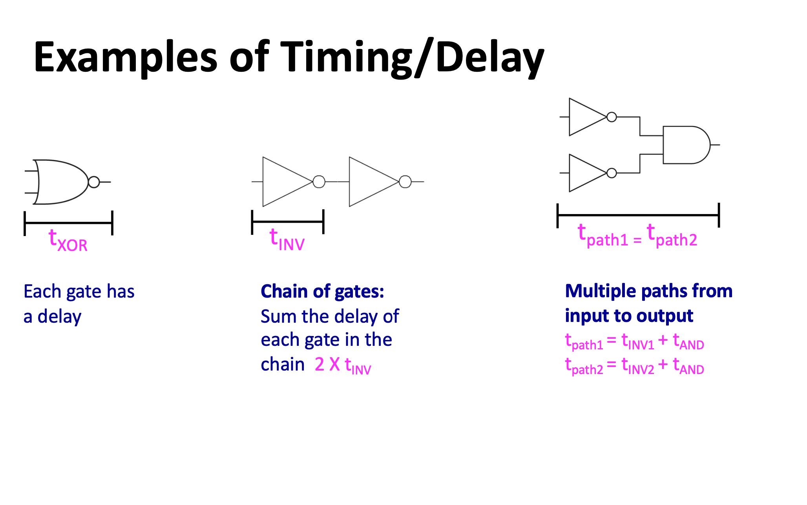

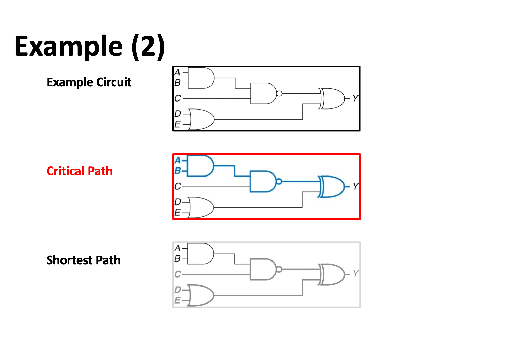

### 进位先行加法器 Carry-Lookahead Adder（CLA）
- **动机**：当电路延迟随输入位数增长时设计就不可扩展（not scalable）——RCA 就是反例。CLA 通过**并行**预先生成进位来加速。
- **Generate / Propagate（必记定义）**：
  - `Gi = AiBi`（该列自己产生进位）
  - `Pi = Ai + Bi`（该列能传播进位）
  - `Ci = AiBi + (Ai+Bi)Ci-1 = Gi + PiCi-1`
- 块级（4-bit block）：`G3:0 = G3 + P3(G2 + P2(G1 + P1G0))`，`P3:0 = P3P2P1P0`，`Ci = Gi:j + Pi:jCj-1`。
- 每个 CLA 块**同时（并行）**为下一块算进位。
- **教训**：**速度-面积权衡（Speed-Area Tradeoff）**——CLA 更快但用更多硬件。这是数字系统的普遍规律。

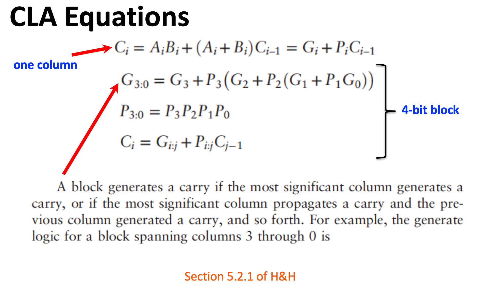

---

## 6. 组合构建块（三）：译码器 Decoder

- **N 个输入，2^N 个输出**；每个输入组合**只有一个输出为 1（one-hot 独热）**。
- 每个输出 = 一个 minterm：`Y0 = A1'A0'`，`Y1 = A1'A0`，`Y2 = A1A0'`，`Y3 = A1A0`。
- **译码器 + OR 门 → 实现任意逻辑函数**（把需要的 minterm 用 OR 接起来）。
- 应用视角：把 00/01/10/11 当成发给四个不同设备的「指令」，译码器负责选中那一个。

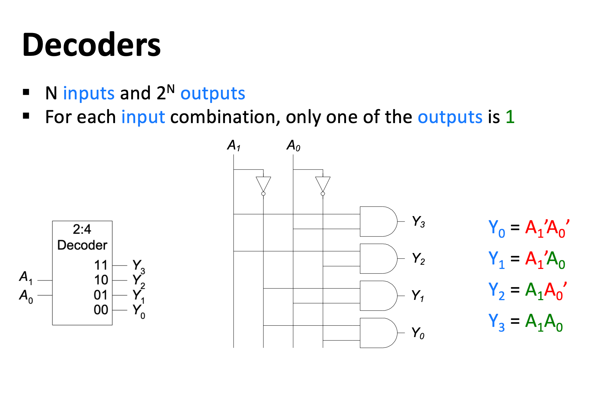

---

## 7. 组合构建块（四）：PLA（可编程逻辑阵列）

- SOP 天然导出**两级逻辑**，PLA 就是它的硬件载体：**AND 阵列 → OR 阵列**。
- 通过**编程连接（programming connections / 烧熔丝 fuse）**挑选 literal 与 implicant。
- 可实现**任意 N 输入 P 输出函数**；芯片工厂统一量产（低成本），出厂后再编程。
- **教训**：可编程是有代价的——若实际只用到部分逻辑，PLA 里会有**冗余**逻辑（programmability 的成本）。

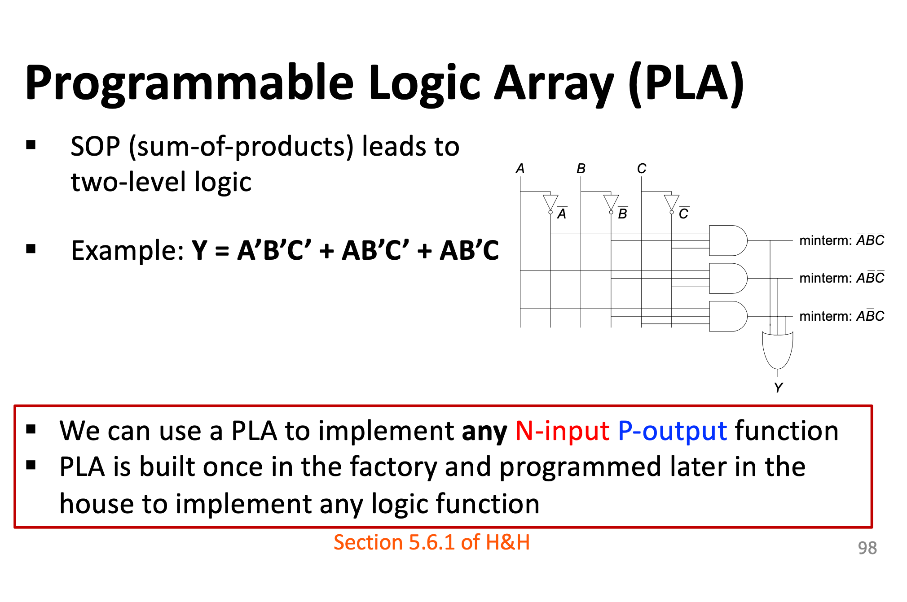

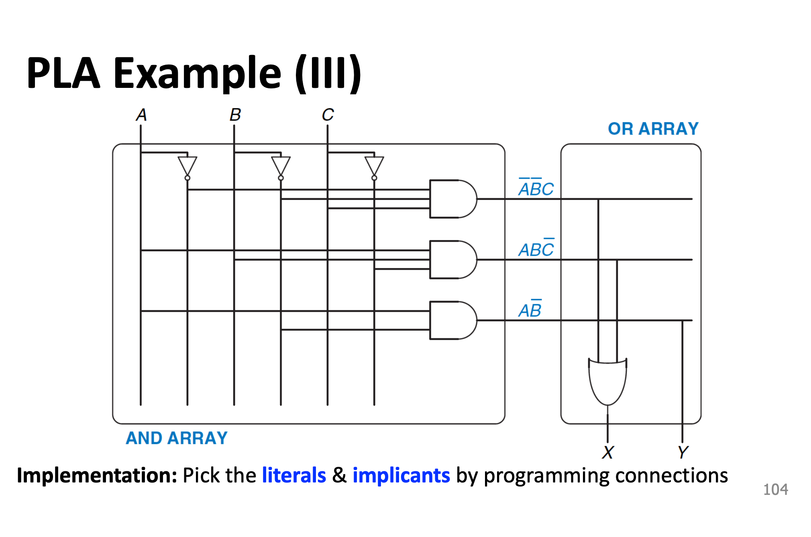

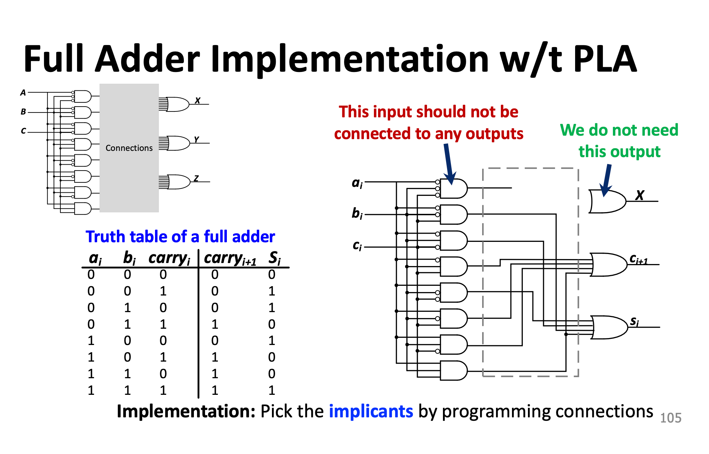

---

## 8. ALU（算术逻辑单元）— 本 set 的高潮

- N 位数据输入/输出，由 **ALUControl** 选择执行哪种运算。
- **ALUControl[1:0] 功能表（必记）**：

| ALUControl₁:₀ | 功能 |
|---|---|
| 00 | Add（加） |
| 01 | Subtract（减） |
| 10 | AND |
| 11 | OR |

- **实现结构**：N 位**加减电路** + N 位**逻辑电路（AND/OR）** + 一个 **4:1 Mux** 用 ALUControl 选出最终 Result。
- 加减电路：A+B 正常加；A−B 用 `A + (−B)`（补码取反加一思路）。
- **硬件的本质：天生并行（inherently parallel）**——ALU 里所有逻辑门同时工作，不存在「先算这个再算那个」。

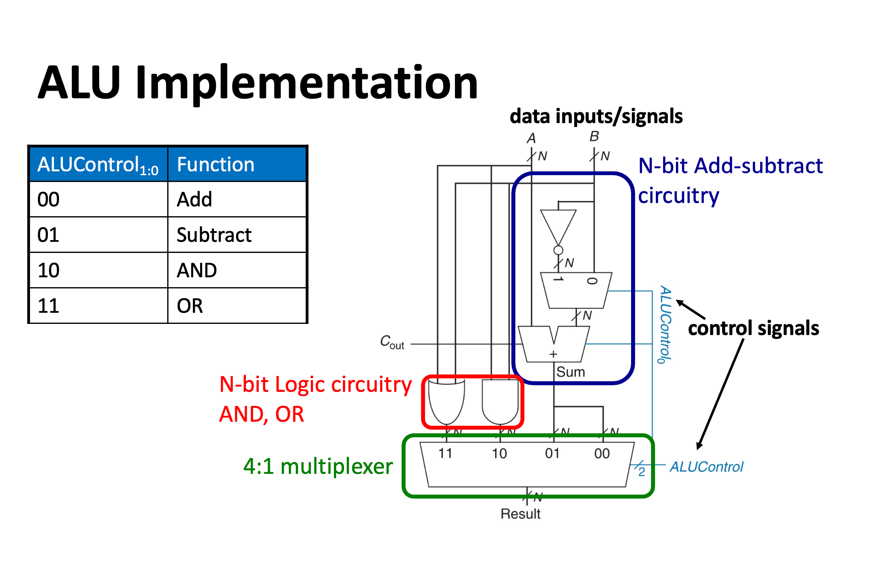

### ALUFLAGS（标志位，必记）
`N Z C V` —— 关于 ALU 结果的元信息：
- **N**egative（结果为负，看最高位）
- **Z**ero（结果为 0）
- **C**arry（进位）
- o**V**erflow（溢出）

**溢出判断**：
- **Option 1（枚举法）**：按 操作 + 符号位 A₃₁/B₃₁/S₃₁ 列出会溢出的 4 种情形：

| 情形 | ALUControl₀ | A₃₁ | B₃₁ | S₃₁ | 白话 |
|---|---|---|---|---|---|
| #1 | 0 (Add) | 0 | 0 | 1 | 正+正=负 |
| #2 | 0 (Add) | 1 | 1 | 0 | 负+负=正 |
| #3 | 1 (Sub) | 0 | 1 | 1 | 正−负=负 |
| #4 | 1 (Sub) | 1 | 0 | 0 | 负−正=正 |

- **Option 2（统一为加法）**：用 A 和 2:1 Mux 输出——Add 取 B、Subtract 取 −B，于是 `A−B` 视为 `A+(−B)`，**一切都是加法**，推理溢出时无需单独考虑减法，电路也更简单。（讲义把 Option 2 的具体电路留作 Homework。）

> 易考：Option 1 的 4 条规则用「正+正得负 / 负+负得正」这种符号直觉记，比死记 0/1 表更稳。

---

## 9. 组合构建块（五）：比较器 Comparator

- **相等比较器（equality checker）**：检查两个 N 位值是否完全相同。
- 实现：每一位对 `Ai, Bi` 做 **XNOR**（同则 1），再把所有位的结果 **AND** 起来 → `Equal`。
- （大小比较 magnitude comparison 是另一回事，本页只做相等。）

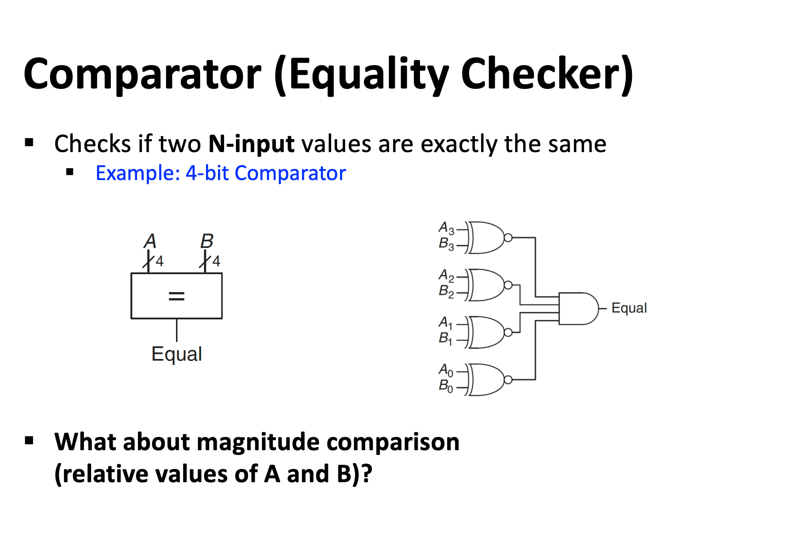

---

## 10. 组合构建块（六）：三态缓冲器 Tri-State Buffer

- 作用：把不同信号**门控（gating）**到同一根线上。像个开关，但在使能时能传 0 也能传 1。
- **第三态 Z（高阻态 high impedance）是关键**。真值表：

| E（使能） | A | Y |
|---|---|---|
| 0 | 0 | **Z** |
| 0 | 1 | **Z** |
| 1 | 0 | 0 |
| 1 | 1 | 1 |

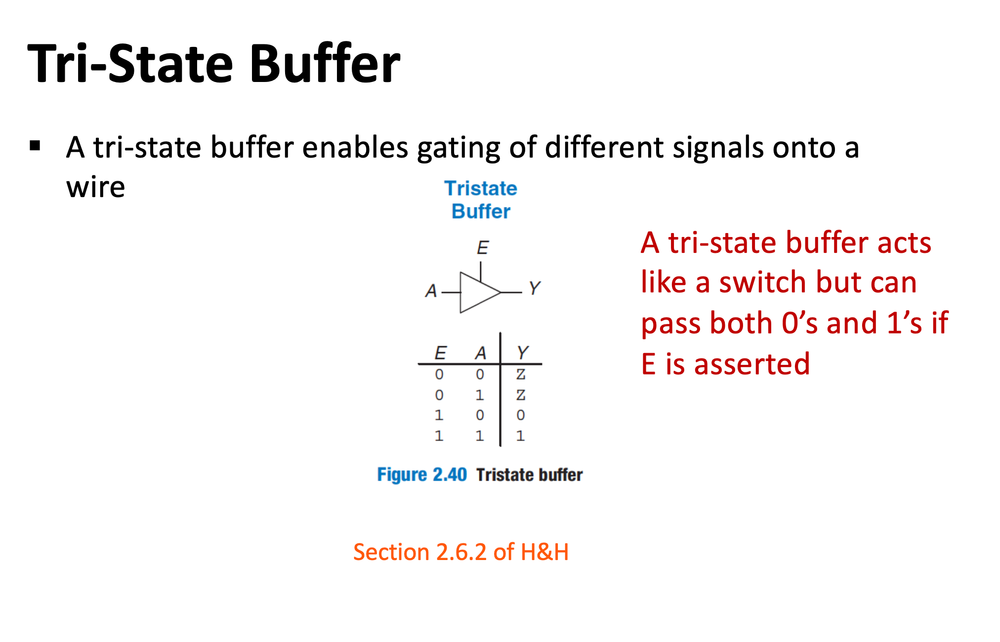

**典型用途：共享总线（shared bus）**
- 一根线被 CPU 和内存（或多个 I/O 外设）共享，每个驱动者前面接一个三态缓冲，**任何时刻只允许一个使能**去驱动总线，其余输出 Z 不干扰。

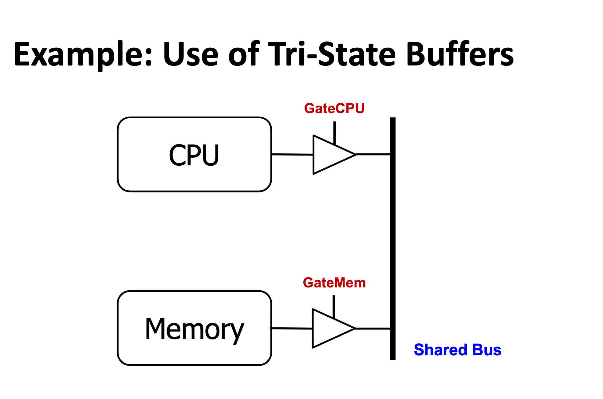

**用三态缓冲搭 Mux**：每个数据输入接一个三态缓冲，用译码后的 select 信号使能其中一个，输出并到同一线上。`Y = D0S' + D1S`（2:1 情形）。

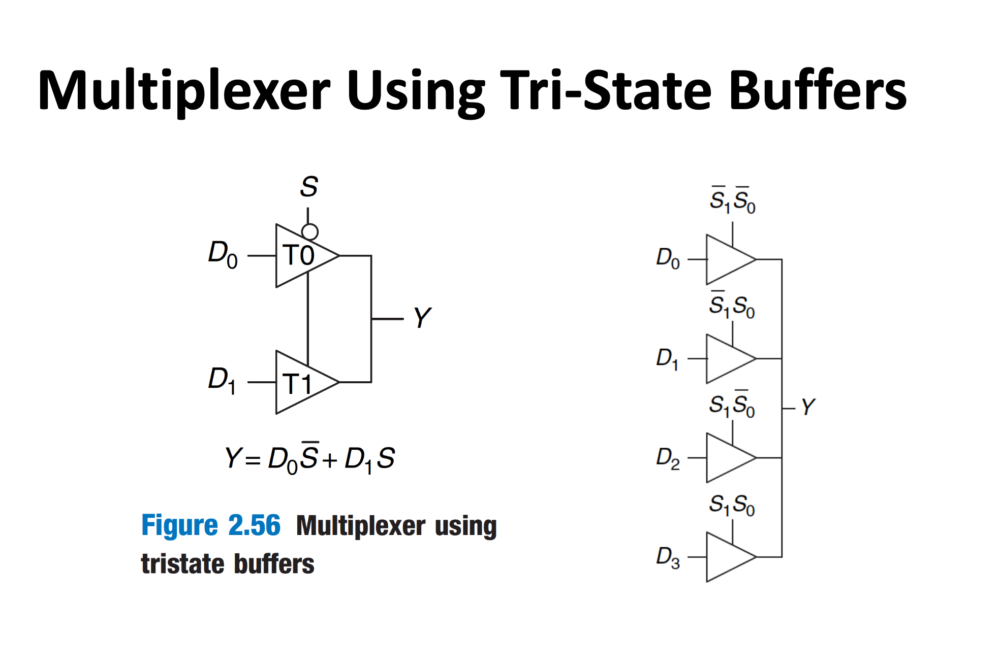

---

## 11. 组合电路的组合规则（Composition Rules）

一个电路**是组合电路**，当且仅当：
- 每个电路元件本身是组合的；
- 每个节点要么是电路输入，要么恰好连到**某一个**元件的输出；
- **不含回路 / 反馈环（no cyclic paths）**——有环就引入了记忆，变时序了。

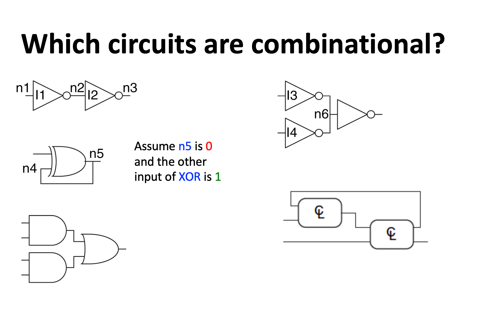

---

## 12. 布尔代数与逻辑化简（Logic Minimization）

**为什么学布尔代数**：为了**最小化面积、成本、逻辑复杂度、能耗**。SOP 规范式不是最简的，需要代数化简。

**公理 Axioms（A1–A5）**：

| # | 公理 | 对偶 Dual | 名称 |
|---|---|---|---|
| A1 | B=0 if B≠1 | B=1 if B≠0 | Binary Field |
| A2 | 0̄=1 | 1̄=0 | NOT |
| A3 | 0·0=0 | 1+1=1 | AND/OR |
| A4 | 1·1=1 | 0+0=0 | AND/OR |
| A5 | 0·1=1·0=0 | 1+0=0+1=1 | AND/OR |

**单变量定理（T1–T5）**：

| # | 定理 | 对偶 | 名称 |
|---|---|---|---|
| T1 | B·1=B | B+0=B | Identity |
| T2 | B·0=0 | B+1=1 | Null Element |
| T3 | B·B=B | B+B=B | Idempotency |
| T4 | B̿=B | — | Involution |
| T5 | B·B̄=0 | B+B̄=1 | Complements |

**多变量定理（T6–T11）**：

| # | 定理 | 对偶 | 名称 |
|---|---|---|---|
| T6 | B·C=C·B | B+C=C+B | Commutativity 交换律 |
| T7 | (B·C)·D=B·(C·D) | (B+C)+D=B+(C+D) | Associativity 结合律 |
| T8 | B·(C+D)=BC+BD | B+(C·D)=(B+C)(B+D) | Distributivity 分配律 |
| T9 | B·(B+C)=B | B+(B·C)=B | Covering 覆盖 |
| T10 | (B·C)+(B·C̄)=B | (B+C)(B+C̄)=B | Combining 合并 |
| T11 | BC+BD+CD=BC+BD | … | Consensus 一致 |

> ⚠️ **易踩坑**：T8' 对偶（OR 对 AND 分配 `B+CD=(B+C)(B+D)`）和普通算术不一样——普通代数里加法不对乘法分配，布尔代数里可以。
- **对偶（Dual）规则**：`·` ↔ `+`，`0` ↔ `1` 整体互换。
- 这些公理/定理用上面的表格即可，**无需截图**（文字表已完整还原）。

**证明方法**：
- 方法 1：**完美归纳（Perfect Induction）**——穷举所有输入组合检验。
- 方法 2：用已有定理（如 T9 Covering、T10 Combining）代数推导。

**化简基本原理**：`PA + PA' = P`（P 是任意 implicant）。
- 最小化标准：用**最少的 implicant 数**；implicant 数相同则**字面量（literal）最少**的更优。
- **质蕴涵项 prime implicant**：无法再与其他项合并出更少字面量项的 implicant。

**化简例题（典型推导竖式，建议跟着抄一遍）**：
- 例1：`Y = AB + AB' → A`（T10 合并；或 T8 分配 → T5' → T1）
- 例2：`Y = A(AB + ABC) → AB`（T8 → T2' → T1 → T7 → T3）
- 例3A：`Y = AB'C + ABC + A'BC → AC + A'BC`（卡在只能合并一对）
- 例3B：用 **T3' 幂等先复制 ABC**，再分别合并 → `AC + BC`（两者都是 prime implicant）。**复制重叠 minterm 来同时参与两次合并**是这里的关键技巧。
- 例4：`Y = A'B'C' + AB'C' + AB'C`（留作练习自行化简）

**德摩根定理 De Morgan's（T12，必记）**：
- `(B0·B1·B2…)' = B0' + B1' + B2'…`（积的补 = 补的和）
- `(B0+B1+B2…)' = B0'·B1'·B2'…`（和的补 = 补的积）

**气泡推移 Bubble Pushing 规则**：
- 推气泡（bubble）会把门体在 **AND↔OR** 之间互换。
- 把气泡从**输出往输入推** → 所有输入端各加一个气泡。
- 把所有输入端的气泡**往输出推** → 输出端加一个气泡。

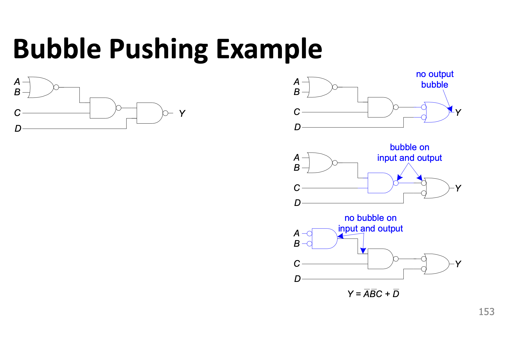

---

## 13. 优先级电路 Priority Circuit（含 Don't-Care）

- 输入：带优先级的「请求者 Requestor」；输出：每个请求者的「授予 Grant」信号（**one-hot**）。
- 应用：会议室预订、四个 CPU 争用总线。
- 高位优先：`Y3 = A3`，`Y2 = A3'A2`，`Y1 = A3'A2'A1`，`Y0 = A3'A2'A1'A0`。
- **无关项 Don't-Care（X）**：表示「不在乎这个输入是什么值」。用 X 可以把 16 行的完整真值表**压缩成 5 行**——一旦高优先位已确定输出，低位取啥都无所谓。

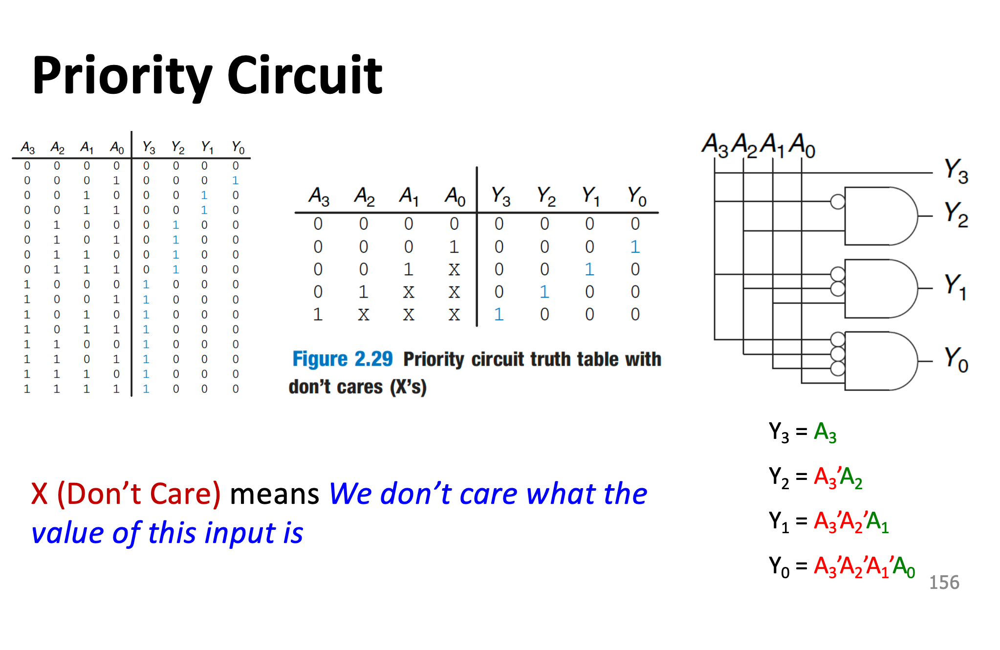

---

## 14. 逻辑完备性 Logical Completeness

- PLA 只需 **AND、OR、NOT** 三种门就能实现任意逻辑函数。
- **NAND 单门就是逻辑完备的**：可以只用 NAND 搭出 NOT、AND、OR → 因此**只用 NAND 一种门就能造出整台计算机**。今天大多数计算机正是由数十亿个 NAND 门构成。（自己证一下 NAND 完备性。）
- 此页为纯文字结论，**无需截图**。

---

## 15. 选学（Optional Self-Study）
- **POS（Product of Sums，和之积）**：SOP 的对偶规范式，用 maxterm 展开。理解了 SOP 就不一定需要它。
- 其他组合电路：**移位器 Shifters** 等。

---

## 本 set 回顾（What We've Done）
现代计算机的组合构建块全家桶：晶体管 → 逻辑门 → Mux / 加法器 / 译码器 / 比较器 / 三态缓冲 / PLA / ALU；配套方法论：真值表→方程→门电路的流水线、布尔代数化简、时序/延迟分析。下一步进入**时序电路**（有记忆的世界）。