# COMP2300 Set 3 笔记 — 时序电路、存储器与有限状态机

> **课程**:ANU COMP2300 — Computer Organisation & Program Execution
> **主讲**:Shoaib Akram
> **本 Set 一句话**:从「只依赖当前输入的组合电路」跨到「能记住过去的时序电路」——先造出存 1 bit 的元件(bistable → SR/D latch → D flip-flop),再拼成寄存器和存储器,再用时钟纪律把它们组织成 FSM,最后落到 SRAM/DRAM 物理存储与时序参数。
> **参考**:H&H 第 3 章(时序逻辑/FSM)、第 5.5 节(存储器)。

> **符号约定**:`S'` = 下一状态(next state);`~X` = X 的非(NOT / 补,课件里画作上划线);`·` = AND,`+` = OR,`⊕` = XOR。

---

## 0. 上下文:为什么需要时序电路
- 组合电路:输出**只取决于当前输入组合**。
- 我们想要:输出取决于**当前 + 过去**的输入 —— 即带 memory 的电路。
- **State(状态)**:一组概括系统「过去行为」的 bit(state variables),每个 bit 存在一个 memory/state element 里。**知道当前 state = 掌握了预测未来所需的全部过去信息**。
- 时序电路 = 组合电路 + 存储元件,输出取决于「输入组合 + 系统 state」。

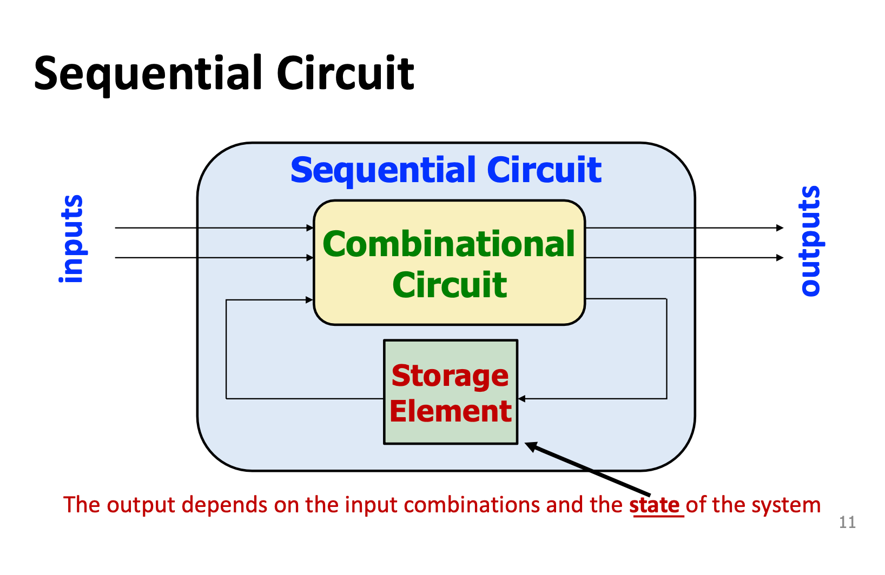

---

## 1. 存 1 bit:从 bistable 到 flip-flop(核心链条)

这一节是全 Set 的地基,四个元件层层解决前者的缺陷:

| 元件 | 输入 | 触发方式 | 致命缺陷 → 催生下一个 |
|---|---|---|---|
| Cross-coupled inverter(bistable) | 无 | — | 有两个稳态但**无法控制**状态 |
| SR Latch | S, R | 电平 | S=R=1 非法;S/R 同时管「存什么」和「何时变」 |
| D Latch | D, CLK | **电平**(level-triggered) | CLK=1 时 Q **持续跟随 D 变化** |
| D Flip-Flop | D, CLK | **边沿**(edge-triggered) | (基本无缺陷,作为寄存器基本单元) |

### 1.1 Bistable element(双稳态元件)
- 存储的根本构件:**一对反相器接成环(cross-coupled inverters)**。
- 两个稳态:Q=0 永远 0,Q=1 永远 1;Q 与 Q' 互补。
- 缺陷:**上电初态不可预测**,且用户没有输入去控制它 → 不实用。

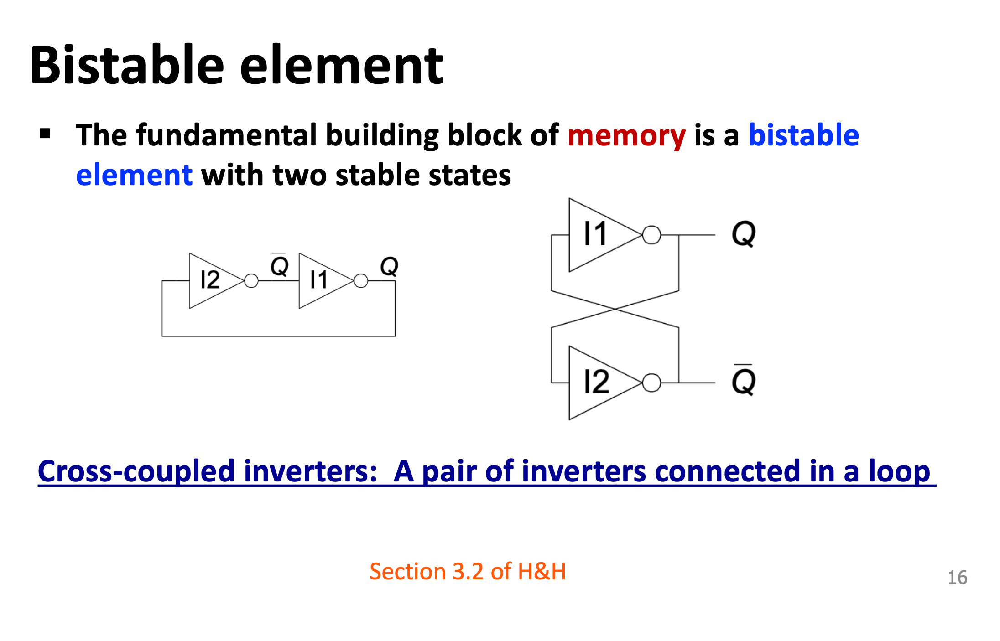

### 1.2 SR Latch
- 两个 cross-coupled **NOR** 门;S = Set(置 1),R = Reset(置 0)。
- NOR 复习:两输入全 0 → 输出 1;任一输入为 1 → 输出 0。

**SR Latch 真值表(重建,P25):**

| Scenario | S | R | Q | Q' |
|---|---|---|---|---|
| Sim-0(保持) | 0 | 0 | Q_prev | Q'_prev |
| Reset | 0 | 1 | 0 | 1 |
| Set | 1 | 0 | 1 | 0 |
| **Sim-1(非法)** | 1 | 1 | **0** | **0** |

- **易考点**:S=R=1 时 Q 和 Q' 同时为 0,违反「互补」——直觉上和物理上都无意义,是**要避免的非法输入**。
- Q 概括了全部历史:只有**最近一次** set/reset 决定未来。

### 1.3 时间的离散化模型(D Latch 前置)
- CS 里不用连续时间,而是把时间切成**固定长度、不可分的 cycle**。
- **时钟(clock)**:一个特殊电路产生的周期性方波,用来**同步全系统的状态更新**。
- 术语:rising edge(上升沿)、falling edge(下降沿)、**Clock period Tc**(周期)。
- **公式**:`Frequency = 1 / Tc`。
- **世界只在 cycle 交界(时钟沿)处改变;cycle 之内世界静止。**

### 1.4 D Latch
- 解决 SR 的两个缺陷:① 用一个 **D(data)** 输入决定「下一状态是什么」;② 用 **CLK** 决定「何时改变」。
- **Level-sensitive / level-triggered(电平触发)**:
  - **CLK = 1 → Transparent(透明)**,像 buffer,Q 跟随 D。
  - **CLK = 0 → Opaque(不透明)**,锁住旧值,Q = Q_prev。
- 内部实现:SR latch 前面加一个反相器,由 CLK 门控。

**D Latch 真值表(重建,P34):**

| Scenario | CLK | D | Q | Q' |
|---|---|---|---|---|
| Opaque(不透明) | 0 | X | Q_prev | Q'_prev |
| Transparent/0 | 1 | 0 | 0 | 1 |
| Transparent/1 | 1 | 1 | 1 | 0 |

- **缺陷**:CLK=1 期间 Q **持续变化** → 时序 bug、难分析。我们希望状态**只在某个瞬间**改变。

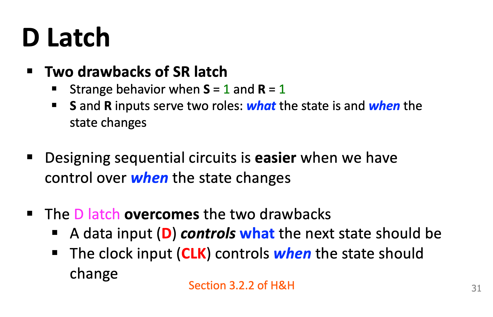

### 1.5 D Flip-Flop(重点)
- **Edge-triggered(边沿触发)**:CLK **从 0 跳到 1 的瞬间**把 D 采样进 Q,其余时刻保持不变。
- **摄影类比**:上升沿 = 按快门拍一张(把 D 拷进 Q);其余时间忽略 D。
- **内部结构 = 两个背靠背 D latch,时钟互补**:
  - **L1 = master(主)**,**L2 = slave(从)**。
  - CLK=0:master 透明、slave 不透明 → D 传到中间节点 N1,但 Q 被切断。
  - CLK=1:master 不透明、slave 透明 → N1 传到 Q,但 N1 与 D 切断。
  - 净效果:**只有上升沿前一刻的 D 被拷到 Q**。
- 别名(都是同一个东西):master-slave FF、edge-triggered FF、positive edge-triggered FF。

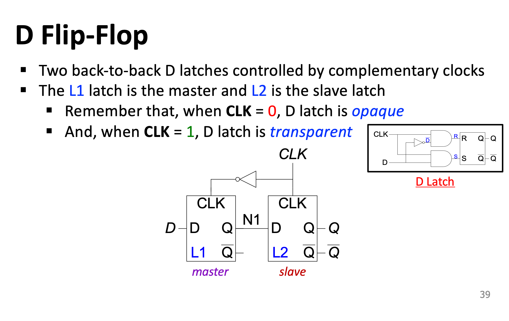

### 1.6 记住符号
- **D Latch 符号**:方框,左 D、上 CLK、右 Q/Q'。
- **D Flip-Flop 符号**:方框,右 Q/Q',输入端有一个**三角(边沿)标记**——这是区分 latch 和 FF 的关键。

---

## 2. 寄存器与 flip-flop 变体

### 2.1 Register(寄存器)
- **模块化原则**:要存多 bit → 用多个 flip-flop,**共享同一个 CLK** 同时写入。
- **Register width(位宽)= FF 个数**。典型:8/16/32/64/…/512+ bit。
  - 宽寄存器用于大数、浮点(需额外位)。64-bit:高性能计算/金融;16-bit:微波炉、汽车 ECU。
- N-bit 寄存器 = N 个 FF 共享 CLK。数据记作 `Q[3:0]`;粗线 + 斜杠 `/4` 表示 4 根线的总线。

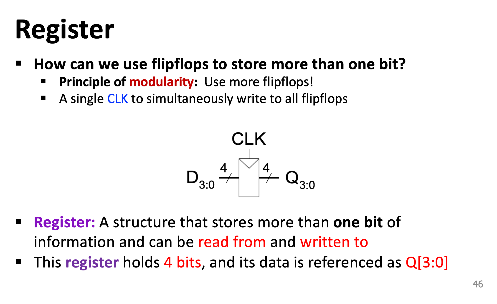

### 2.2 三种 flip-flop 变体
- **Enabled FF**:多一个 **EN** 输入。EN=1 时上升沿采样 D;EN=0 时保持。
  - 内部常用 **clock gating**:`CLK AND EN`。**⚠️ 对时钟做逻辑是大忌**——AND 门会延迟时钟;若 EN 在 CLK=1 时变化会产生 glitch(错误时刻翻转)。
- **Resettable FF**:多 **RESET** 输入。RESET=1 → 忽略 D、输出置 0。分**同步复位**(仅时钟沿)与**异步复位**(立即)。
- **Settable FF**:多 **SET** 输入。SET=1 → Q 置 1。

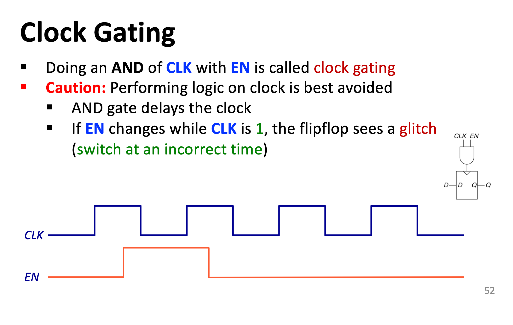

### 2.3 Latch vs Flip-flop 时序例题(考试原型 ⭐)
给定 CLK、D 波形,画出 Q(Latch) 与 Q(Flipflop):
- **Latch(CLK=1 透明)**:CLK 高电平期间 Q **持续跟随 D**。
- **Flip-flop(边沿采样)**:只在**上升沿**取一次 D,cycle 内保持不变。
- 两者在 D 于 CLK 高电平期间变化时结果不同 —— 这正是考点。

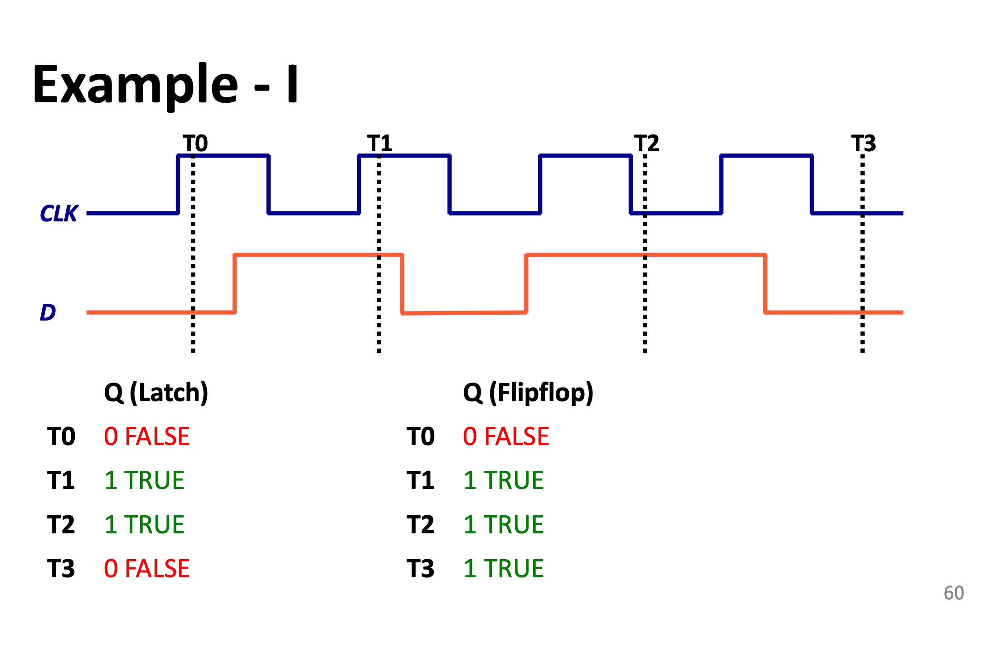

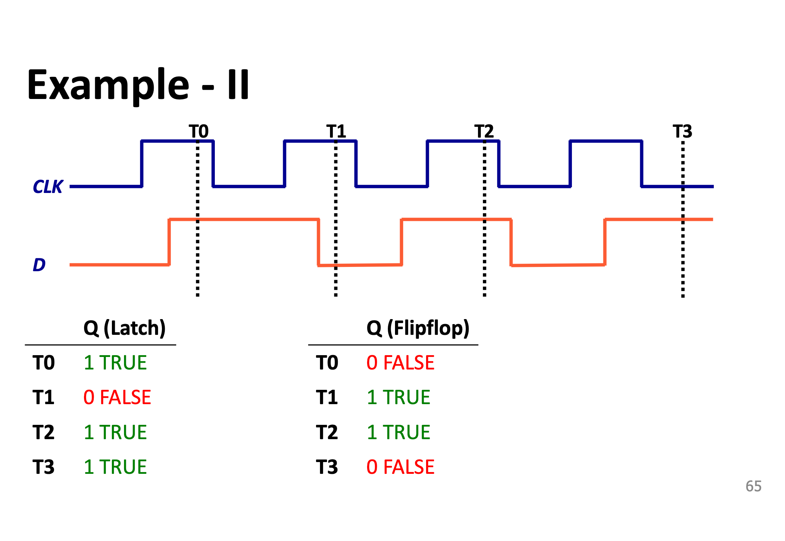

---

## 3. Memory(存储器阵列)

### 3.1 核心概念(必记)
- **Address(地址)= 命名/标识方案**;**Data(数据)= location 里存的信息**。二者对立。
- 三个决定 memory 的参数:① 有多少 location?② 每个 location 存多少 bit?③ 用什么技术存?
- **地址位数 = log2(location 数)**。例:4 个 location → 2 位地址。
- **Addressability(可寻址粒度)= 每个 location 存的 bit 数**(例中为 8 bit)。
- **Address space(地址空间)= 全部唯一 location 的集合**。
- 现代计算机几乎都是 **byte-addressable(按字节寻址)**;典型规模数十亿 location。
  - 例:20 亿 location × 8-bit → 地址空间 2 GB。

**示例 memory array(重建,P71):**

| Address | Data |
|---|---|
| 00 | 0100 1001 |
| 01 | 0100 1011 |
| 10 | 0010 0010 |
| 11 | 1100 1001 |

### 3.2 读/写的电路实现
- 每个「box」是一个 **bit cell**(存 1 bit,类似带 EN 的 enabled FF,有输入 Di、输出 D)。
- **读**:**Address Decoder** 把地址译码出一条 **wordline**(选中一行)→ 该行 cell 把值驱动到输出 → **Multiplexer(与 decoder 配合)**选出对应列。
- **写**:置 **WE(Write Enable)**=1,把 **Di** 送到选中 cell 的 D/EN。
- **Full Memory Array** = 同时支持读和写(WE + Addr + Di + D 输出)。

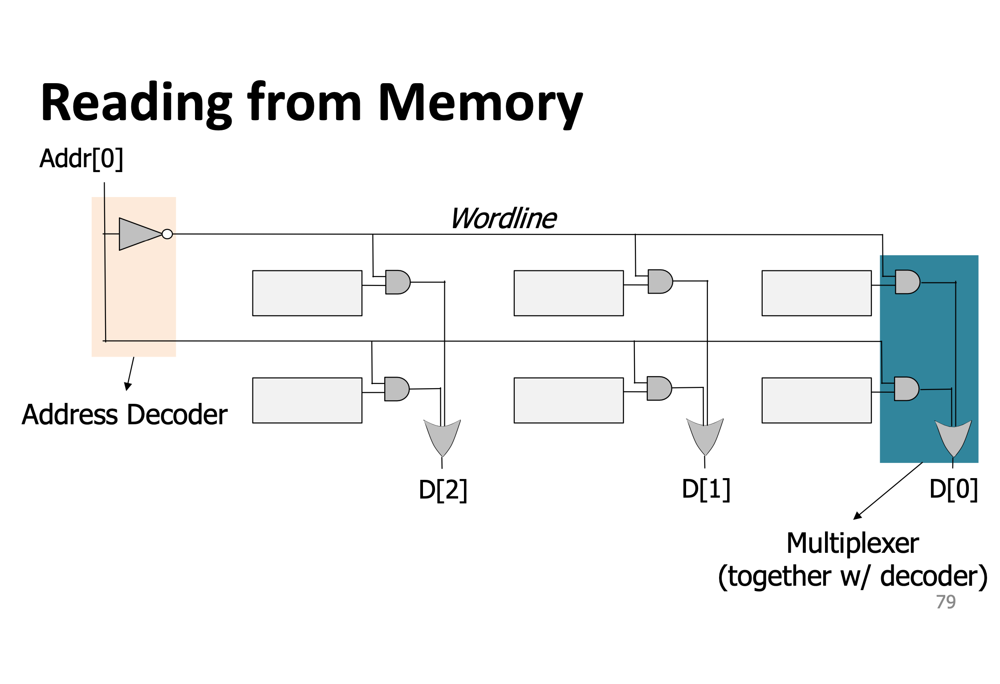

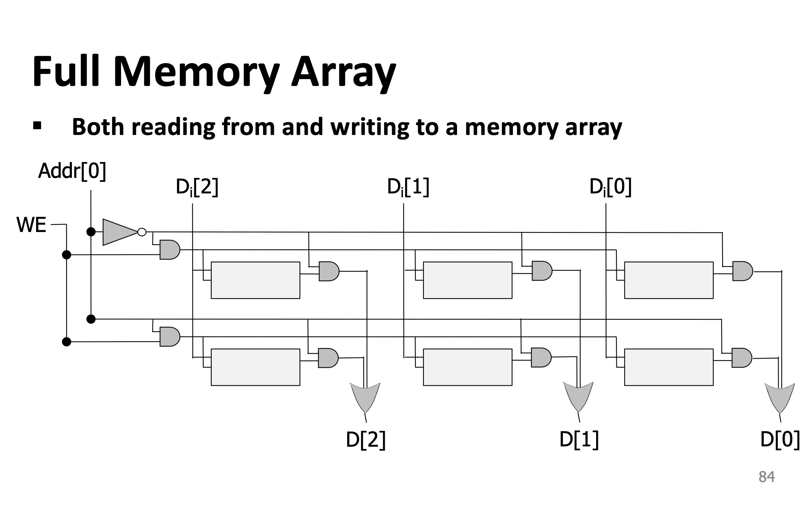

### 3.3 更大的阵列 & 多端口
- **Bigger array(4 location × 3 bit)**:2 位地址 `Addr[1:0]`,decoder 选行、MUX 选输出。
- **Multi-Ported Memory(多端口)**:一个 port = 一次读/写访问。常见配置:两读端口(A1/RD1、A2/RD2)+ 一写端口(A3/WD3),支持**同时访问多个地址**。这就是寄存器堆(register file)的雏形。

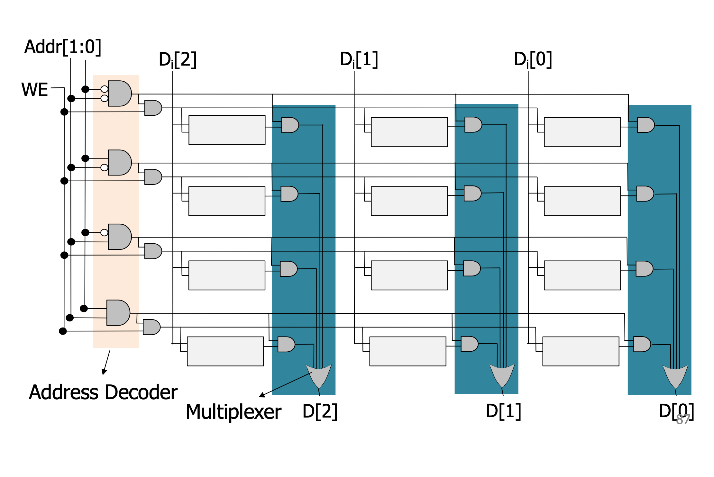

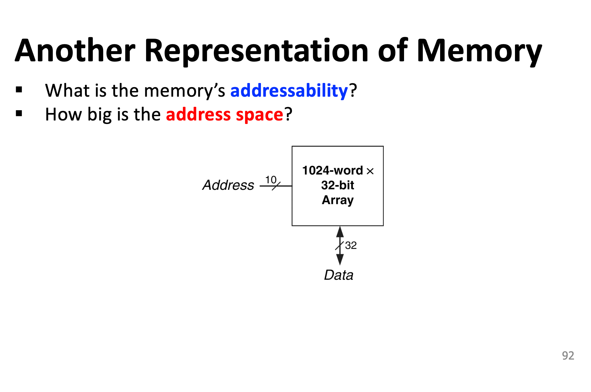

---

## 4. 时序逻辑:State、时钟纪律与「为什么不能乱接」

### 4.1 State 与状态图
- **State = 系统在某瞬间所有相关元素的快照**。
- 例(密码锁 R13-L22-R3):状态 A(锁定未操作)→ B(R13 完成)→ C(R13-L22 完成)→ D(解锁)。走错任何一步回到 A。
- **State diagram** 完整描述系统行为(锁、自动售货机、交通灯都能画)。

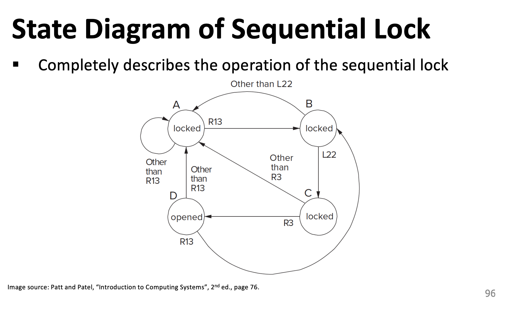

### 4.2 异步 vs 同步(核心区分)
| | Asynchronous(异步) | Synchronous(同步) |
|---|---|---|
| 状态转移时机 | 事件发生时**随时**转移,无同步信号 | 每隔**固定时间**、由**时钟**触发 |
| 例子 | 密码锁、售货机 | 现代计算机 |
| 权衡 | 更高效(无时钟开销) | 多组件多状态时**更容易做对** |

**本课程一律假设同步系统。**

- 时钟的作用:① 决定**何时**换状态;② 跨众多时序元件**同步**状态变化;③ 组合逻辑在一个 cycle 内求值 → **时钟周期必须容纳最大组合延迟**。

### 4.3 任意(异步)电路为何是坏主意
- **Cyclic path(环路)**:输出直接反馈回输入。**组合逻辑无环路**(输出经传播延迟后稳定)。
- 两个反例:
  - **Ring Oscillator(环形振荡器)**:奇数个反相器成环,无稳态(astable),X 在 0/1 间振荡。若每个反相器延迟 1 ns、3 个反相器 → 时钟周期 6 ns(一来一回)。
  - **Asynchronous D Latch**:若 `t_INV >> t_AND, t_OR`,N1 和 Q 可能在 CLK 变化前就掉下来 → Q 卡在 0 → **race condition(竞态)**。
- **结论**:含环路的电路 = 异步电路,难分析、有竞态/振荡、换个条件就失效。

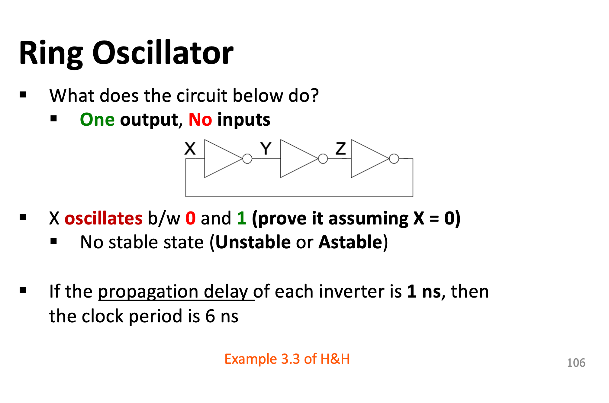

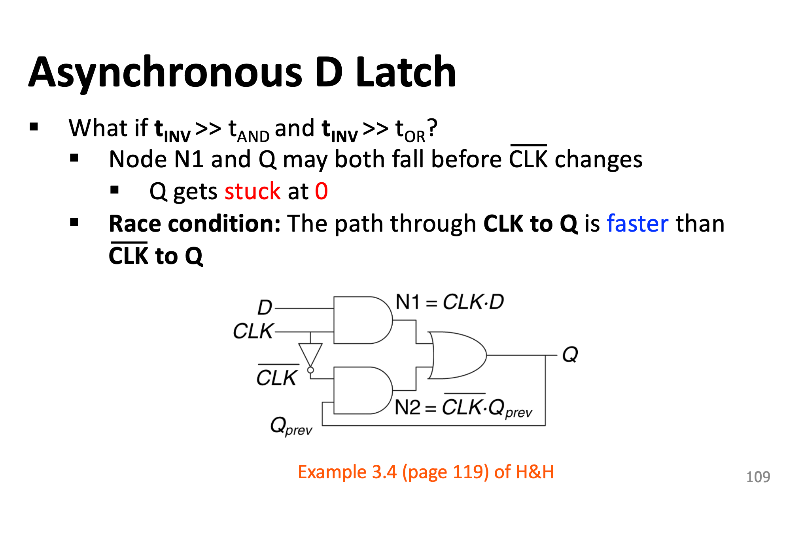

### 4.4 同步时序电路 + 组合规则(必记)
- **解法**:在环路里**插入 register**打断它。register 含 state 且被时钟同步。
- **总规则**:只要时钟足够慢,让所有 register 输入在下一个时钟沿前稳定,就消除所有竞态。
- **组合规则(Composition Rules,4 条):**
  1. 每个元件**要么是 register,要么是组合元件**。
  2. **至少有一个** register。
  3. **所有 register 接同一个时钟**信号。
  4. **每条 cyclic path 至少含一个 register**。

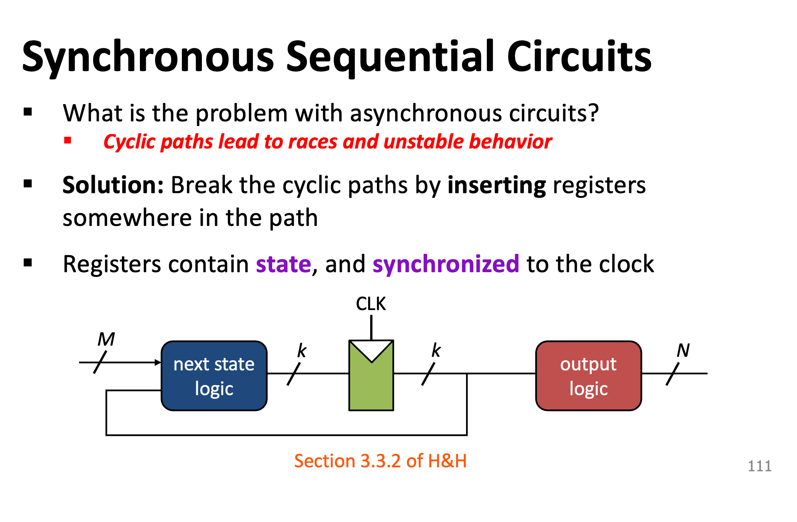

---

## 5. 有限状态机 FSM(本 Set 重头戏)

### 5.1 FSM 是什么 & 五要素
- **FSM = 有状态系统的离散时间模型**:有限个状态 + 状态间转移。可建模交通灯/电梯/微波炉/CPU 等。
- **五要素**:① 有限个 state;② 有限个外部输入;③ 有限个外部输出;④ 所有状态转移的显式规范;⑤ 每个输出值由什么决定的显式规范。

### 5.2 三大组成部分 & Moore vs Mealy(必考区分)
FSM 三部分:**next state logic(组合)+ state register(时序)+ output logic(组合)**。
- **state register**:时钟沿存当前状态 S,并提供下一状态 S'。
- **两类 FSM 区别在 output logic**:

| | Moore | Mealy |
|---|---|---|
| 输出取决于 | **只有当前 state** | **当前 state + 输入** |
| 输出反应速度 | 慢一个周期(要等状态变) | **快一个周期**(直接响应输入) |
| 状态数 | 较多 | **较少** |
| 状态图标注 | 输出标在**状态圆圈内** | 输出标在**转移箭头(arc)上** |

- 想让 Mealy 输出对齐 Moore:在 Mealy 输出后加一个 flip-flop 延迟一拍。
- 选哪种取决于「你希望输出何时响应」。

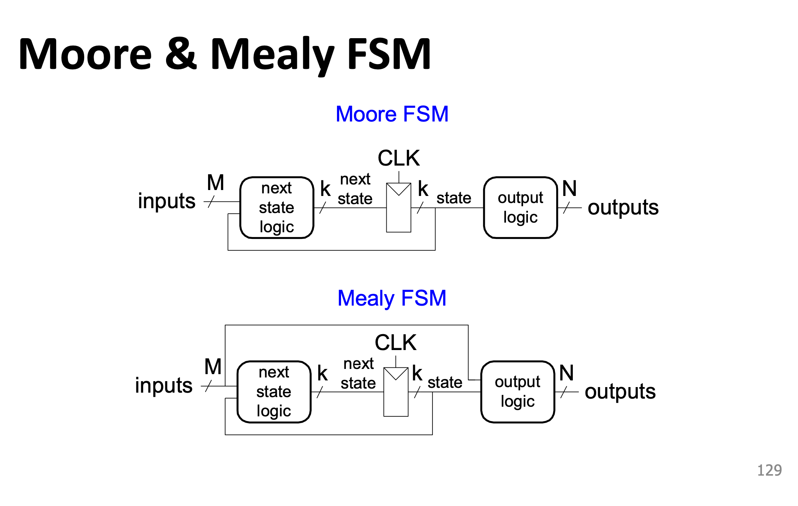

### 5.3 为什么 state register 必须用 Flip-Flop 而非 Latch
- 需求:数据要在**整个时钟周期内可用**(让组合逻辑有足够时间处理)。
- **Latch 不行**:CLK=1 时 latch 透明,D 会直接穿到 Q → 状态在周期内乱变(undesirable)。
- **Flip-Flop 才对**:D 只在**下一周期开头**在 Q 可见,且 Q **整个周期稳定**。

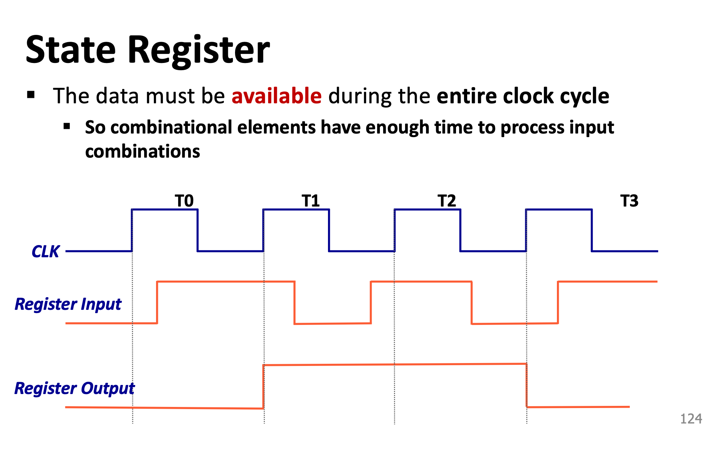

---

## 6. 完整实例:智能交通灯 FSM(H&H 3.4.1,贯穿全流程)

**规格**:2 输入 `TA, TB`(有车为 TRUE);2 输出 `LA, LB`(红/黄/绿)。每 5 秒可换状态,**除非绿灯且有车则保持绿**。

**四个状态**:S0(LA 绿 / LB 红)、S1(LA 黄 / LB 红)、S2(LA 红 / LB 绿)、S3(LA 红 / LB 黄)。

### 6.1 状态转移图(State Transition Diagram)⭐
- Moore 型:输出标在圆圈内;箭头 = 转移,箭头上标输入条件。
- 逻辑:S0 有 A 车(TA)则留 S0,无则→S1;S1→S2;S2 有 B 车(TB)留 S2,无则→S3;S3→S0。

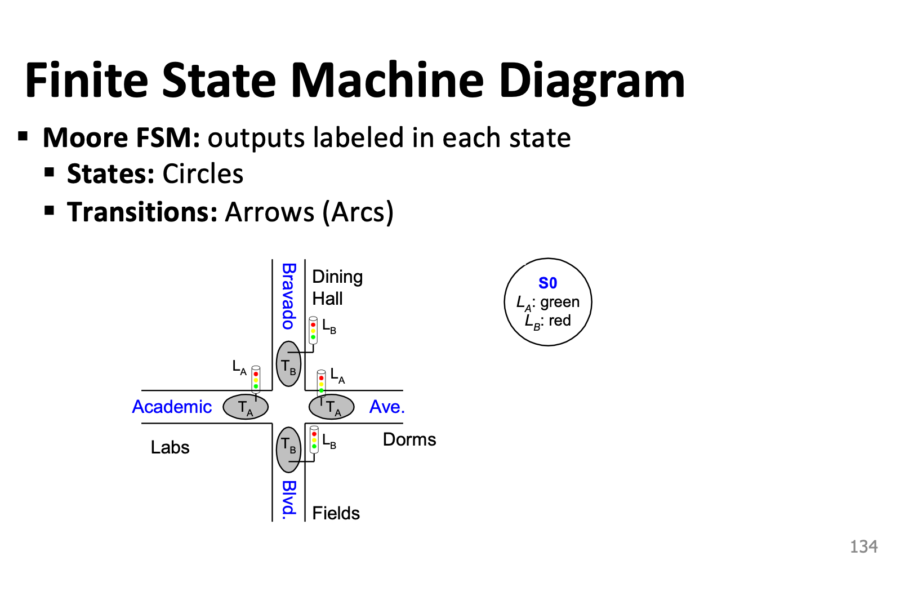

### 6.2 状态转移表(重建)

**符号表(P141):**

| 当前 S | TA | TB | 下一 S' |
|---|---|---|---|
| S0 | 0 | X | S1 |
| S0 | 1 | X | S0 |
| S1 | X | X | S2 |
| S2 | X | 0 | S3 |
| S2 | X | 1 | S2 |
| S3 | X | X | S0 |

**状态编码**:S0=00,S1=01,S2=10,S3=11。

**编码后转移表(P143):**

| S1 | S0 | TA | TB | S'1 | S'0 |
|---|---|---|---|---|---|
| 0 | 0 | 0 | X | 0 | 1 |
| 0 | 0 | 1 | X | 0 | 0 |
| 0 | 1 | X | X | 1 | 0 |
| 1 | 0 | X | 0 | 1 | 1 |
| 1 | 0 | X | 1 | 1 | 0 |
| 1 | 1 | X | X | 0 | 0 |

**Next state 方程(P148,化简):**
```
S'1 = S1 ⊕ S0
S'0 = (~S1 · ~S0 · ~TA) + (S1 · ~S0 · ~TB)
```

### 6.3 输出表(重建)

**输出编码**:green=00,yellow=01,red=10。

| S1 | S0 | LA1 | LA0 | LB1 | LB0 | 含义 |
|---|---|---|---|---|---|---|
| 0 | 0 | 0 | 0 | 1 | 0 | S0: LA绿 LB红 |
| 0 | 1 | 0 | 1 | 1 | 0 | S1: LA黄 LB红 |
| 1 | 0 | 1 | 0 | 0 | 0 | S2: LA红 LB绿 |
| 1 | 1 | 1 | 0 | 0 | 1 | S3: LA红 LB黄 |

**Output 方程(P155):**
```
LA1 = S1
LA0 = ~S1 · S0
LB1 = ~S1
LB0 = S1 · S0
```

### 6.4 完整电路原理图(Schematic)⭐
把上面三部分接起来:inputs → **next state logic** → **state register**(2 个 FF,S'1/S'0 → S1/S0,带 Reset)→ **output logic** → outputs。

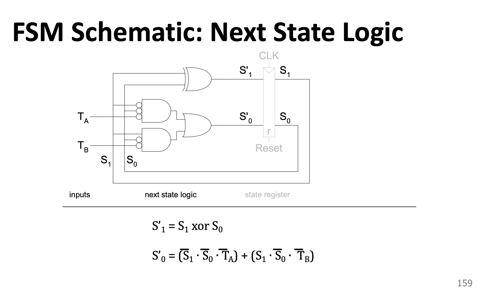

### 6.5 时序图(Timing Diagram)⭐
10 个 cycle,展示 CLK / Reset / TA / TB / S' / S / LA / LB 如何逐拍演化(注意 S' 领先 S 一拍,输出随 S 变)。这是把「状态图 + 表 + 电路」串起来验证的关键图,**极易考**。

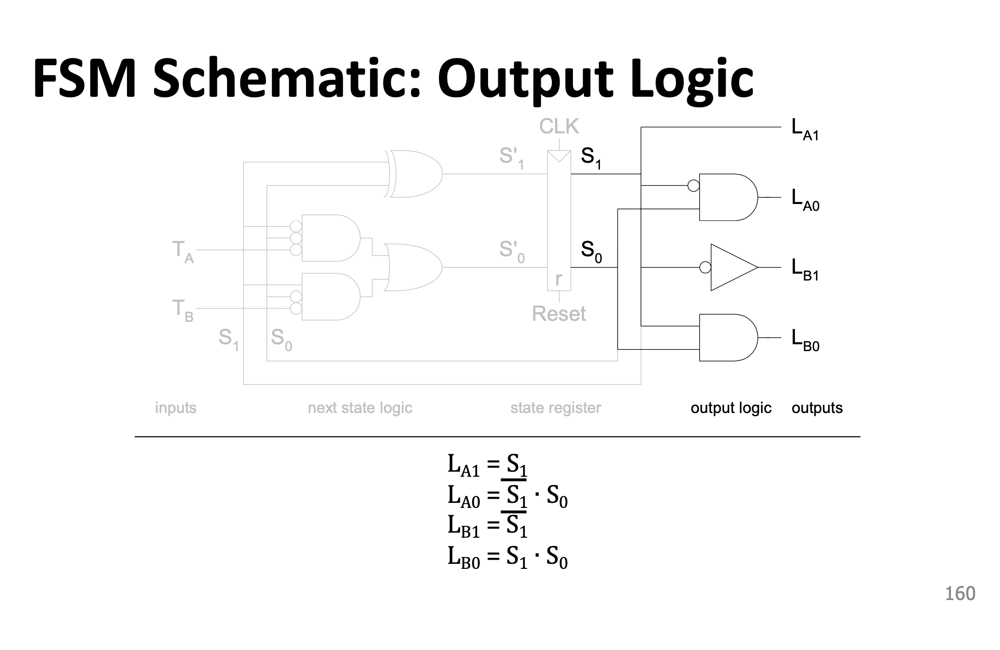

- **Synchronizer(同步器)**:确保像交通传感器这样的**异步输入**只在时钟沿被采样,避免亚稳态。

---

## 7. 状态编码(State Encoding)

| 方案 | 位数 | 特点 |
|---|---|---|
| **Binary / Full Encoding(二进制/全编码)** | log2(状态数) | **最少 FF**;但 next state / output 逻辑不一定最简。例:00,01,10 |
| **One-Hot Encoding(独热)** | = 状态数(恰好 1 位为 1) | **最多 FF**,但**next state 逻辑最简**、最易自动化综合。例:0001,0010,0100,1000 |

- **One-hot 的意义**:牺牲空间(更多寄存器位)换更简单更快的状态转移逻辑;**FPGA 里尤其常用**,因为逻辑结构更容易综合。
- 设计者需在给定约束下**权衡选择**编码方案。

---

## 8. 其它 FSM 主题

### 8.1 Divide-by-N Counter(分频计数器)
- 无输入、一输出 Y;Y 每 N 个时钟周期**高电平 1 个周期** → 把时钟频率**除以 N**(例中 N=3)。
- 可分别用 binary 和 one-hot 编码实现,对比两者的转移表/输出表/电路。

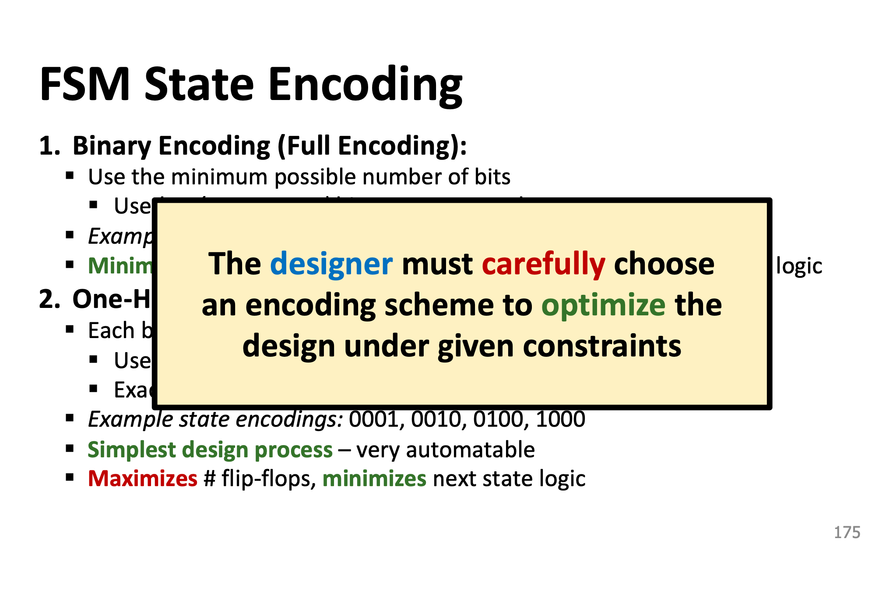

### 8.2 Moore vs Mealy 实例(蜗牛问题)
- Alyssa 的蜗牛爬过 0/1 纸带,**最后两位是 `01` 时微笑**。分别设计 Moore 与 Mealy FSM。
- **观察**:Mealy 输出**早一个周期**(响应输入而非等状态变);Mealy **状态更少**;Mealy 输出标在**箭头上**。

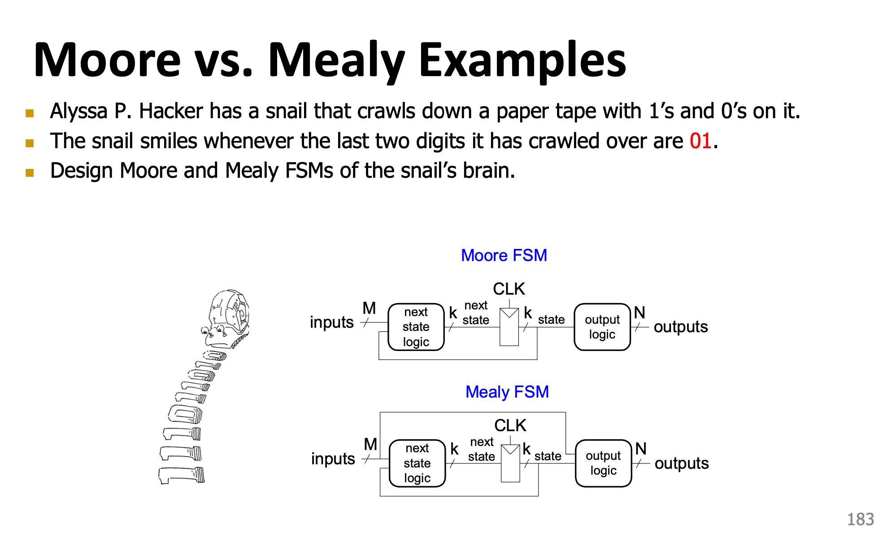

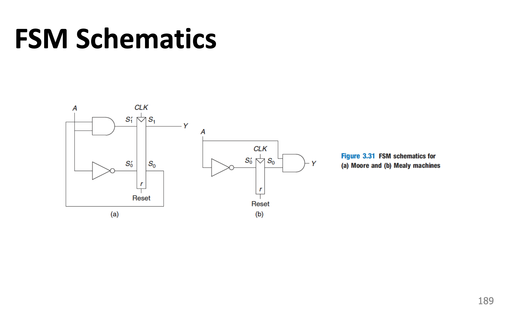

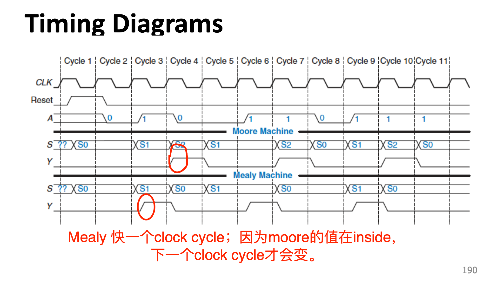

### 8.3 从电路反推 FSM(reverse engineering)
给定 FSM 电路图,倒推出 FSM 图。步骤:
1. 判断类型(看 output 是否依赖输入 → Moore/Mealy)。
2. 推 next state 与 output **方程**。
3. 由方程建**简化真值表**。
4. 猜二进制编码、给状态命名。
5. 用状态标签建**输出表**。
6. 画 FSM 图。

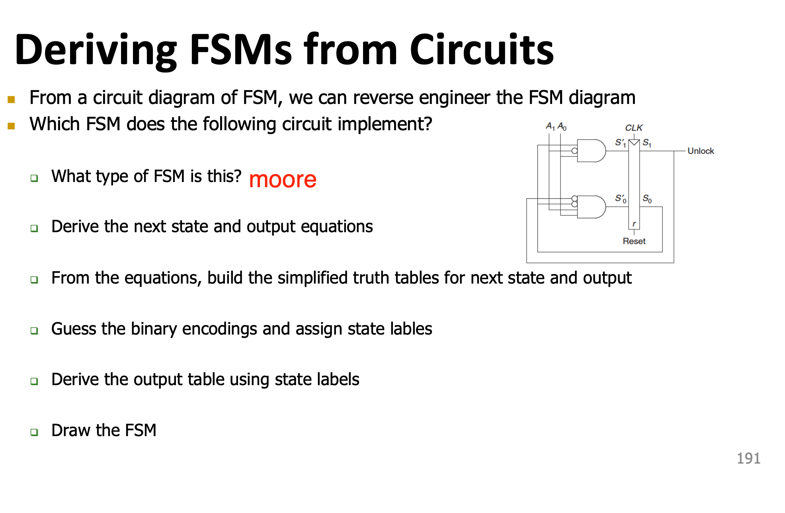

### 8.4 FSM 设计流程(正向,必记)
1. **画状态转移图**:把文字规格形式化、去歧义。(先定 reset 状态,再逐步加转移;**取好状态名很重要**。)
2. **推 next state 逻辑**:状态二进制编码 → 转移(真值)表 → 化简的 next state 方程。
3. **推 output 逻辑**:输出编码 → 输出表 → 方程。
4. **把方程变成逻辑门电路**(next state + output)。
> 提示:建 FSM 像编程(有 control-flow、if-then-else 由输入控制),但**它不是编程**;硬件里通常有很多并发 FSM。

---

## 9. 时序参数(Timing,H&H 3.5)

理解三个关键量(都因为「输出不会瞬间变、输入需保持稳定才能被可靠采样」):

| 参数 | 定义 |
|---|---|
| **t_pcq**(Clock-to-Q propagation delay) | 时钟上升后,输出**稳定到最终值**所需时间 |
| **t_setup**(Setup time) | 上升沿**之前**,输入必须已稳定的最短时间 |
| **t_hold**(Hold time) | 上升沿**之后**,输入必须继续稳定的最短时间 |
| **Aperture time** | = t_setup + t_hold,输入必须保持稳定的总时长 |

- **技术假设**:现代 FF 的 t_hold ≈ 0,后续讨论可忽略 hold time。
- **时钟周期(必记公式)**:
```
Tc = t_pcq + t_pd + t_setup
```
其中 t_pd = 组合电路(next state logic)的传播延迟。「要慢到这个程度电路才稳定」。
- **Sequencing overhead(时序开销)= t_pcq + t_setup**:理想情况整个周期都该做有用功(组合处理),但 FF 的时序开销会侵占这段时间。

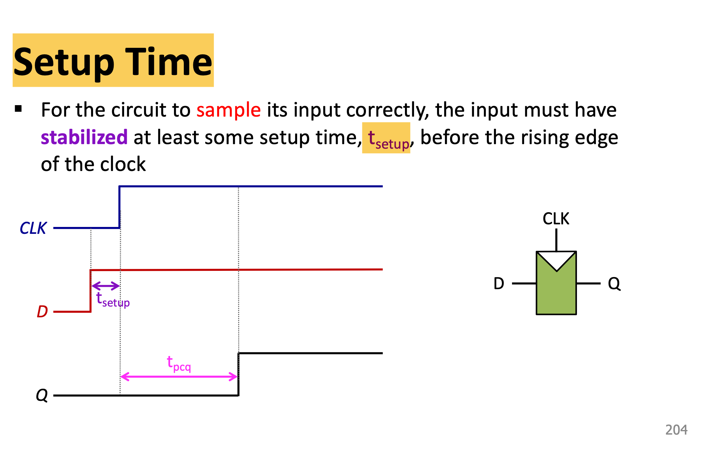

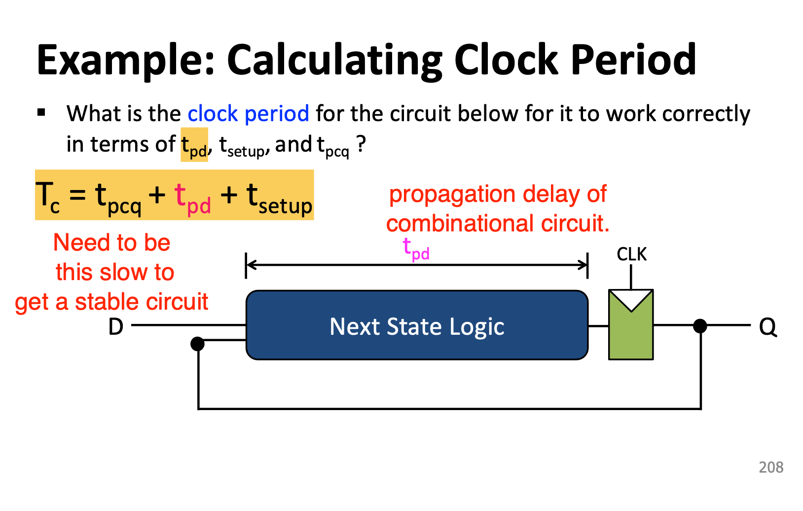

---

## 10. 存储元件:SRAM / DRAM(H&H 5.5)

### 10.1 动机与三级对比(必记)
FF/寄存器适合「边处理边存」,但有时只需**大量存储**(主存、U 盘、SSD、磁盘),可用更便宜、**异步存**的元件。

| 类型 | 速度 | 成本/bit | 关键特性 |
|---|---|---|---|
| Latch / Flip-Flop | 很快 | 很贵(~20+ 晶体管) | 用于 CPU 内寄存器 |
| **SRAM**(Static RAM) | 较快 | 贵(**6T**) | bit 存在 **cross-coupled inverter** 里;非破坏读 |
| **DRAM**(Dynamic RAM) | 慢 | 便宜(**1T1C**:1 晶体管 + 1 电容) | **读破坏性**,需 **refresh**;需特殊制程 |

### 10.2 通用存储组织
- **Bit cell**:存 1 bit。**Wordline** 选中(使能)整行;**Bitline** 用于读出/写入该 bit。
  - 叫 word line 是因为它寻址一整行的一个「word」——整行一起读写。
- **通用 memory 组织**:decoder 译地址 → 选 wordline;MUX(或 **tri-state buffer**)选输出 bitline。
- **Tri-state Buffer 复习**:E 高时导通、E 低时输出**浮空(floating / Z)**(不被任何电路驱动)。可用一对 tri-state buffer 让 bitline 既读又写。
- **读/写时序**:
  - **READ**:先拉 wordline,选中行把 bitline 驱动到 H/L。
  - **WRITE**:先把 bitline 驱动到 H/L,再拉 wordline,把值存进该行 cell。

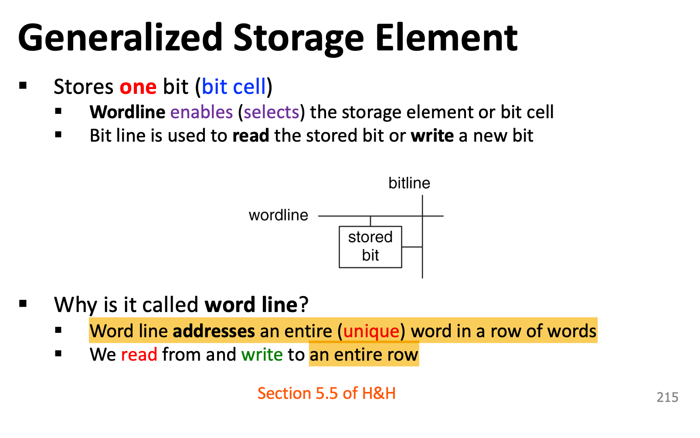

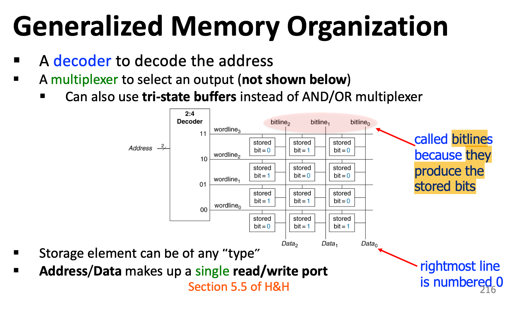

### 10.3 SRAM Bit Cell(6T)⭐
- 数据存在 **cross-coupled inverter**;两条输出:**bitline** 与 **~bitline**。
- **6T** = 交叉耦合反相器(4 个晶体管)+ 2 个 nMOS 接入管。
- wordline 拉高时,两个 nMOS 导通,数据在 cell 与 bitline 间传输。

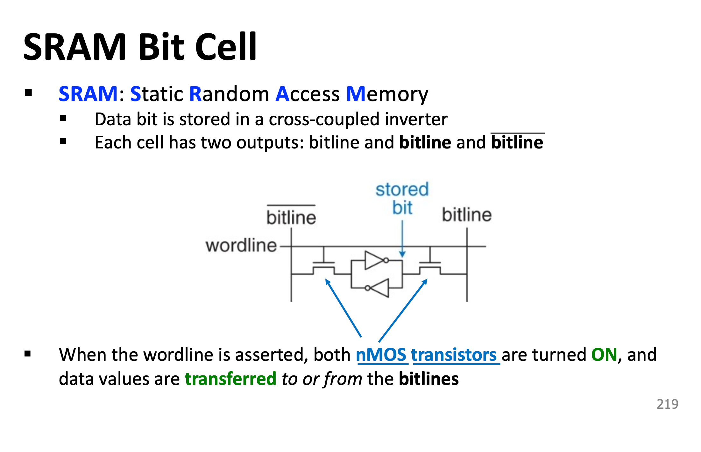

**MOS NOT 门复习(重建,P221):** 0V=逻辑0,3V=逻辑1,`Y = ~A`。

| A | P(pMOS) | N(nMOS) | Y |
|---|---|---|---|
| 0 | ON | OFF | 1 |
| 1 | OFF | ON | 0 |

### 10.4 DRAM Bit Cell(1T1C)⭐
- 以**电容上有无电荷**存 1 bit;nMOS 当开关,把电容接/断到 bitline。
- **Static vs Dynamic 的本质区别**:SRAM 的节点由接到电源的交叉耦合反相器**主动驱动**;DRAM 的电容节点**不被主动驱动** → 电荷会漏。
- **读**:电荷从电容转到 bitline → **破坏原值 → 读后必须重写(restore)**。
- **Refresh**:即使不读,也要**每隔几毫秒**读+重写一次(电荷渐漏)→ 额外能耗 + 昂贵电路,是 DRAM(尤其大容量)的关键缺点。这也是它叫「dynamic」的原因。
- **写**:值从 bitline 转到电容。

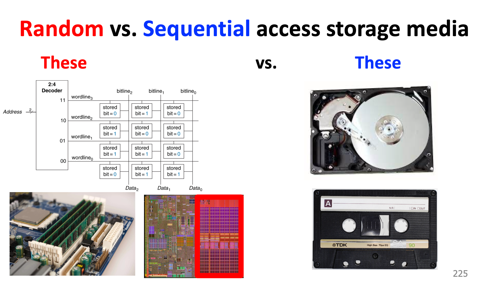

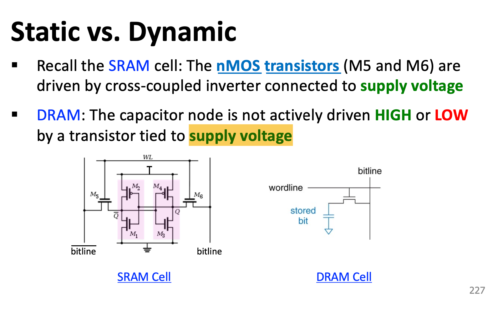

### 10.5 RAM、顺序访问介质与存储层次
- **RAM(Random Access Memory)**:byte-addressable;任一 data word 可**独立访问**,且**任意字访问延迟相同**。
- **顺序访问介质**(对比 RAM):
  - **磁带(cassette/tape)**:近处数据取得快,**必须从头倒带读取** → 天生顺序。
  - **硬盘(HDD)**:旋转盘片 + 磁臂;近处快,盘片需转到磁臂下才能读 → 天生顺序。
- **存储层次(Memory Hierarchy)**:
  - CPU 芯片**内**:flip-flop(寄存器)+ SRAM(cache)。
  - CPU 芯片**外**:DRAM(DIMM 内存条)。
  - **Volatile(易失,断电即失)**:SRAM、DRAM。**Non-volatile(非易失,断电仍在)**:如相册存照片的介质。

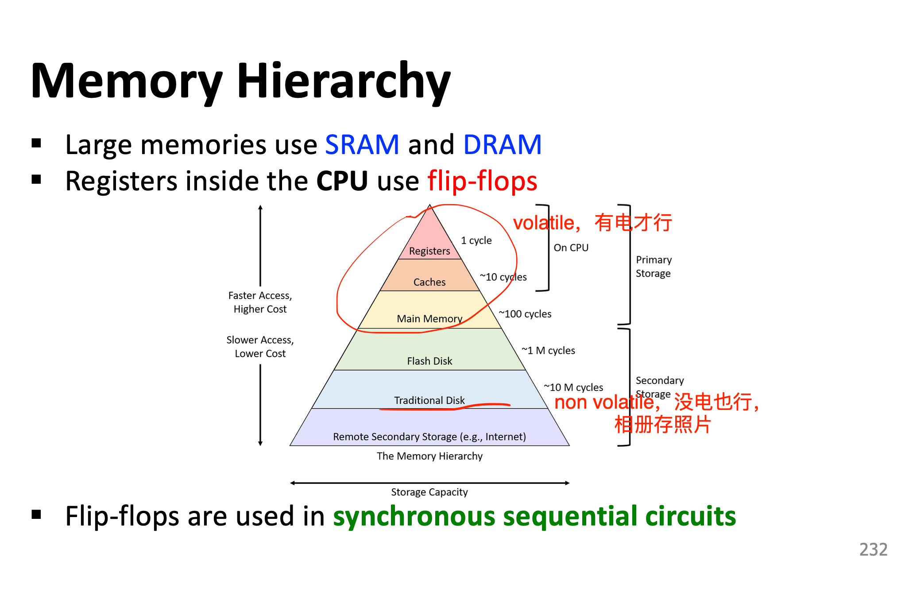

