# COMP2300 Set 4 笔记 — 架构层：Von Neumann 模型、ARM ISA 与单周期微架构

> **课程**：ANU COMP2300 — Computer Organisation and Program Execution
> **讲师**：Shoaib Akram
> **本 set 主题一句话**：从 Von Neumann 执行模型出发，讲清 **ISA 是什么**（ARM/QuAC 的指令、格式、寻址模式、条件执行、分支、C→汇编翻译），再讲清 **怎么用硬件实现它**（单周期数据通路 + 控制单元 + 关键路径性能分析）

---

## 0. 本 set 的骨架

```
Von Neumann 模型 (5 个部件)
   ↓
ISA = 指令集 + 架构状态
   ↓  (ARM / QuAC / MIPS / LC-3 对照)
指令周期 (FETCH → ... → STORE RESULT)
   ↓
ARM 汇编：DP 指令 / 访存指令 / 条件执行 / 分支 / C 三大结构 / 数组 / 移位 / 字符
   ↓
ISA 权衡 (RISC vs CISC, 语义鸿沟, 寻址模式)
   ↓
微架构：单周期数据通路 + 控制单元
   ↓
性能分析：Execution time = N × CPI × Tc
```

---

## 1. Von Neumann 模型

### 1.1 五大部件（1946，Burks/Goldstine/von Neumann）

| 部件 | 职责 | 关键寄存器 |
|---|---|---|
| **Memory** | 存**程序 + 数据**（统一，不分家） | MAR、MDR |
| **Processing Unit** | 实际计算 | ALU + 寄存器堆（TEMP） |
| **Control Unit** | 控制指令执行顺序 | **PC**（=IP）、**IR** |
| **Input** | 键盘、鼠标、磁盘… | KBDR、KBSR |
| **Output** | 显示器、打印机、磁盘… | DDR、DSR |

> 今天所有通用计算机都用这个模型。

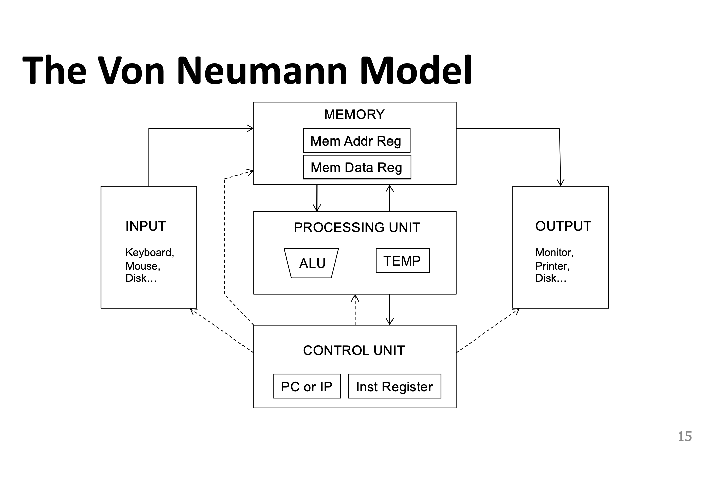

### 1.2 两大关键性质 ⭐ 必考

1. **Stored program（存储程序）**
   - 指令存在**线性内存数组**里
   - **指令和数据共用同一内存**（unified）
   - **一个存储值到底是指令还是数据，取决于控制信号**——这是重点，不是靠内存里"标记"出来的
2. **Sequential instruction processing（顺序指令处理）**
   - 一次处理一条指令（fetch → execute → complete）
   - PC 标识当前/下一条指令
   - PC 顺序推进，**除非遇到控制转移指令**

（P56 与 P131 是同一张，重复强调。）

---

## 2. ISA vs. 微架构 ⭐ 核心概念区分

这是本 set 最容易考的概念题。

| | **ISA（Architecture）** | **微架构（Microarchitecture）** |
|---|---|---|
| 是什么 | **规范 / 接口** | **实现**（组织 + 硬件） |
| 类比 | 油门踏板 = "加速"的接口 | 引擎内部 = 怎么实现"加速" |
| 包含 | 指令及其二进制编码、每条指令的**语义**、字长、寄存器个数、内存可寻址性 | 行波进位 vs 超前进位加法器；mux vs 三态缓冲；SOP vs 最简布尔式；只用 NAND vs AND/OR/NOT |
| 关系 | **一个 ISA → 多个微架构** | 变化快 |
| 变化速度 | 一次性设计 + 增量改动；全世界只有少数几个 ISA | 每代都换 |

**关键洞见**：ISA 的设计会决定微架构层的电路是简单还是复杂。

**谁需要知道 ISA？**
- 程序员（把意图传给硬件）
- 计算机架构师（造电路执行这些指令）
- **编译器作者**——ISA 规定了要把 C/C++/Rust 翻译成机器码所需知道的**一切**

### 2.1 ANU 会遇到的 4 个 ISA

| ISA | 定位 | 字长 | 寄存器 | 用在哪 |
|---|---|---|---|---|
| **QuAC** | ANU 自研教学 ISA | 16 bit | 8 个 GPR（一个未定义） | tutorial + Assignment 1 |
| **MIPS** | 开山 RISC（John Hennessy） | 32 bit | 32 个 GPR（5-bit 编号） | 只讲广度 |
| **ARM** | 主流 RISC（Advanced RISC Machines），手持设备事实标准 | ARMv4: 32 bit（v8: 64） | 16 个 GPR R0–R15（4-bit 编号） | 讲课主线 + Assignment 2 |
| **LC-3** | Little Computer 3，教学 ISA | 16 bit | 8 个 GPR | 指令周期示例 |

### 2.2 ISA 到底规定了什么 ⭐

**ISA = 指令集 + 架构状态**

- **指令集**
  - Opcodes（操作码：做什么）
  - Operands（操作数：对谁做）
  - **Data types**（数据类型，如 2's complement、bit vector）
  - **Addressing modes**（寻址模式 = 算出操作数的公式）
  - **Instruction formats**（指令格式）
- **架构状态（Architectural State / 程序员可见状态）**
  - **Memory**
  - **Register set**
  - **Program Counter**

> **元要点**：架构状态是 ISA 规范的一部分。程序员能通过写机器码操纵的，就是这三样。

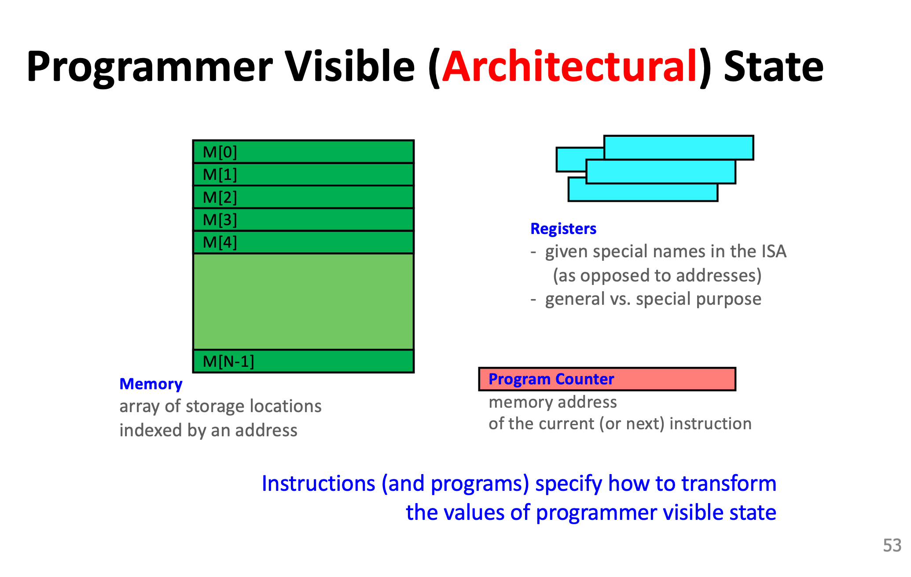

---

## 3. 内存组织

### 3.1 地址空间 vs 可寻址性 ⭐ 必分清

| 术语 | 定义 | 例子 |
|---|---|---|
| **Address space（地址空间）** | 可唯一标识的**位置总数** | MIPS: 2³²；ARM: 2³² 或 2⁴⁸；x86-64: 最多 2⁴⁸ |
| **Addressability（可寻址性）** | **每个地址存多少 bit** | byte-addressable（8 bit）、word-addressable |

- **Word-addressable**：每个 data word 一个唯一地址。QuAC 是 word-addressable（16-bit word）
- **Byte-addressable**：每个字节一个唯一地址。**MIPS、ARM 都是 byte-addressable**
- 同样大小的内存改成 bit-addressable：8 位置 × 8 bit → 64 个位置，每个存 1 bit

### 3.2 大小端 Big/Little Endian

- 典故：Gulliver's Travels，从鸡蛋大头 / 小头敲开
- **区别只在一个 word 内部 4 个字节的编号顺序**，字（word）的地址不变
- **Does it matter? 答案：不，这只是约定** —— 除非跨机器交换数据 / 强转指针类型时

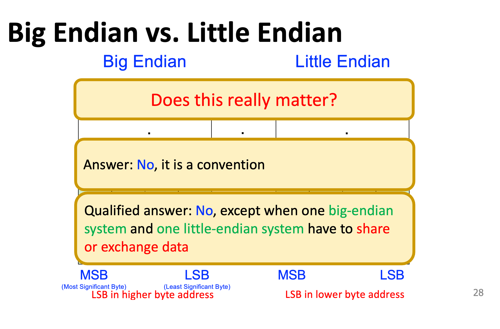

### 3.3 MAR / MDR — 访存的两个寄存器 ⭐

| | 步骤 1 | 步骤 2 |
|---|---|---|
| **读（load）** | MAR ← 要读的地址 | 内存把该地址的数据放进 **MDR** |
| **写（store）** | MAR ← 地址，MDR ← 数据 | 拉高 **Write Enable** → MDR 的值写入 MAR 指定地址 |

> **口诀（P175 原话）**："有括号就是地址"。`[R1]` → R1 是**指针**；`[PC]` → 取指令。
> 同一块内存既存指令又存数据，区别只在于**谁在用它**。

---

## 4. 处理单元与寄存器堆

- ALU 处理的量叫 **word**。ARMv4 = 32 bit，MIPS = 32 bit，**QuAC = 16 bit**
- 为什么要寄存器？算 `((A+B)*C)/D` 时中间结果如果每次都写内存再读回来，**一次访存远慢于一次加法/乘法**
- **Register File（寄存器堆）**：可被指令操纵的一组寄存器
  - ARM：**16 个 GPR，R0–R15**，4-bit 编号，寄存器宽度 = 字长 = 32 bit
    - **R0–R12 存变量；R13–R15 有特殊用途**
  - MIPS：32 个 GPR，5-bit 编号
  - QuAC：8 个 GPR
- 寄存器的**名字和二进制编号由 ISA 规定；用 SRAM 还是触发器实现是微架构的事**

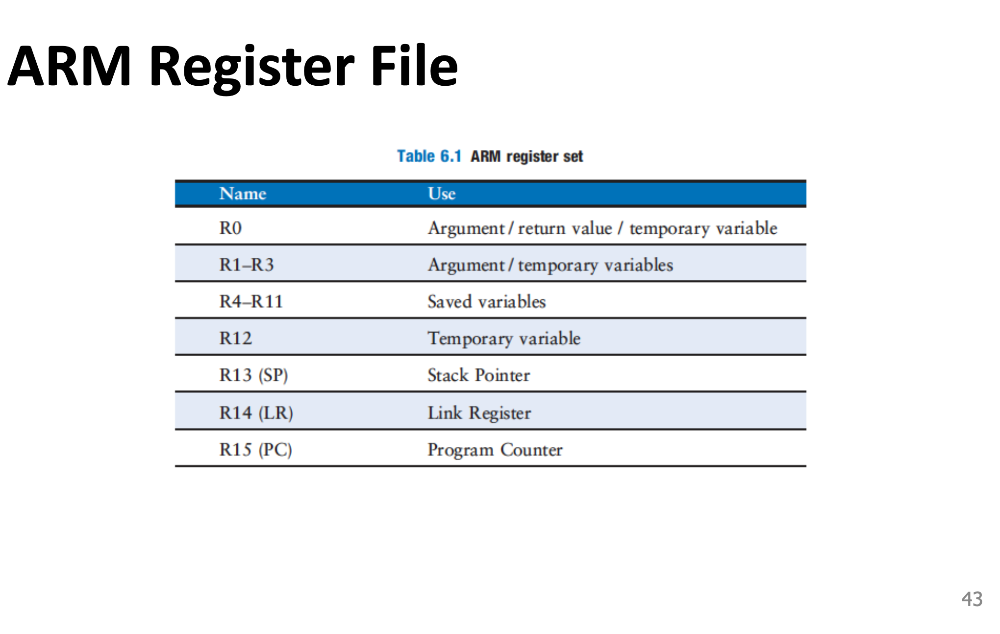

MIPS 寄存器约定（不需要截图，已重建）：

| Name | Number | Usage |
|---|---|---|
| `$0` | 0 | 常数 0 |
| `$at` | 1 | 汇编器临时 |
| `$v0-$v1` | 2–3 | 函数返回值 |
| `$a0-$a3` | 4–7 | 函数参数 |
| `$t0-$t7` | 8–15 | 临时变量 |
| `$s0-$s7` | 16–23 | saved 变量 |
| `$t8-$t9` | 24–25 | 临时变量 |
| `$k0-$k1` | 26–27 | OS 临时 |
| `$gp` | 28 | global pointer |
| `$sp` | 29 | stack pointer |
| `$fp` | 30 | frame pointer |
| `$ra` | 31 | 返回地址 |

---

## 5. 指令基础

### 5.1 三大指令类型 ⭐（贯穿全 set，P78 / P134 / P331 反复出现）

1. **Operate（Data Processing）指令** —— 在 ALU 里做运算
2. **Data movement（Memory）指令** —— 读写内存
3. **Control flow（Branch/Jump）指令** —— 改变执行顺序（做决策）

### 5.2 指令 = Opcode + Operands

- **Opcode**：做什么
- **Operands**：对谁做
- 二者的排布 = **instruction format / encoding**

| ISA | 指令宽度 | Opcode 位置 | 最多几个 opcode |
|---|---|---|---|
| MIPS | 32 bit | `[31:26]` | 64 |
| QuAC | 16 bit | `[15:12]` | 16 |
| **ARM** | 32 bit | **`[27:26]`** | **4** |

> **ARM 只有 2 bit opcode（4 类）** 这点很反直觉，容易考。具体是哪条指令由 `cmd`/`funct` 字段再细分。

### 5.3 从汇编到机器码

- **Compiler**：高级语言 → 汇编（人可读）
- **Assembler**：汇编 → 机器码（0/1）

ARM `ADD R0, R1, R2` 的编码推导（必须会手推）：

| 31:28 | 27:26 | 25 | 24:21 | 20 | 19:16 | 15:12 | 11:0 |
|---|---|---|---|---|---|---|---|
| cond | op | I | cmd | S | Rn | Rd | Src2 |
| 1110 | 00 | 0 | 0100 | 1 | 0001 | 0000 | 000000000010 |

→ `0xE0910002`（幻灯片 P83 写作 `0x E 0 9 1 0 0 0 1`，注意最后一位应为 2 = R2；**幻灯片这里疑似笔误**，自己按字段重算一遍。）

QuAC `add r0, r1, r2` → 字段 `8 | 0 | 0 | 1 | 2` → `1000 0 0 000 001 0 010` → **`0x8012`**

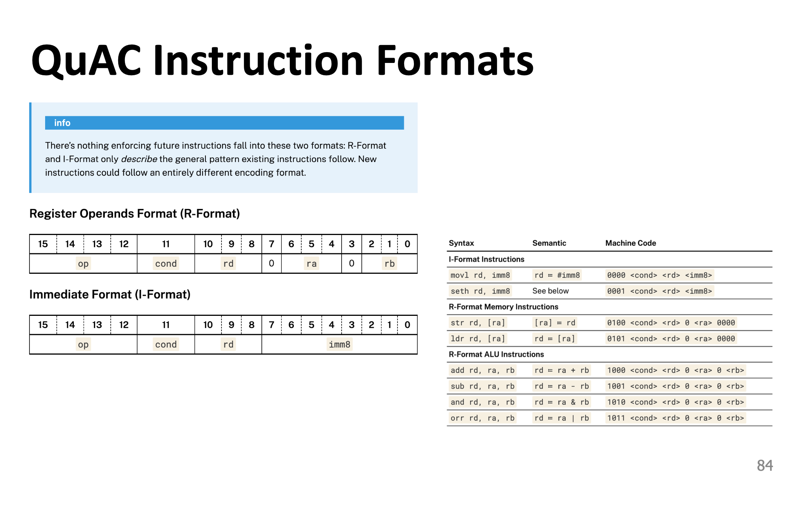

---

## 6. ARM 指令格式（三大格式，必背）⭐⭐

### 格式 1：Data Processing (DP)

```
 31:28   27:26   25   24:21   20   19:16   15:12        11:0
| cond  |  op  | I  |  cmd  | S  |  Rn   |  Rd   |     Src2     |
| cond  |  00  |         funct         |  Rd   |     Src2     |
```

字段含义：

| 字段 | 位 | 含义 |
|---|---|---|
| `cond` | 31:28 | 条件执行（**1110 = 无条件 AL**） |
| `op` | 27:26 | **00 = data processing** |
| `funct` | 25:20 | = `I` + `cmd` + `S` |
| `I` | 25 | **0 → Src2 是寄存器；1 → Src2 是立即数** |
| `cmd` | 24:21 | 具体哪条 DP 指令（**0100 = ADD，0010 = SUB，1101 = 移位类**） |
| `S` | 20 | 1 = 该指令设置条件标志 |
| `Rn` | 19:16 | 第一源操作数寄存器 |
| `Rd` | 15:12 | 目的寄存器 |
| `Src2` | 11:0 | 第二源（寄存器或无符号立即数） |

两个变体：

```
DP-Immediate:  cond | 00 | 1 | cmd | S | Rn | Rd | 0000 |  imm8
DP-Register:   cond | 00 | 0 | cmd | S | Rn | Rd | 00000000 |  Rm
```

### 格式 2：Memory

```
 31:28   27:26      25:20       19:16   15:12    11:0
| cond  |  01  | I P U B W L  |  Rn   |  Rd   | imm12 |
```

- `op = 01`
- `Rn` = 基址寄存器
- `Rd` = 目的（LDR）/ 源（STR）
- `Src2` = offset（立即数 / 寄存器 / 移位寄存器）
- **`I`(bit25) = Src2 编码方式；`L`(bit20) = 1 → LDR，0 → STR**

具体：
```
LDR Rd, [Rn, #imm12]:   cond | 01 | 1 1 1 0 0 1 | Rn | Rd | imm12
STR Rd, [Rn, #imm12]:   cond | 01 | 1 1 1 0 0 0 | Rn | Rd | imm12
                                              ↑ L
```

### 格式 3：Branch

```
 31:28   27:26   25:24        23:0
| cond  |  10  |  1 L  |     imm24     |
```

- `op = 10`，bit25 恒为 1
- **`L` = 0 → B（分支）；`L` = 1 → BL（Branch and Link，支持函数调用）**
- `imm24` = **24-bit 有符号立即数**

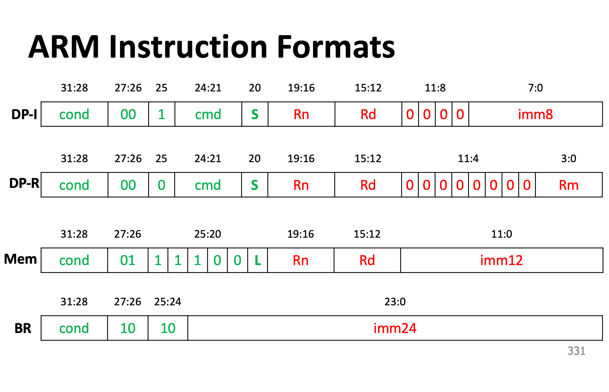

---

## 7. Data Processing 指令

### 7.1 基本用法

```arm
; a = b + c – d，映射 R0=a, R1=b, R2=c, R3=d, R4=t
ADD R4, R1, R2
SUB R0, R4, R3
```
- `R1, R2` = 源操作数，`R4` = 目的操作数
- 寄存器映射由人或**编译器**决定

### 7.2 四大设计原则 ⭐ 必背

| # | 原则 | 含义 |
|---|---|---|
| **1** | **Regularity leads to simpler hardware**（规整→硬件简单） | 固定 2 源 1 目的，更好编码、更好实现。QuAC 同理 |
| **2** | **Smaller is Faster**（小即是快） | 小寄存器堆读起来比大的快 |
| **3** | **Good design demands good compromises**（好设计需要好折中） | 为了编码立即数必须放弃 R 格式、引入新格式 |
| **4** | **Make the common case fast**（让常见情况快） | ARM 只保留简单、常用指令；指令数少 → 译码硬件简单小快；复杂操作用多条简单指令拼 |

### 7.3 立即数

- 事实：**程序里 98% 的常数能塞进 13 bit**
- 优点：**无需访存/访寄存器，值直接在指令里**
- 缺点：**编码位数有限，立即数只有 8–12 bit**

```arm
ADD R7, R7, #4      ; a = a + 4
SUB R8, R7, #0xC    ; b = a - 12
MOV R4, #0          ; i = 0
MOV R5, #0xFF0      ; x = 4080
MOV R1, R7          ; MOV 也可以取寄存器源
```

### 7.4 更多 DP 指令

`AND` / `ORR`(OR) / `EOR`(XOR) / `BIC`(Bit Clear) / `MVN`(MoVe and Not)

**BIC 掩码要点** ⭐：
```arm
BIC R6, R1, R2      ; R6 = R1 AND (NOT R2)
```
- R2 是**掩码**：**想在 R1 中清零的位，在 R2 里置 1**
- 用途：位掩码、强制不要的位归零

### 7.5 RISC vs. CISC ⭐

| | **RISC** | **CISC** |
|---|---|---|
| 全称 | Reduced Instruction Set Computer | Complex Instruction Set Computer |
| 指令 | 少而简单 | 多而复杂 |
| 硬件 | 复杂度低 → **高时钟频率、省电** | 复杂 → **关键路径长、频率低** |
| 代码 | 解决同一问题**需要更多指令** | 每条指令做得多 → **指令数少** |
| 例子 | **ARM、MIPS、QuAC、RISC-V** | **Intel x86** |

**QuAC 为什么是 RISC**：定宽指令（译码简单）、opcode 少、只有两种格式且跨格式规整（`rd` 恒在 `Instr[10:8]`、opcode 恒在同一位置）、GPR 少、ISA 里给常数留了空间、易转十六进制、**只能通过专用指令访存**（load-store 架构）。唯一"有点复杂"的是 `seth`。
**QuAC 的条件分支 = 条件执行 + 通用 PC**（没有专门的 branch 指令，靠把 PC 当普通寄存器写）。

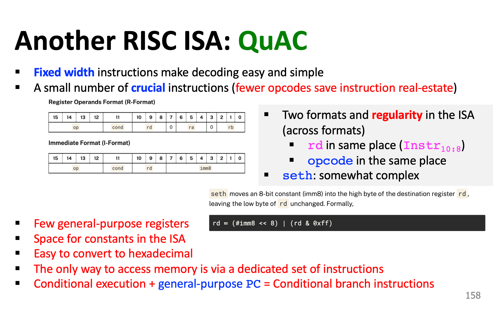

---

## 8. Data Movement 指令（LDR / STR）

### 8.1 为什么需要

寄存器堆装不下真实程序的数据 → 大部分数据住在**慢速内存**里，用时搬进寄存器，不用时搬回去腾寄存器。

- **LDR** = LoaD Register：内存 → 寄存器堆
- **STR** = STore Register：寄存器堆 → 内存

### 8.2 base + offset 寻址 ⭐

```arm
LDR R0, [R1, #12]     ; R0 ← Memory[R1 + 12]    R1=基址(源), R0=目的
STR R0, [R1, #12]     ; Memory[R1 + 12] ← R0    R0 和 R1 都是源，目的是内存地址
```

跨 ISA 对照（`a = A[2]`，A 的基址在基址寄存器里）：

| ISA | 汇编 | 语义 | 为什么是这个 offset |
|---|---|---|---|
| ARM | `LDR R3, [R0, #8]` | R3 ← Mem[R0+8] | byte-addressable，4 bytes/word → 2×4 = 8 |
| MIPS | `lw $s3, 8($s0)` | $s3 ← Mem[$s0+8] | 同上 |
| LC-3 | `LDR R3, [R0, #2]` | R3 ← Mem[R0+2] | **word-addressable**，直接用字号 |

> **换算公式**：`byte address = word_address × (bytes/word)`。ARM/MIPS 是 4；假如 QuAC 是 byte-addressable 就是 2。

### 8.3 LDR / STR 例题（必练）

```arm
; 读地址 8 的 32-bit word 到 R3，用 R2 做基址
MOV R2, #0
LDR R3, [R2, #8]     ; R3 = 0x01EE2842  （Word 2 的内容）

; 把 R7 存到 memory word 21
MOV R5, #0
STR R7, [R5, #0x54]  ; 21 × 4 = 84 = 0x54
```

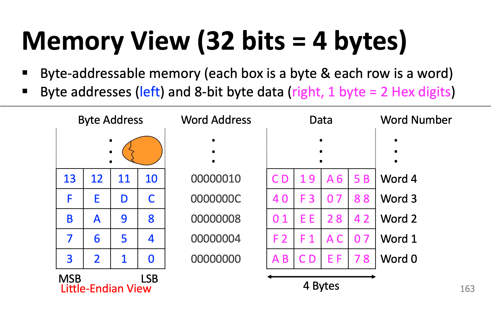

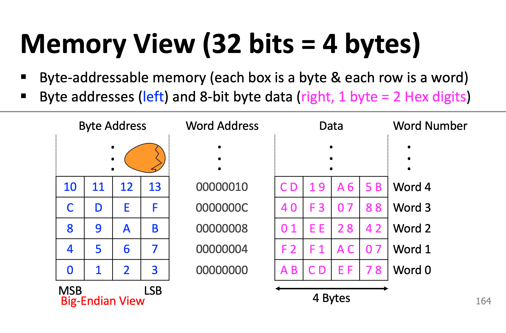

### 8.4 32 位机的两个事实

- 地址总线宽 32 bit → 地址空间 2³² 个位置
- **虽然内存是 byte-addressable，一次 LDR 仍然返回 32-bit 的整字**去填满寄存器

---

## 9. 条件执行（Conditional Execution）⭐⭐ ARM 特色

### 9.1 两步走

1. **某条指令设置条件标志**（N, Z, C, V），它们存在 **CPSR**（Current Program Status Register）里
2. **后续指令根据标志的状态决定是否执行**

### 9.2 设置标志的两种方法

| 方法 | 写法 | 说明 |
|---|---|---|
| **1. CMP** | `CMP R5, R6` | 计算 **R5 − R6**，**不保存结果**，只设标志 |
| **2. 加 S 后缀** | `ADDS R1, R2, R3` | 正常做加法并**保存结果到 R1**，同时设标志 |

标志含义：

| 标志 | 置 1 的条件 |
|---|---|
| **Z** | 结果为 0 |
| **N** | 结果为负 |
| **C** | 产生进位（carry out） |
| **V** | 产生**有符号溢出** |

### 9.3 条件助记符表（P182 内容，已重建）

| cond | 助记符 | 含义 | 条件表达式 |
|---|---|---|---|
| 0000 | **EQ** | Equal | Z |
| 0001 | **NE** | Not equal | Z̄ |
| 0010 | CS / **HS** | Carry set / unsigned higher or same | C |
| 0011 | CC / **LO** | Carry clear / unsigned lower | C̄ |
| 0100 | **MI** | Minus / negative | N |
| 0101 | **PL** | Plus / positive or zero | N̄ |
| 0110 | **VS** | Overflow set | V |
| 0111 | **VC** | Overflow clear | V̄ |
| 1000 | **HI** | Unsigned higher | Z̄ · C |
| 1001 | **LS** | Unsigned lower or same | Z + C̄ |
| 1010 | **GE** | Signed ≥ | (N ⊕ V)′ |
| 1011 | **LT** | Signed < | N ⊕ V |
| 1100 | **GT** | Signed > | Z̄ · (N ⊕ V)′ |
| 1101 | **LE** | Signed ≤ | Z + (N ⊕ V) |
| 1110 | **AL**（或省略） | Always / 无条件 | 忽略标志 |

> **易错点**：**HS/LO/HI/LS = 无符号比较（看 C、Z）；GE/LT/GT/LE = 有符号比较（看 N、V）**。写 `BGT` 还是 `BHI` 取决于数据是不是有符号。

### 9.4 例题 1（P184）

```arm
; R5 = 17, R9 = 23
CMP   R5, R9        ; 17 - 23 = -6
SUBEQ R1, R2, R3
ORRMI R4, R0, R9
```
- 标志：**N=1, Z=0, C=0, V=0**（借位 → C=0）
- `SUBEQ`：Z=0 → **不执行**
- `ORRMI`：N=1 → **执行**

### 9.5 例题 2（P185，课本 307–308 页）

```arm
; R2 = 0x80000000, R3 = 0x00000001
CMP   R2, R3        ; 0x80000000 - 1 = 0x7FFFFFFF
ADDEQ R4, R5, #78
ANDHS R7, R8, R9
ORRMI R10, R11, R12
EORLT R12, R7, R10
```
- 标志：**N=0, Z=0, C=1, V=1**（负数减正数得正数 → 有符号溢出）
- `ADDEQ`：Z=0 → 不执行
- `ANDHS`：C=1 → **执行**
- `ORRMI`：N=0 → 不执行
- `EORLT`：LT = N⊕V = 0⊕1 = 1 → **执行**

> **这两题是考题原型**，务必自己算一遍 NZCV。

### 9.6 flags 的作用范围（P222 手写批注，重要）

- CMP 设置的 flags **控制后面的条件跳转/条件执行指令，不只限于紧跟的那一条**
- **多条指令都能用**，只要中间没有被新的算术/逻辑指令覆盖
- **一旦 flags 被覆盖，CMP 的效果就失效**

### 9.7 QuAC 的条件执行

- **`Instr[11]` 是 cond 位**
- ALU 指令设置 flags
- `cond = TRUE` → **只有上一条 ALU 指令把 Z 置 TRUE 才执行本指令**，否则不执行
- **默认编码 cond = 0（执行）**：`add r1,r2,r3`（cond=FALSE）vs `addeq r1,r2,r3`（cond=TRUE）
- `eq` 和 Z 的关系：两个寄存器相等 ⟺ 它们的差为 0 ⟺ Z=1

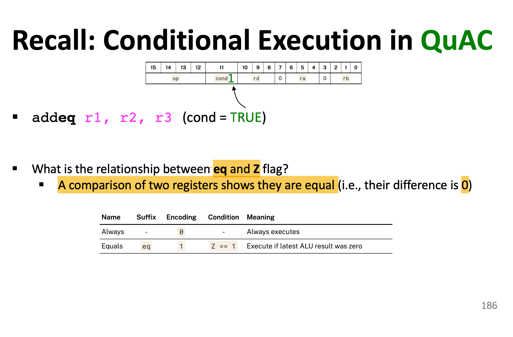

---

## 10. 分支指令与 PC

### 10.1 PC 的顺序推进规则 ⭐

| ISA 配置 | PC 更新 |
|---|---|
| **32-bit ISA + byte-addressable** | **PC = PC + 4** |
| 64-bit ISA + byte-addressable | PC = PC + 8 |
| 32-bit ISA + word-addressable | PC = PC + 1（QuAC） |

- **PC 在 FETCH 阶段递增**（准备好下一条）
- **Branch 在 EXECUTE 阶段用新地址覆盖 PC** → 抹掉 FETCH 时递增的那个值

### 10.2 分支类型

| 指令 | 说明 |
|---|---|
| **B** | 无条件分支：总是跳到 TARGET |
| **B\<cond\>**（如 BEQ/BNE） | 条件分支：跳 TARGET 或执行下一条顺序指令 |
| **BL** | Branch and Link：为 C/Java 的**函数调用**提供架构支持 |

```arm
; 无条件，总是 Taken
    ADD R1, R2, #17
    B   TARGET
    ORR R1, R1, R3      ; 被跳过
    AND R3, R1, #0xFF   ; 被跳过
TARGET
    SUB R1, R1, #78
```
```arm
; 条件，Not Taken
    MOV R0, #4
    ADD R1, R0, R0      ; R1 = 8
    CMP R0, R1          ; 4 - 8 ≠ 0 → Z = 0
    BEQ THERE           ; Z=0 → NOT TAKEN
    ORR R1, R1, R1      ; ← 实际执行这条
THERE
    ADD R1, R1, #78
```

**Symbolic Address（符号地址）**：`TARGET` 这类 label 是人可读的**内存地址代号**，由 **assembler** 翻译成真实地址。

### 10.3 BTA 计算 ⭐⭐ 必考公式

**BTA（Branch Target Address）= 分支被 taken 时下一条要执行的指令地址**

处理器三步算 BTA：
1. **`imm24` 左移 2 位**（word → byte）
2. **符号扩展**（把 `Instr[23]` 复制到 `Instr[31:24]`）
3. **加 PC + 8** ← **这个 +8 是 ARM 的坑，必背**

**例（P211）**：`imm24 = 3`，PC 指向 `0x80A0`
- 3 << 2 = 12（`0b1100`）
- 符号扩展后仍是 +12
- BTA = **PC + 8 + 12** = `0x80A0 + 8 + 12` = **`0x80B4`**

> 为什么是 +8 不是 +4？因为 ARM 的**读 R15 返回 PC + 8**（历史上三级流水线的产物）。这条在数据通路一节还会再出现。

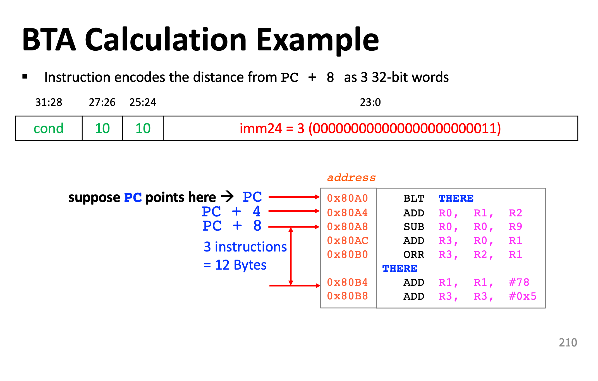

### 10.4 分支术语（P213）

| 术语 | 含义 |
|---|---|
| **Branch Target** | TARGET 指令的内存地址 |
| **Branch Condition** | 为真则跳转的条件 |
| **Branch Resolution/Evaluation** | 求解分支条件这个动作 |
| **Taken (T)** | 条件为 TRUE → 跳转 |
| **Untaken / Not Taken (NT)** | 条件为 FALSE → 顺序执行 |
| **Branch behavior** | Strongly/Weakly Taken/Untaken；Always Taken/Untaken |
| **Branch Prediction** | 高性能 CPU 里分支会阻碍有用工作 → 用分支预测器预测**方向(T/NT) 和目标** |

---

## 11. 指令周期（Instruction Cycle）⭐⭐

### 11.1 六个阶段

| # | 阶段 | 干什么 |
|---|---|---|
| 1 | **FETCH** | 从内存取指令进 IR。**所有指令都需要** |
| 2 | **DECODE** | 识别指令，**并生成后续阶段的控制信号** |
| 3 | **EVALUATE ADDRESS** | 算出访存地址（基址 + offset） |
| 4 | **FETCH OPERANDS** | 取源操作数 |
| 5 | **EXECUTE** | 在 ALU 里真正做运算 |
| 6 | **STORE RESULT** | 结果写回目的地。完成后→**新一轮 FETCH** |

**不是所有指令都需要全部六个阶段** ⭐：
- **LDR 不需要 EXECUTE**
- **ADD 不需要 EVALUATE ADDRESS**
- x86 的 `ADD [eax], edx` 是六个阶段全占的例子

### 11.2 FETCH 的三步（LC-3，必背）

1. **MAR ← PC，同时 PC 递增**
2. **访问内存 → 指令进入 MDR**
3. **IR ← MDR**

### 11.3 各阶段细节

- **DECODE**：LC-3 用 **4-to-16 译码器**识别 `IR[15:12]` 这 4 位 opcode（16 种）；剩下 12 位说明还需要什么
- **EVALUATE ADDRESS**：LDR 需要（寄存器 + 立即数）；ADD 不需要
- **FETCH OPERANDS**：
  - LDR：① MAR ← 上一步算出的地址 ② 读内存 → 源操作数进 MDR
  - ADD：从寄存器堆取。**某些微处理器可以在 DECODE 的同时读寄存器堆**（→ 后面五阶段划分的由来）
- **STORE RESULT**：ADD 把 ALUResult 写入 DR；LDR 把 MDR 写入 DR

### 11.4 Machine Cycle vs Instruction Cycle ⭐

- 每一步由控制单元指挥，**每步花一个 machine cycle**
- **一个 machine cycle = 一个 clock cycle**（这两个是一回事）
- **一个 instruction cycle 通常由多个 machine cycle 组成**（= 多周期机器）
- **若一个 instruction cycle 只用一个 machine cycle → 单周期计算机**
  - 单周期机器**更简单**（控制单元不是 FSM，纯组合逻辑）
- 1 GHz CPU → 每秒 10⁹ 个时钟周期 → 一个周期 1 ns

**Labs 4–6 + Assignment 1 造的是单周期 CPU**：整条指令（所有阶段）必须在一个周期内完成，**一个 clock cycle = 一个 machine cycle = 一个 instruction cycle**。

### 11.5 需要记住的告诫（P129）

- 不是所有指令都需要所有阶段
- **阶段的顺序不是铁律**
- **有些阶段可以合并成一个**
- 换个微架构，某些结构可能根本不需要
- **"微架构风格"决定很多细节**

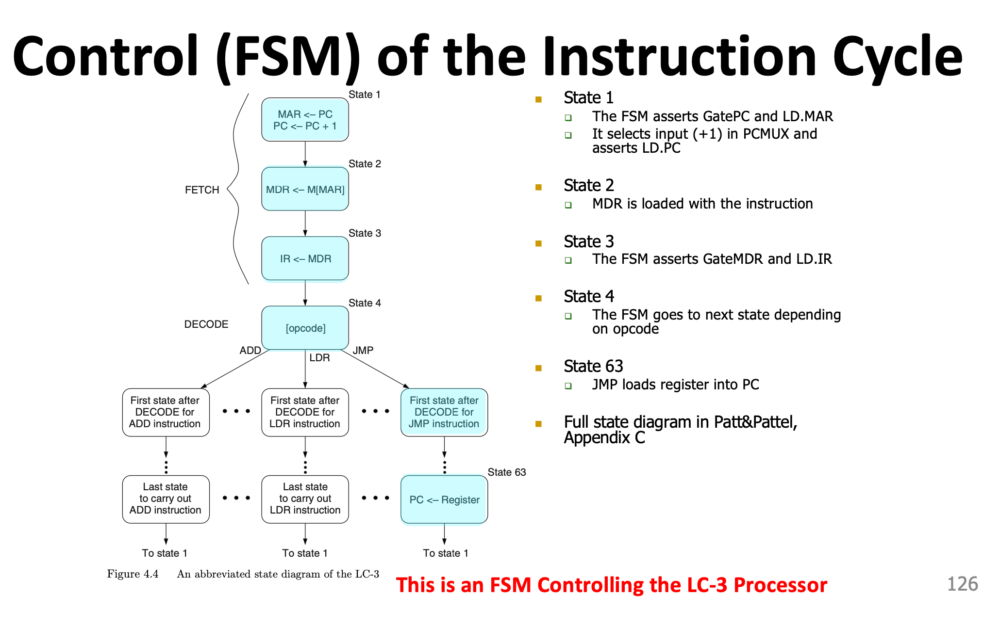

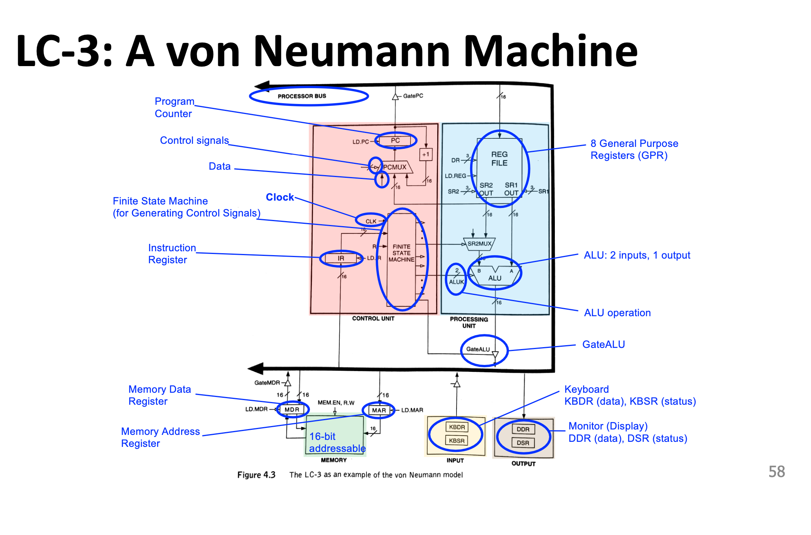

---

## 12. C 三大程序结构 → ARM 汇编 ⭐⭐

### 12.1 三大结构

1. **Sequential**：一个子任务接一个，不回头
2. **Conditional**：二选一
3. **Iterative**：重复做某个子任务

### 12.2 if 语句

**核心技巧：汇编里检查的是 C 条件的"相反条件"，条件为假时跳过 if 块。**

```c
if (apples == oranges)
    f = i + 1;
f = f - i;
```
```arm
; R0=apples, R1=oranges, R2=f, R3=i
    CMP R0, R1
    BNE L1            ; ← 检查相反条件！不等就跳过 if 块
    ADD R2, R3, #1
L1
    SUB R2, R2, R3
```

**版本 2（用 BEQ，更忠实地翻译，但多一条指令）**：
```arm
    CMP R0, R1
    BEQ L1
    B   L2
L1
    ADD R2, R3, #1
L2
    SUB R2, R2, R3
```

**版本 3（条件执行，最短最快）**：
```arm
    CMP   R0, R1
    ADDEQ R2, R3, #1
    SUB   R2, R2, R3
```

### 12.3 if-else

```c
if (apples == oranges) f = i + 1;
else                   f = f - i;
```
```arm
    CMP R0, R1
    BNE L1
    ADD R2, R3, #1
    B   L2            ; ← 无条件分支，跳过 else 块
L1
    SUB R2, R2, R3
L2
```

**条件执行版**：
```arm
    CMP   R0, R1
    ADDEQ R2, R3, #1
    SUBNE R2, R2, R3
```

### 12.4 条件执行 vs 分支的权衡 ⭐ 考点

**条件执行的优点**：更短、更快（少一条指令）。
**条件执行的缺点**：
- **if 块很长时，逐条写条件助记符很烦**
- **条件执行仍然要把那些不执行的指令从内存取出来**（needless fetching）——白白花掉取指带宽

### 12.5 switch-case

```c
switch (button) {
   case 1: atm = 20;  break;
   case 2: atm = 50;  break;
   case 3: atm = 100; break;
   default: atm = 0;  break;
}
```
```arm
; R0 = button, R1 = atm      （汇编注释以 ; 开头）
    CMP   R0, #1
    MOVEQ R1, #20
    BEQ   DONE
    CMP   R0, #2
    MOVEQ R1, #50
    BEQ   DONE
    CMP   R0, #3
    MOVEQ R1, #100
    BEQ   DONE
    MOV   R1, #0        ; default
DONE
```
→ `break` 就是 `BEQ DONE`，是**一连串 CMP + 条件 MOV + 条件跳出**。

---

## 13. 循环

### 13.1 for 循环三要素

```c
for (i = 0; i < 10; i = i + 1)   // ① 初始化 ② 终止条件 ③ 推进
    sum = sum + i;
```

### 13.2 标准翻译（风格 1）

```arm
; R0 = i, R1 = sum
    MOV R0, #0        ; i = 0
    MOV R1, #0        ; sum = 0
FOR
    CMP R0, #10       ; i < 10 ?
    BGE DONE          ; i >= 10 → 退出
    ADD R1, R1, R0    ; sum += i
    ADD R0, R0, #1    ; i++
    B   FOR
DONE
```
**每轮循环 5 条指令。**

### 13.3 另一种风格（风格 2，更差）

```arm
    MOV R0, #0
    MOV R1, #0
COND
    CMP R0, #10
    BLT FOR           ; i < 10 → 进循环体
    B   DONE          ; 否则退出
FOR
    ADD R1, R1, R0
    ADD R0, R0, #1
    B   COND
DONE
```
**每轮 6 条指令**——多一条 `B`。这两个版本正是 §17 Exercise 2 要比性能的对象。

### 13.4 递减循环（最优）⭐

```c
for (i = 9; i >= 0; i = i - 1) sum = sum + i;
```
```arm
    MOV  R0, #9
    MOV  R1, #0
FOR
    ADD  R1, R1, R0   ; sum += i
    SUBS R0, R0, #1   ; i-- 并设置 flags   ← 关键：一条指令干两件事
    BNE  FOR          ; i != 0 就继续
DONE
```
**每轮省 2 条指令**（不需要单独的 CMP 和无条件 B）。
**核心技巧：把循环改成递减到 0，用 `SUBS` 的 Z 标志直接当终止条件，省掉 CMP。**

### 13.5 为什么不能展开写 10 遍 ADD

- Poor practice
- **代码不可复用**（下次可能是 20 次不是 10 次）
- **指令占内存**：每条指令都要占空间、都要被取

### 13.6 while 循环

```c
int POW = 1; int X = 0;
while (POW != 128) { POW = POW * 2; X = X + 1; }
```
```arm
; R0 = POW, R1 = X
    MOV R0, #1
    MOV R1, #0
WHILE
    CMP R0, #128
    BEQ DONE
    LSL R0, R0, #1    ; POW *= 2    ← 左移一位 = 乘 2
    ADD R1, R1, #1
    B   WHILE
DONE
```
特例：`while(TRUE)` 永远执行，`while(FALSE)` 永不执行。

### 13.7 Syntax vs Semantics

- **Syntax（语法）**：关键字怎么排（`;` 结尾、循环用括号）
- **Semantics（语义）**：这些排布是什么意思（重复执行直到条件不满足）
- 没有语法规则 → 难以理解程序员意图；CPU 做什么取决于语句和指令的**语义**

---

## 14. 数组

### 14.1 概念

- **Data Structure**：为便于存取而以特定方式组织在内存中的数据集合。两个方面：**组织方式 + 读写函数**。例：Array、Linked List、Stack、Queue
- **Array**：**同类型**数据对象在内存中**顺序排列**
- **Base Address = 第一个元素的地址**；索引从 0 开始
- **同样的基址和索引方案，不同元素类型 → 元素的实际地址不同**（1-byte 数组 vs 4-byte 数组）
- 内存里存的值怎么解释，取决于它的 **type**（unsigned int / int / 12-byte student record…）

```c
int marks[5] = {0, 2, 3, 1, 5};   // int 在多数架构上 4 bytes
char alphas[5] = {'a','b','c','d','e'};   // char 永远 1 byte
```

### 14.2 数组遍历的四个版本（逐步压缩）⭐ 重点

任务：`for (i=0; i<200; i++) scores[i] = scores[i] + 10;`，基址 `0x14000000`

**版本 1（P269）— 手动算字节偏移**
```arm
    MOV R0, #0x14000000
    MOV R1, #0
LOOP
    CMP R1, #200
    BGE L3
    LSL R2, R1, #2       ; word → byte（i × 4）
    LDR R3, [R0, R2]     ; R3 = scores[i]
    ADD R3, R3, #10
    STR R3, [R0, R2]
    ADD R1, R1, #1
    B   LOOP
L3
```

**版本 2（P273）— 用 `LDR Rd,[Rn,Rm,LSL #2]` 吃掉 LSL**
```arm
LOOP
    CMP R1, #200
    BGE L3
    LDR R3, [R0, R1, LSL #2]    ; 地址 = R0 + (R1 × 4)
    ADD R3, R3, #10
    STR R3, [R0, R1, LSL #2]
    ADD R1, R1, #1
    B   LOOP
L3
```

**版本 3（P277）— 用 post-index 吃掉指针递增**
```arm
    MOV R0, #0x14000000
    ADD R1, R0, #800      ; R1 = 数组最后一字节地址 0x14000800（200×4）
LOOP
    CMP R0, R1            ; 到数组尾了吗？
    BGE L3
    LDR R2, [R0]
    ADD R2, R2, #10
    STR R2, [R0], #4      ; ← post-index：先存到 [R0]，之后 R0 += 4
    B   LOOP
L3
```

> **这一节讲的正是"ISA 演进为软件减负"**：`LDR R3,[R0,R1,LSL #2]` 少一条 LSL，但**微架构要在 ALU 前加移位器**。这就是 RISC vs CISC 的具体体现——**负担放软件还是硬件？**

### 14.3 ARM 三种 Indexing Mode ⭐⭐ 必考

| 模式 | 写法 | 地址 | 基址寄存器 |
|---|---|---|---|
| **Offset** | `LDR R0, [R1, R2]` | **R1 + R2** | **不变** |
| **Pre-indexed** | `LDR R0, [R1, R2]!` | **R1 + R2** | **访存前**更新：R1 = R1 + R2 |
| **Post-indexed** | `LDR R0, [R1], R2` | **R1** | **访存后**更新：R1 = R1 + R2 |

**记忆点**：
- **感叹号 `!` = pre-index**（先更新再用？不——**地址仍是 R1+R2，但基址寄存器被写回**）
- **中括号提前闭合 `[R1], R2` = post-index**（**地址就是 R1 本身**，用完才加）
- 三种模式下 **offset 都可以是立即数**

### 14.4 其他练习

```arm
; array[i] = array[i] * 8，i 从 199 递减
    MOV  R0, #0x60000000
    MOV  R1, #199
FOR
    LDR  R2, [R0, R1, LSL #2]
    LSL  R2, R2, #3            ; ×8
    STR  R2, [R0, R1, LSL #2]
    SUBS R1, R1, #1
    BPL  FOR                   ; i >= 0 继续（用 PL：N=0）
```

---

## 15. 移位指令（类别：Data Processing）

### 15.1 四种移位

| 指令 | 全称 | 行为 | 空位填什么 |
|---|---|---|---|
| **LSL** | Logical Shift Left | 左移，高位丢掉 | **低位补 0** |
| **LSR** | Logical Shift Right | 右移，低位丢掉 | **高位补 0** |
| **ASR** | Arithmetic Shift Right | 右移，低位丢掉 | **高位补符号位** |
| **ROR** | Rotate Right | 循环右移 | **从右边掉出来的位补回左边** |

### 15.2 数值意义 ⭐

- **左移 N 位 = 乘以 2ᴺ**（`0b00000011`=3 → LSL 1 → `0b00000110`=6）
- **算术右移 N 位 = 除以 2ᴺ**（`0b00000011`=3 → LSR 1 → `0b00000001`=1）
- 用途：**提取位 / 拼装位模式** → 网络编程、密码学、数据压缩

> **注意**：LSR 用于无符号除法；**有符号数除法必须用 ASR**（因为要保符号位）。这是常见错误点。

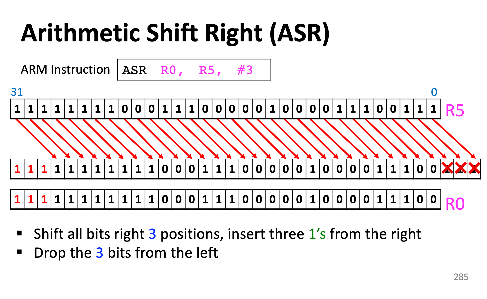

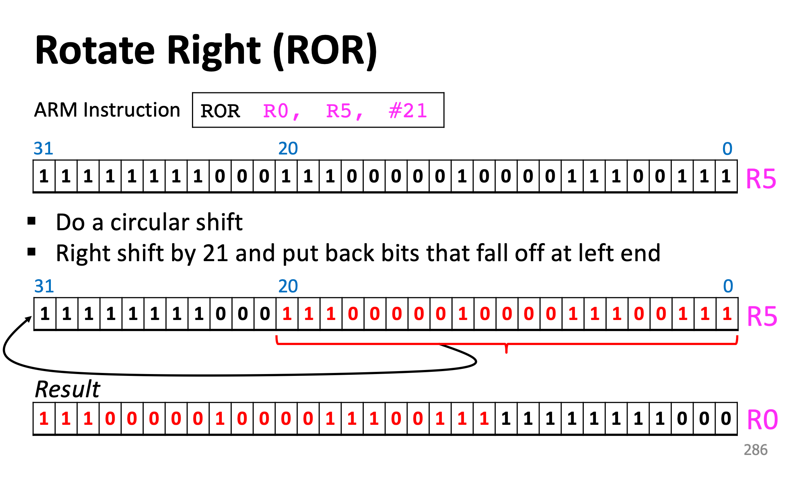

### 15.3 移位指令的机器编码 ⭐⭐

**移位指令属于 DP-Register 格式的特例**：

```
DP-R 通用:   cond | 00 | 0 | cmd  | S |  Rn  | Rd |  00000000  | Rm
移位指令:    cond | 00 | 0 | 1101 | S | 0000 | Rd | shamt5 |sh|0| Rm
                              ↑          ↑      11:7    6:5  4  3:0
```

| 字段 | 值 | 含义 |
|---|---|---|
| **`cmd`** | **1101** | 移位类指令 |
| **`Rn`** | **0000** | 不用，置 0 |
| **`shamt5`** `[11:7]` | 5-bit | **移位量**（立即数形式） |
| **`sh`** `[6:5]` | **00=LSL, 01=LSR, 10=ASR, 11=ROR** | 选哪种移位 |
| bit 4 | 0 | 移位量是立即数 |
| `Rm` `[3:0]` | | 被移位的寄存器 |

**移位量放在寄存器里的变体**（如 `LSL R4, R8, R6`）：

```
 31:28  27:26  25  24:21  20  19:16  15:12  11:8  7  6:5  4  3:0
| cond |  00  | 0 | cmd  | S |  Rn  |  Rd  | Rs  | 0 | sh | 1 | Rm |
                                            ↑            ↑
                                     移位量寄存器      bit4=1
```
→ **bit 4 = 0 表示移位量是立即数，= 1 表示移位量在寄存器 Rs 里**。

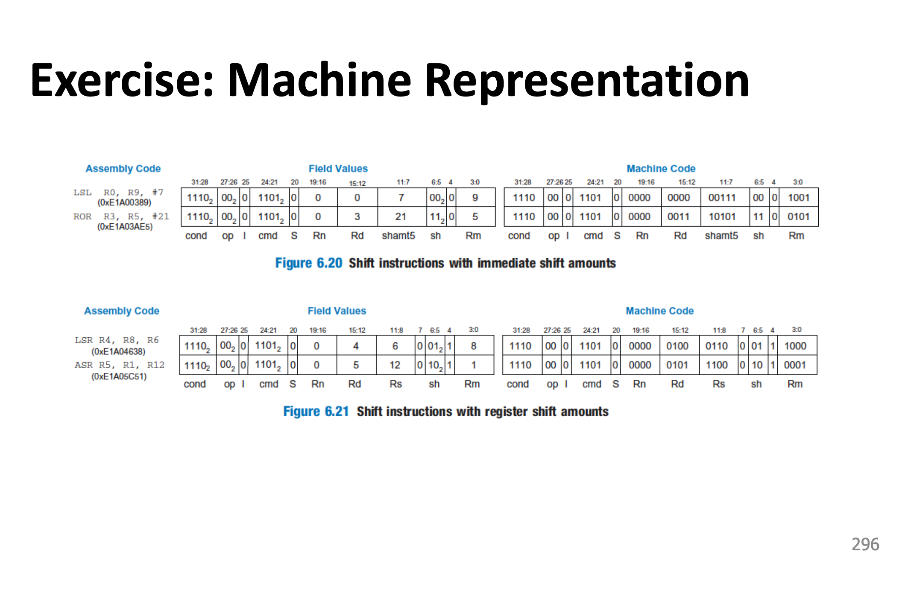

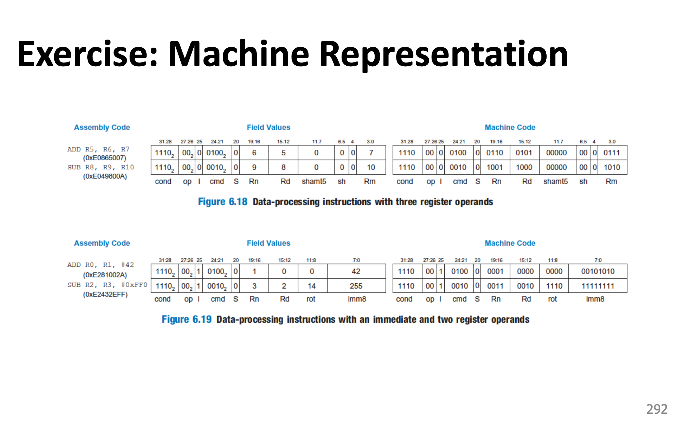

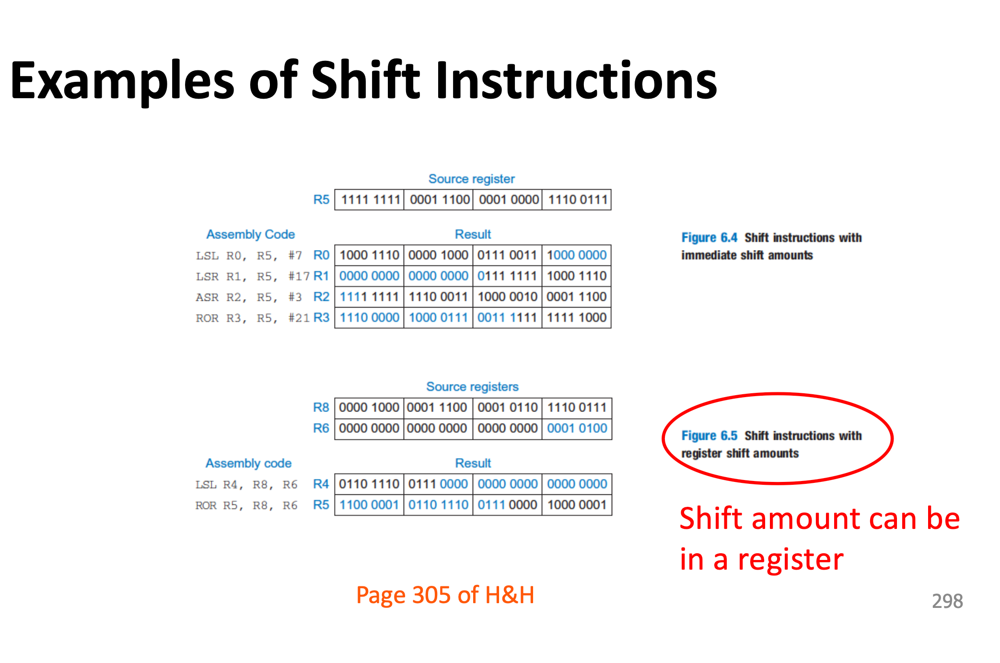

---

## 16. 字符与字节操作

### 16.1 ASCII

- **1963 年**制定，American Standard Code for Information Interchange
- 每个文本字符一个唯一**字节**；英文字符 < 256 → 单字节够用
- 范围：十进制 0–255，十六进制 00–FF
- C 语言用 **`char`** 表示字节/字符
- **Unicode**：16 bit，支持重音、亚洲语言等（Java 等用它）

**必记数字** ⭐：**小写和大写相差 `0x20`（32）**。
→ `array[i] - 32` 就是小写转大写。

### 16.2 字节访存指令 ⭐

| 指令 | 行为 |
|---|---|
| **LDRB** | 从内存加载一字节到寄存器，**零扩展**填满 32 bit |
| **LDRSB** | 从内存加载一字节到寄存器，**符号扩展**填满 32 bit |
| **STRB** | 把 32-bit 寄存器的**最低字节（LSB）**存到内存指定字节，**高位被忽略** |

**例题（P308–P311）**，假设 R4 = 0，内存：地址 0→`03`, 1→`42`, 2→`8C`, 3→`F7`；R3 = `11 10 A1 9B`

| 指令 | 结果 |
|---|---|
| `LDRB  R1, [R4, #2]` | **R1 = `00 00 00 8C`**（零扩展） |
| `LDRSB R2, [R4, #2]` | **R2 = `FF FF FF 8C`**（0x8C 最高位是 1 → 符号扩展补 FF） |
| `STRB  R3, [R4, #3]` | **地址 3 的内容从 `F7` 变成 `9B`**（只写 R3 的 LSB） |

> **这题是考题原型**：LDRB 零扩展 vs LDRSB 符号扩展的区别，以及 STRB 只动一个字节。

### 16.3 C 字符串

```c
char welcome[6] = {'H','E','L','L','O','\0'};   // 手动写 '\0'，手动追踪长度
char welcome[]  = "HELLO";                       // 编译器算长度、自动插 '\0'
```
- **C 字符串以 null terminator `'\0'` 结尾**（不像 Python 自带长度）
- 5 个字符 + 1 个 `'\0'` = 6

### 16.4 练习：字符数组转大写

```c
char array[11] = "anthonymay";
for (i = 0; i < 10; i = i + 1) array[i] = array[i] - 32;
```
```arm
; R0 = base addr, R1 = i
    MOV  R1, #0
LOOP
    CMP  R1, #10
    BGE  DONE
    LDRB R2, [R0, R1]     ; R2 = array[i]   ← 必须用 LDRB 不是 LDR
    SUB  R2, R2, #32      ; 小写 → 大写
    STRB R2, [R0, R1]     ; array[i] = R2
    ADD  R1, R1, #1
    B    LOOP
DONE
```

### 16.5 练习：字符串在内存中的布局 ⭐

把 `"HELLO!"` 存到 `0x1522FFF0`（ASCII：H=0x48, E=0x65, L=0x6C, O=0x6F, !=0x21, Null=0x00）

| Address | Byte 3 | Byte 2 | Byte 1 | Byte 0 |
|---|---|---|---|---|
| `0x1522FFF4` | — | `00` (`\0`) | `21` (`!`) | `6F` (`O`) |
| `0x1522FFF0` | `6C` (`L`) | `6C` (`L`) | `65` (`E`) | `48` (`H`) |

> **注意这是小端布局**：`H` 在 Byte 0（低地址），一行 word 从右往左读。这题非常容易在 Byte 顺序上翻车。
> 幻灯片上 `E = 0x65` 实为 `0x45`（`0x65` 是小写 `e`）——**幻灯片笔误，考试按标准 ASCII 表来**。

---

## 17. ISA 权衡

### 17.1 ISA 影响什么

**Performance / Power & energy / Code size 与 instruction footprint / 电路成本与复杂度（芯片面积）/ 未来演进空间**

### 17.2 复杂指令 vs 简单指令 ⭐

| | **复杂指令** | **简单指令** |
|---|---|---|
| 优点 | **代码稠密高效** | **电路简单**（微架构简单） |
| 缺点 | **电路复杂，关键路径长** | **指令占用空间大**（同一问题要更多指令）；**语义鸿沟大** |
| 例子 | **x86**：operate 指令的操作数可以同时是寄存器和内存 → **Register-Memory 架构** | **ARM**：只能通过 LDR/STR 访存 → **Load-Store 架构** |

**寄存器数量的权衡**：寄存器多 → 减少访存，但**寄存器堆变慢**（Design Principle #2），且指令里需要更多位来编码寄存器号。

### 17.3 语义鸿沟（Semantic Gap）⭐

**定义**：指令、数据类型、寻址模式**离高级语言（HLL）有多近**。

```
小语义鸿沟                      大语义鸿沟
HLL                            HLL
 ↕ (容易映射)                   ↕ (难映射，编译器压力大)
ISA: 复杂指令+复杂数据类型       ISA: 简单指令+简单数据类型
+复杂寻址模式                    +简单寻址模式
 ↕                              ↕
HW 控制信号 (复杂)              HW 控制信号 (简单)
```

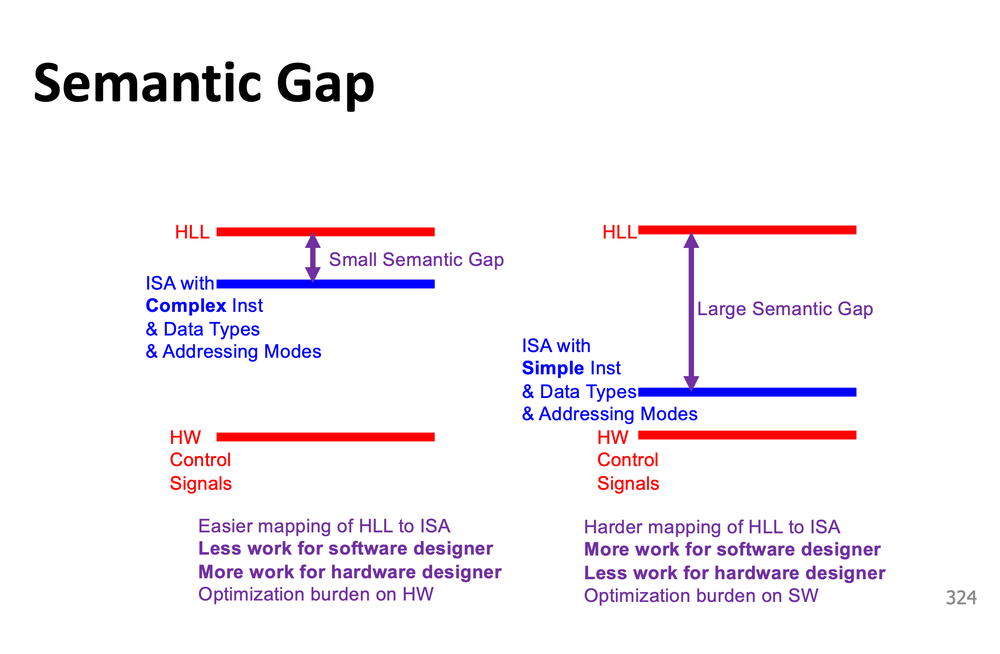

### 17.4 ARM 的四种寻址模式

| 模式 | 用途 |
|---|---|
| **Register** | 读写操作数 |
| **Immediate** | 读写操作数 |
| **Base**（base + offset） | 读写操作数 |
| **PC-relative** | **写 PC**（分支） |

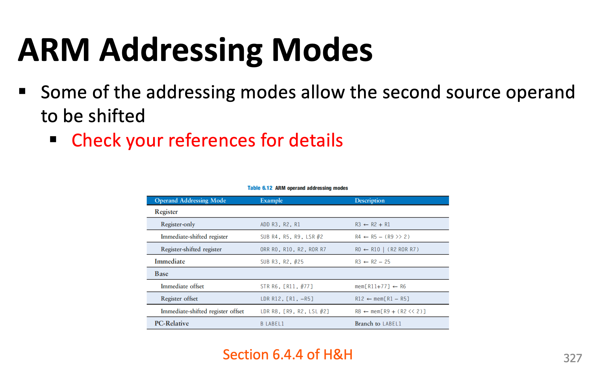

**Addressing Mode 权衡**：
- 复杂寻址模式 → **简化 HLL→汇编的翻译**
- 但 → **电路更复杂**（需要 ALU 加基址和偏移、ALU 前面加移位器）
- **核心问题：优化负担放软件还是硬件？**
  - 多条简单指令 + 简单微架构
  - 少数复杂指令 + 复杂微架构

---

## 18. 微架构：单周期 ARM CPU ⭐⭐⭐

### 18.1 什么叫"处理一条指令"

```
AS  (处理前的架构状态)
     ↓  Process Instruction
AS' (处理后的架构状态)
```
**处理一条指令 = 按 ISA 规范把 AS 变换成 AS'**。

- **ISA 抽象地规定** AS' 应该是什么 → 它定义了一个**抽象 FSM**：
  - **State = 程序员可见状态**
  - **Next-state logic = 指令执行规范**
  - **从 ISA 角度看，AS 和 AS' 之间没有"中间状态"—— 一条指令一次状态转移**
- **微架构决定怎么把 AS 变成 AS'**：
  - 实现有很多选择
  - **可以引入程序员不可见的状态来加速** → **一条指令多次状态转移**

### 18.2 单周期 vs 多周期 ⭐ 必考对比

| | **单周期（Single-Cycle）** | **多周期（Multi-Cycle）** |
|---|---|---|
| 每条指令 | **一个时钟周期** | **多个周期/阶段** |
| 状态更新 | **全部在指令执行结束时** | **执行过程中就可以更新**（但**架构状态**仍在结束时更新） |
| 周期时间由谁决定 | **最慢的那条指令** → **时钟周期长** | **最慢的那个 stage** |
| 实现 | 纯**组合逻辑**做指令执行，无程序员不可见的中间状态；**控制单元不是 FSM** | 控制单元是 FSM |
| 优点 | 简单、好解释 | 时钟可以更快 |

> **两者在微架构层都是字面意义上的 von Neumann 模型。**

```
      ┌──────────────┐        ┌─────────────┐
   ┌─►│ Combinational│  AS'   │ Sequential  │  AS
   │  │    Logic     ├───────►│   Logic     ├──┐
   │  └──────────────┘        │  (State)    │  │
   └───────────────────────────────────────────┘
```
- **时钟周期时间由什么决定？** → 组合逻辑的**关键路径**（最长延迟路径）

### 18.3 ARM 架构状态元件（P348–P349）⭐

| 元件 | 特性 |
|---|---|
| **PC** | **逻辑上是寄存器堆的一部分**；每周期都被独立地读写。（"物理上"要不要放进寄存器堆？→ 设计选择） |
| **Instruction Memory** | **单读端口**；32-bit 地址输入 A，32-bit 指令输出 RD |
| **Register File** | **15 个寄存器（R0–R14）+ 额外输入接收来自 PC 的 R15**；**两个读端口**（4-bit A1/A2 → 32-bit RD1/RD2）；**一个写端口**（A3 + WD3 + write enable）；**读 R15 返回 PC + 8**；若 PC 在寄存器堆外，写 R15 必须特殊处理 |
| **Data Memory** | **单个读/写端口**；WE=TRUE → 在**时钟上升沿**把 WD 写入地址 A；WE=FALSE → 把地址 A 的值读到 RD |

**通用规则**：
- **所有读都是组合的、常数时间**（不现实，但现在够用）
- **所有写和状态更新都在时钟上升沿发生** → **同步时序电路**

### 18.4 微架构的两大部分

| | 职责 | 组成 |
|---|---|---|
| **Datapath**（本课 32-bit） | 对数据字做操作 | **Memories、registers、ALUs、multiplexers** |
| **Control Unit** | 告诉 datapath 怎么执行指令 | 从 datapath 接收当前指令 → 产生 **mux selects、ALU control、register enable、memory write** 信号 |

> Charles Petzold《CODE》："CPU 控制信号就是提线木偶的那些线。"

### 18.5 设计流程（一次加一条指令）

支持的指令子集：
- **DP**：`ADD, SUB, AND, ORR`（寄存器和立即数偏移都支持）
- **Memory**：`LDR, STR`（**只支持正立即数偏移**）
- **Branch**：`B`

配色约定：**新连线 = 黑色；已讲过的硬件 = 灰色；控制信号 = 蓝色**。

### 18.6 LDR 数据通路的 7 步 ⭐⭐

| Step | 做什么 |
|---|---|
| **1** | **取指**：从 instruction memory 读指令。**注意 PC（当前态）和 PC'（次态）的区别** |
| **2** | 从寄存器堆读源操作数（基址寄存器 `Rn`）→ 数据出现在 **RD1** |
| **3** | **零扩展** `Instr[11:0]`（imm12） |
| **4** | **ALU 算地址**（`ALUControl = 00` → ADD） |
| **5** | 把 data memory 读回的数据写回寄存器堆的 `Rd` |
| **6** | 算下一条指令地址 **PC' = PC + 4**。**硬件天生并行**——这一步和上面同时发生 |
| **7a** | **读 R15 返回 PC + 8** |
| **7b** | **写 R15**（PC 可能是某条指令的结果） |

**Zero Extension**：`ImmExt[31:12] = 0`，`ImmExt[11:0] = Instr[11:0]`。

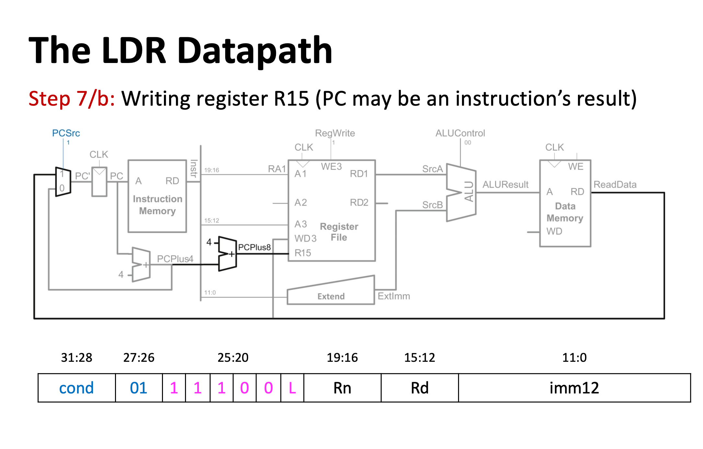

### 18.7 逐步扩展

| Step | 指令 | 加了什么 |
|---|---|---|
| **8** | **STR** | 读第二个寄存器（`Rd`）并把值写内存。**ReadData 被忽略，因为 RegWrite = FALSE**。**STR 和 LDR 用同一格式，但 `Rd` 变成源操作数** |
| **9** | **DP-Immediate** | 改 extend block（imm8 而非 imm12）；加信号把 **ALUResult 写回寄存器堆** |
| **10** | **DP-Register** | 把 `Rm` 送到寄存器堆的 **A2 端口** → 需要**在寄存器堆输入和 ALU 输入上加 mux** 来选第二源 |
| **11** | **Branch** | 改 extend block（sign-extend imm24 并左移 2）；给 **RegSrc 加一位** |

**DP-Immediate 与 LDR 的两个关键区别**：
1. **imm8 而不是 imm12**
2. **目的寄存器存的是 ALU 结果，不是访存结果** → 需要 **MemtoReg 多路选择器**在 `ReadData` 和 `ALUResult` 之间选
   - **MemtoReg = 1 → LDR；= 0 → DP 指令**

### 18.8 ALU 控制编码 ⭐ 必背

| ALUControl | Function |
|---|---|
| **00** | **ADD** |
| **01** | **SUB** |
| **10** | **AND** |
| **11** | **ORR** |

ALU 还产生**四个标志（NZCV）送给控制单元**。

### 18.9 Extend Block 操作 ⭐⭐ 必背

三种指令格式对立即数字段的解释不同，由 **2-bit 的 `ImmSrc[1:0]`** 控制：

| `ImmSrc[1:0]` | `ExtImm` | 说明 |
|---|---|---|
| **00** | `{24'b0, Instr[7:0]}` | **零扩展 imm8**（DP-Immediate） |
| **01** | `{20'b0, Instr[11:0]}` | **零扩展 imm12**（LDR/STR） |
| **10** | `{6{Instr[23]}, Instr[23:0], 2'b00}` | **符号扩展 imm24 并左移 2**（Branch） |

> 注意 `10` 那一行同时干了三件事：**复制符号位 6 次 + 拼上 imm24 + 末尾补两个 0（= 左移 2）**。这正好对应 §10.3 的 BTA 计算前两步。（**PC+8 那一步不在 extend block 里**，靠读 R15 返回 PC+8 实现。）

### 18.10 控制单元

**输入**：`Instr[31:28]`(cond)、`Instr[27:26]`(op)、`Instr[25:20]`(funct)、**Flags**（条件执行要用）、**目的寄存器**（为了正确更新 PC）

**关键性质** ⭐：**单周期微架构的控制器是纯组合的**（不是 FSM）。

**条件逻辑**：必须保证只有当条件指令**确实要执行**时，架构状态的更新才被使能 → **写使能信号必须只在条件成立时为 TRUE**。
→ **不满足条件时，写使能线会被条件逻辑"kill"掉**。

**PCSrc 生成的例子** ⭐：
```
PCSrc = ((Rd == 15) & RegW) | Branch
```
PCSrc = 1 的三种情况：
- **目的寄存器 Rd 是 R15**
- **RegW = 1**（ADD/SUB 或 LDR 要写寄存器）
- **是分支指令**（opcode = 10，B 或 BL）

> **作业提醒（幻灯片原话）**：**别忘了把条件执行考虑进去！**

### 18.11 主译码器真值表（P379，已重建）⭐⭐

| Op | Funct5 | Funct0 | Type | Branch | MemtoReg | MemW | ALUSrc | ImmSrc | RegW | RegSrc | ALUOp |
|---|---|---|---|---|---|---|---|---|---|---|---|
| 00 | 0 | X | **DP Reg** | 0 | 0 | 0 | 0 | XX | 1 | 00 | 1 |
| 00 | 1 | X | **DP Imm** | 0 | 0 | 0 | 1 | 00 | 1 | X0 | 1 |
| 01 | X | 0 | **STR** | 0 | X | 1 | 1 | 01 | 0 | 10 | 0 |
| 01 | X | 1 | **LDR** | 0 | 1 | 0 | 1 | 01 | 1 | X0 | 0 |
| **11** | X | X | **B** | 1 | 0 | 0 | 1 | 10 | 0 | X1 | 0 |

> ⚠️ **幻灯片自相矛盾**：Instruction Format – 3 明确写 **branch 的 `op = 10`**（P209、P332 都是 10），但这张真值表的 Op 列写的是 **11**。**课本 H&H 的表用的是 10**。考试/作业按 **`op = 10`** 走，这里大概率是幻灯片笔误。要么按 10 记，要么在课上问一句。
>
> 另外注意 **`Funct5` = `Instr[25]` = I 位**（区分 DP-Reg / DP-Imm），**`Funct0` = `Instr[20]` = L 位**（区分 STR / LDR）。

**处理器操作实例的控制信号取值**：

| 信号 | **ORR**（DP-R） | **LDR** |
|---|---|---|
| PCSrc | 0 | 0 |
| MemtoReg | **0**（要 ALU 结果） | **1**（要内存数据） |
| MemWrite | 0 | 0 |
| ALUControl | **11**（ORR） | **00**（ADD，算地址） |
| ALUSrc | **0**（第二源是寄存器） | **1**（第二源是立即数） |
| ImmSrc[1:0] | **XX**（不用） | **01**（零扩展 imm12） |
| RegWrite | 1 | 1 |
| RegSrc[1:0] | 00 | 00 |

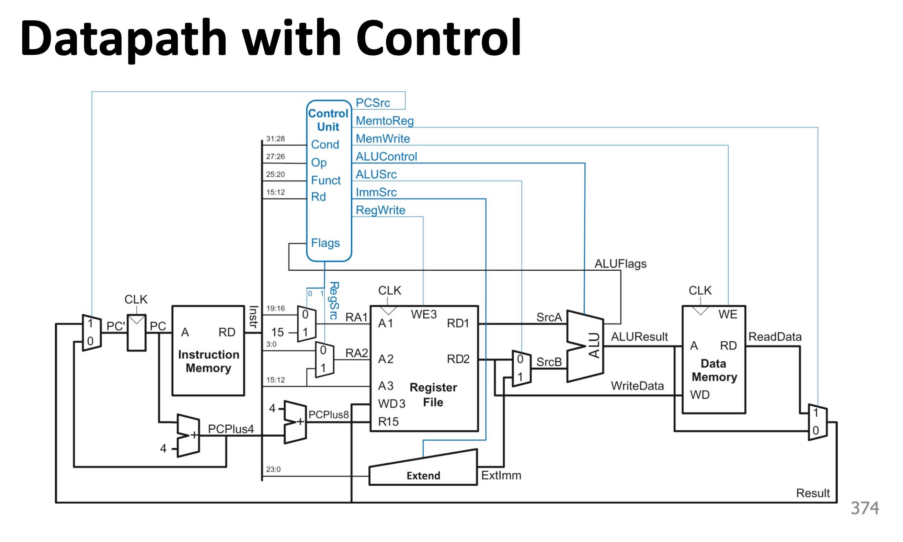

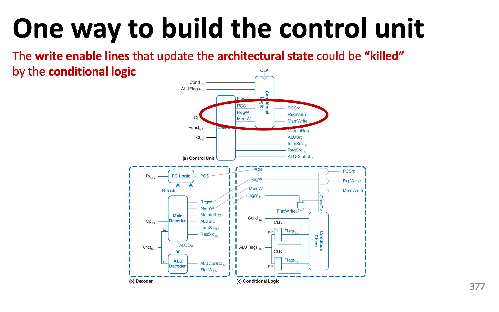

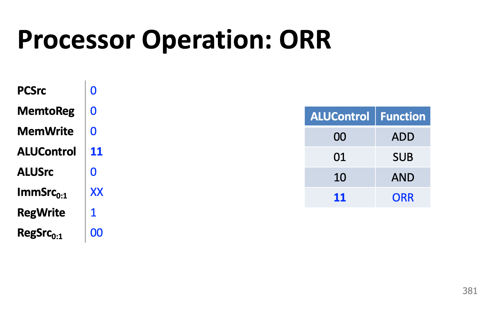

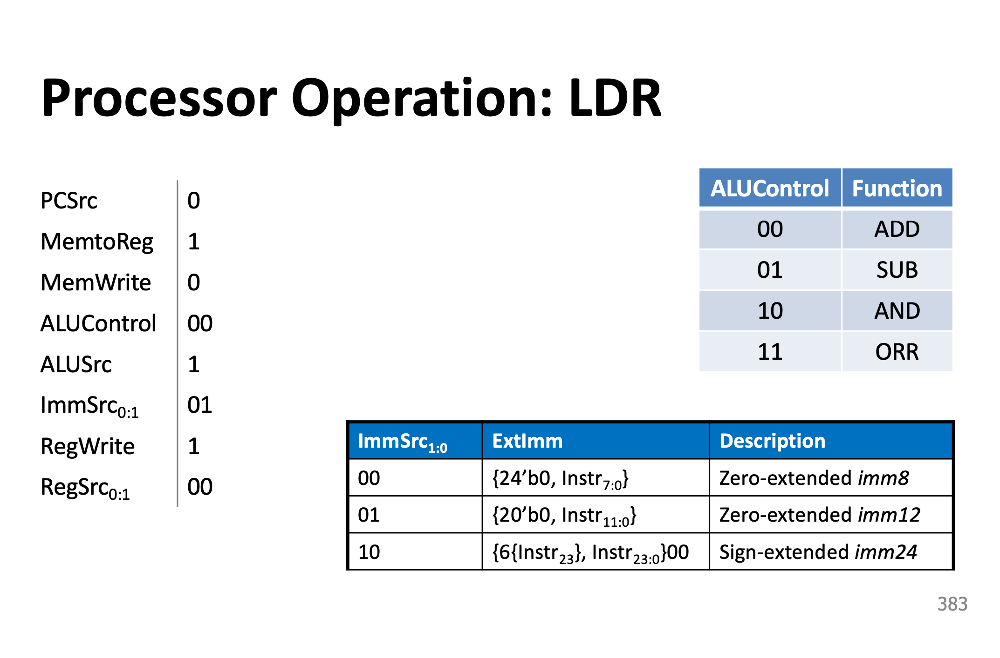

---

## 19. 性能分析 ⭐⭐

### 19.1 核心公式（必背）

```
Execution time = (# instructions) × (cycles / instruction) × (seconds / cycle)
               =        N         ×          CPI           ×        Tc
```

| 因子 | 取决于什么 |
|---|---|
| **N**（指令数） | **ISA、程序员水平、编译器、算法** |
| **CPI**（每指令周期数） | **微架构** |
| **Tc**（时钟周期 = 1/f） | **关键路径、电路工艺、加法器类型、门级细节** |

> **性能 = 执行时间**（程序从头跑到尾的时间）。

### 19.2 怎么让程序更快

| 减少哪个 | 手段 |
|---|---|
| **N** | 让指令"做得更多"（**CISC**）；用更好的编译器 |
| **CPI** | **更简单的指令（RISC）**；用多个并行的单元/ALU/核 |
| **f ↑（Tc ↓）** | 更新的制造工艺；重新设计时序关键部件；**采用流水线** |

> **注意 N 和 CPI 是对着干的**：CISC 减 N 但增 CPI/Tc；RISC 减 CPI/Tc 但增 N。这就是全部权衡所在。

### 19.3 单周期 CPU 的情况

- **N**：ARM 是 RISC → 偏多
- **CPI = 1，固定** —— 幻灯片原话：**"One, fixed, bad idea!"**
- **Tc = CPU 电路的关键路径**

**为什么 CPI=1 是坏主意** ⭐：因为**时钟周期必须迁就最慢的那条指令**，所有指令都陪着最慢的一起慢。**没办法让常见情况变快**（违反 Design Principle #4）。

### 19.4 关键路径元件（P393）

| 参数 | 描述 |
|---|---|
| `tpcq_PC` | **PC 的 clock-to-Q 延迟** |
| `tmem` | 内存读 |
| `tdec` | 译码器传播延迟 |
| `tmux` | 多路选择器延迟 |
| `tRFread` | 寄存器堆读 |
| `text` | 扩展块延迟 |
| `tALU` | ALU 延迟 |
| `tRFsetup` | 为下周期写寄存器堆做 setup |

### 19.5 关键路径公式 ⭐⭐ 必背

**LDR（最慢的指令）**：
```
Tc = tpcq_PC + tmem + tdec + max[tmux + tRFread , text + tmux] + tALU + tmem + tmux + tRFsetup
```
因为**内存和寄存器堆比组合逻辑慢** → `tmux + tRFread >> text + tmux`，所以：
```
Tc(LDR) = tpcq_PC + 2·tmem + tdec + tRFread + tALU + 2·tmux + tRFsetup
```

**DP-R**：
```
Tc(DP-R) = tpcq_PC + tmem + tdec + tRFread + tALU + 2·tmux + tRFsetup
```

**对比**：**LDR 比 DP-R 多一个 `tmem`**（要访问 data memory）。

### 19.6 关键路径分析结论 ⭐

- **不同指令关键路径不同**：**LDR 最慢**；**DP-R 和 B 更短**，因为它们**不访问数据内存（内存慢！）**
- 单周期处理器是**同步时序电路** → **时钟周期必须恒定且长到能容纳最慢的指令**
- 关键路径公式里各变量的数值**取决于具体制造工艺**

### 19.7 Exercise 1（P397）— 必做

**题**：16 nm CMOS，100 billion (10¹¹) 条指令，单周期 CPU，求执行时间。

| 参数 | 延迟 (ps) |
|---|---|
| tpcq_PC | 40 |
| tmem | 200 |
| tdec | 70 |
| tmux | 25 |
| tRFread | 100 |
| tALU | 120 |
| tRFsetup | 60 |

**解**：
```
Tc = tpcq_PC + 2·tmem + tdec + tRFread + tALU + 2·tmux + tRFsetup
   = 40 + 2(200) + 70 + 100 + 120 + 2(25) + 60
   = 40 + 400 + 70 + 100 + 120 + 50 + 60
   = 840 ps
```
```
Execution time = N × CPI × Tc = 10¹¹ × 1 × 840×10⁻¹² s = 84 s
```

> **考试就考这个套路**：先套 LDR 关键路径公式算 Tc，再乘 N 和 CPI（单周期 CPI=1）。

### 19.8 Exercise 2（P398）— 两种 for 循环风格比性能

同样的 `for (i=0; i<10; i++) sum += i;`，两种翻译：

| | **风格 A**（COND 在前） | **风格 B**（FOR 标签在前） |
|---|---|---|
| 循环体 | `CMP; BLT FOR; B DONE;` + `ADD; ADD; B COND;` | `CMP; BGE DONE; ADD; ADD; B FOR;` |
| **每轮指令数** | **6** | **5** |

- 初始化：各 2 条（`MOV R0,#0` + `MOV R1,#0`）
- 循环执行 10 轮完整迭代 + 第 11 次判断退出
- **N_A = 2 + 10×6 + 2 = 64**（最后一次 CMP + B DONE）
- **N_B = 2 + 10×5 + 2 = 54**（最后一次 CMP + BGE DONE）
- **Execution time = N × 1 × 840 ps** → **A ≈ 53.8 ns，B ≈ 45.4 ns**

> ⚠️ 指令计数的边界（最后一轮怎么算）取决于计法，**答案以课上/tutorial 给的为准**。这里的重点是：**同样的 C 代码，翻译风格不同 → N 不同 → 执行时间不同**，而 CPI 和 Tc 都没变。这正好印证了公式里 **N 取决于程序员/编译器**。

### 19.9 单周期 CPU 的缺陷（P399）⭐ 必背

1. **需要两块内存**（指令内存 + 数据内存，**不能复用**）
2. **需要三个加法器**（**不能复用**）
3. **时钟周期被最慢的指令决定** → **没法让常见情况变快**（例如 DP 指令明明可以更快）

> 这三条正是下一步走向**多周期 / 流水线**的动机。

---

## 20. 附：需要额外注意的坑

| # | 坑 | 正解 |
|---|---|---|
| 1 | ARM opcode 只有 2 bit | `op[27:26]`：**00=DP，01=Memory，10=Branch**。具体指令靠 `cmd`/`funct` 区分 |
| 2 | BTA 忘了 +8 | **BTA = PC + 8 + (sign_extend(imm24) << 2)** |
| 3 | 读 R15 | **返回 PC + 8**，不是 PC |
| 4 | pre-index vs post-index | `[R1,R2]!` 地址是 R1+R2；`[R1],R2` **地址就是 R1** |
| 5 | LSR vs ASR | **有符号数除以 2ᴺ 必须用 ASR** |
| 6 | LDRB vs LDRSB | **零扩展 vs 符号扩展**。`0x8C` → `00 00 00 8C` vs `FF FF FF 8C` |
| 7 | 条件执行还是要取指 | 不执行的指令仍然被 fetch，**只是不更新架构状态** |
| 8 | 单周期控制器 | **纯组合逻辑，不是 FSM**（多周期才是 FSM） |
| 9 | 单周期 Tc | 取 **LDR** 的关键路径（含 **2·tmem**），不是 DP 的 |
| 10 | flags 的有效期 | CMP 之后可以有多条条件指令，**直到 flags 被新的算术/逻辑指令覆盖** |

