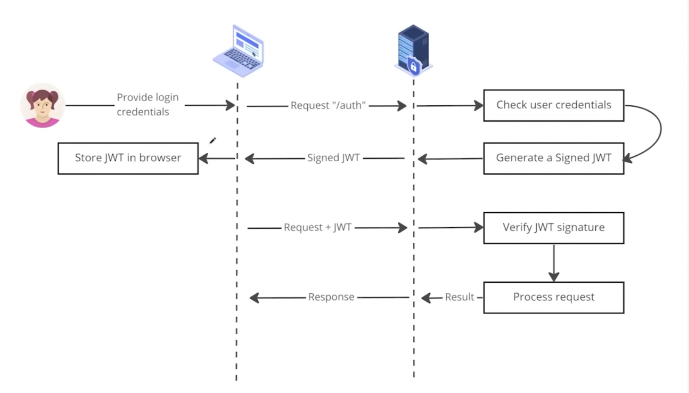

# JWT（JSON Web Token）整理版

这份笔记结合流程图，聚焦后端/FastAPI 实战视角，讲清 JWT 的结构、流程与常见实现（含 FastAPI Users）。



## 1. 一句话理解
JWT 是服务器签名过的“通行证”字符串。客户端带着它就能证明身份，服务器无需保存 session。

## 2. JWT 结构
JWT 由三段字符串组成，用 `.` 连接：
```
header.payload.signature
```
- Header：签名算法
- Payload：用户身份信息（user_id、role、exp 等）
- Signature：服务器私钥签名，用于防篡改

关键点：**JWT 是签名，不是加密**。内容可被解码读取，但不能被伪造或篡改。

## 3. 典型流程（登录 -> 携带 -> 验证）
1. 用户登录，POST `/auth`  
2. 服务器校验账号密码，正确则签发 JWT，错误返回 401  
3. 前端保存 JWT（常见：HttpOnly Cookie 或 Authorization Header）  
4. 前端访问受保护接口，携带：  
   `Authorization: Bearer <JWT>`  
5. 服务器验证签名、检查过期（exp）  
6. 通过则执行业务逻辑，失败返回 401/403  

## 4. 为什么 JWT 不用 Session
传统 Session 的问题：  
- 服务器需要保存状态  
- 多机扩容要共享 session  
- 需要 sticky session  

JWT 的优势：  
- 无状态  
- 易扩展  
- 前后端分离友好  

## 5. Payload 放什么
只放“身份相关信息”，不放敏感数据。

示例：
```json
{
  "sub": "user_id",
  "email": "eden@example.com",
  "role": "user",
  "exp": 1700000000
}
```

不要放：密码、手机号、银行卡、隐私信息。

## 6. 安全要点
1. 防篡改依赖签名：
```text
HMACSHA256(base64(header) + "." + base64(payload), SECRET_KEY)
```
2. 泄露后在过期前“可被冒用”，因此需要：
   - 短过期时间
   - refresh token
   - HTTPS
3. JWT 只是身份认证，不是权限控制。权限仍需业务判断：
```python
if user.role != "admin":
    raise HTTPException(status_code=403)
```

## 7. FastAPI 中 JWT 的位置
常见依赖写法：
```python
Depends(get_current_user)
```
内部流程：读取 Header/Cookie -> 验签 -> 解 payload -> 获取 current_user。

## 8. FastAPI Users 的典型结构（user.py 视角）
### 8.1 关键组件
- `BearerTransport`：从 `Authorization: Bearer` 读取 token  
- `JWTStrategy`：签名与过期策略  
- `AuthenticationBackend`：把 transport + strategy 组合  
- `FastAPIUsers`：统一用户依赖入口  

### 8.2 SECRET
```python
SECRET = "YOUR-SECRET-KEY"
```
用于签名 JWT 和生成验证/重置 token。生产环境必须放在 `.env`。

### 8.3 UserManager
```python
class UserManager(UUIDMixin, BaseUserManager[User, uuid.UUID]):
    reset_password_token_secret = SECRET
    verification_token_secret = SECRET
```
负责用户生命周期逻辑（注册、重置密码、验证等）。

### 8.4 get_user_manager 依赖
```python
async def get_user_manager(
    user_db: SQLAlchemyUserDatabase = Depends(get_user_db)
):
    yield UserManager(user_db)
```
`yield` 用于依赖生命周期管理。

### 8.5 BearerTransport 与 JWTStrategy
```python
bearer_transport = BearerTransport(tokenUrl="auth/jwt/login")

def get_jwt_strategy() -> JWTStrategy:
    return JWTStrategy(secret=SECRET, lifetime_seconds=3600)
```

### 8.6 AuthenticationBackend
```python
auth_backend = AuthenticationBackend(
    name="jwt",
    transport=bearer_transport,
    get_strategy=get_jwt_strategy,
)
```

### 8.7 FastAPIUsers 与 current_active_user
```python
fastapi_users = FastAPIUsers[User, uuid.UUID](
    get_user_manager,
    auth_backend,
)

current_active_user = fastapi_users.current_user(active=True)
```

### 8.8 路由使用
```python
@router.get("/me")
async def me(user: User = Depends(current_active_user)):
    return user
```

## 9. 一句话串联整条链路
登录签发 JWT -> 前端保存 -> 请求携带 Bearer -> 后端验签 -> 解析用户 -> 注入路由。
