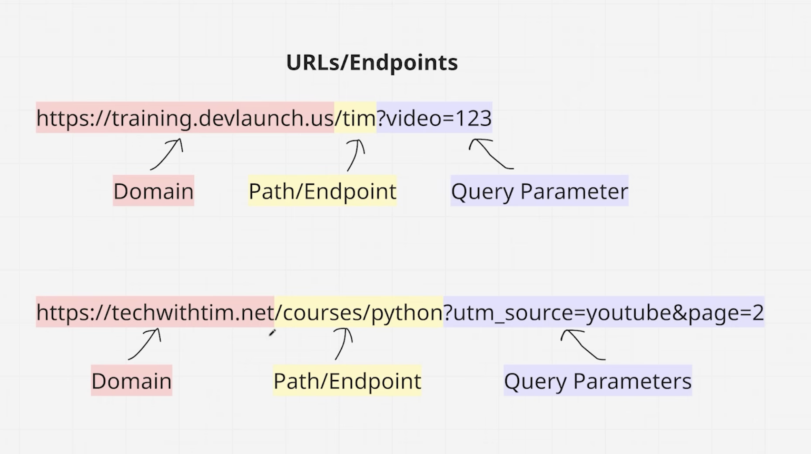
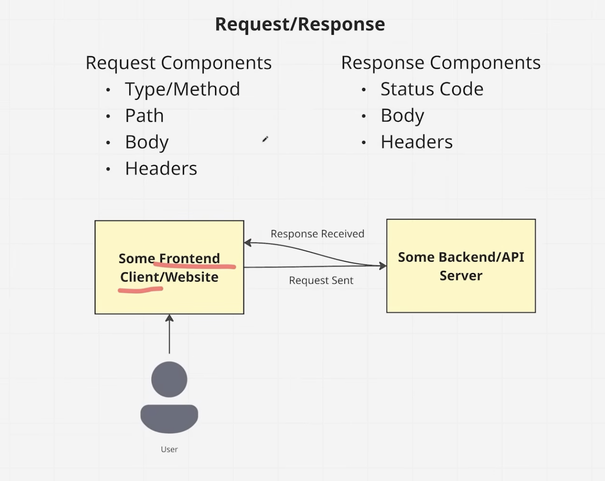
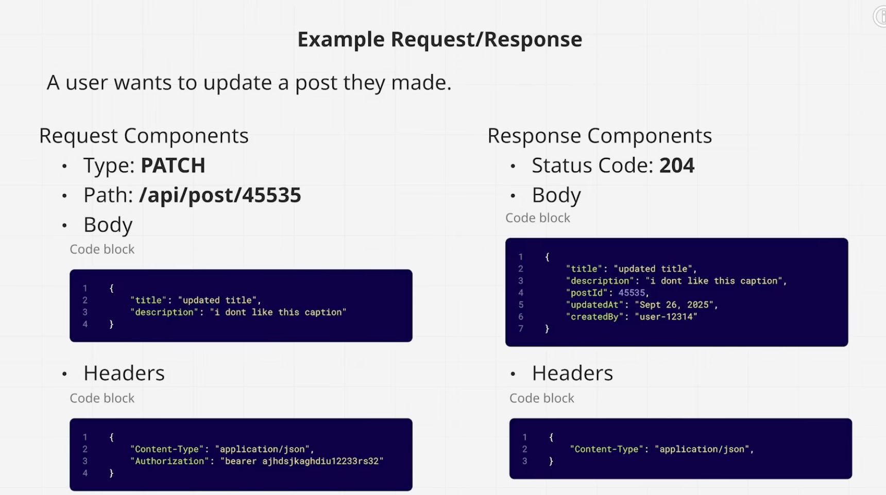

# URL Structure & Request/Response (Combined)

This note combines two pieces: first understand URL/Endpoint, then Request/Response. Because "request path + params" is the core input of a Request, it reads more coherently in one doc.



## 1. The three parts of a URL

Example:

```
https://training.devlaunch.us/tim?video=123
```

### 1️⃣ Domain

```
https://training.devlaunch.us
```

- Purpose: tells the browser/client which server to find
- Like: the address of a building
- Backend view: handled by DNS + server; not directly related to FastAPI/backend code

### 2️⃣ Path / Endpoint

```
/tim
```

- This is the part the backend cares about most
- In FastAPI, it usually maps to a function, e.g.

```python
@app.get("/tim")
def get_tim():
    ...
```

👉 So: Q

- Endpoint ≈ Path
- Path decides "which function you're calling"

### 3️⃣ Query Parameters

```
?video=123
```

- video is the param name
- 123 is the param value
- Used to pass different conditions/data to the same endpoint

In FastAPI, you'd write:

```python
@app.get("/tim")
def get_tim(video: int):
    return {"video": video}
```

## 2. Second example (multiple params)

```
https://techwithtim.net/courses/python?utm_source=youtube&page=2
```

Breakdown:

- Domain
  - https://techwithtim.net
- Path / Endpoint
  - /courses/python
- Query Parameters
  - utm_source=youtube
  - page=2

👉 Multiple params are separated by `&`
👉 Param order usually doesn't matter

## 3. A critical understanding (important for exams & real use)

❌ Wrong

- endpoint = the whole URL

✅ Correct

- Endpoint = Path
- Query parameters are the input to the endpoint

That means:

```
/tim?video=123
/tim?video=456
```

👉 Same endpoint
👉 Only the params differ

## 4. How to use this in FastAPI / API learning?

You will often see designs like:

```
GET /users
GET /users?id=5
GET /users?page=2
GET /users/5
```

The difference is:

- Path: the entry/function
- Query params: filters, pagination, search conditions

---



## 5. One-sentence summary of the whole diagram

User → Frontend (Client) → Send Request → Backend (API) → Return Response → Frontend → User

This is the full lifecycle of HTTP Request/Response.

## 6. Left side: What is a Request?

What the frontend (browser / app / frontend code) sends to the backend.

The diagram lists Request Components:

### 1️⃣ Type / Method

Common ones:

- GET: retrieve data
- POST: create data
- PUT / PATCH: update data
- DELETE: delete data

👉 Tells the backend what you want to do

### 2️⃣ Path / Endpoint

Examples:

```
/users
/users/123
/posts?page=2
```

👉 Tells the backend which resource/feature you want to operate

### 3️⃣ Body

- Not all requests have one
- Common in POST / PUT / PATCH

Example (JSON):

```json
{
  "username": "eden",
  "password": "123456"
}
```

👉 Used to send large or structured data

### 4️⃣ Headers

Some "meta info", e.g.

- Content-Type: application/json
- Authorization: Bearer xxx
- Accept: application/json

👉 Used to describe:

- data format
- authentication
- client info

## 7. Right side: What is a Response?

The result returned by the backend after handling the request.

### 1️⃣ Status Code

Very important—the first thing frontend checks:

- 200 OK: success
- 201 Created: created
- 400 Bad Request: bad params
- 401 Unauthorized: not logged in / token invalid
- 404 Not Found: path or resource not found
- 500 Internal Server Error: backend blew up 💥

👉 Frontend often decides UI behavior based on status code

### 2️⃣ Body

The actual data returned by backend:

```json
{
  "id": 1,
  "name": "Eden"
}
```

Or:

```json
{
  "error": "User not found"
}
```

### 3️⃣ Headers

For example:

- Content-Type: application/json
- Set-Cookie
- Cache-Control

👉 Tell the frontend how to handle the data

## 8. The most important arrows (frontend/backend boundary)

🔁 Request Sent

Frontend → Backend

- Frontend can only send requests
- Frontend cannot directly access the database

🔁 Response Received

Backend → Frontend

- Backend can only return responses
- Backend cannot control how the page looks

👉 This is the core of frontend/backend decoupling

## 9. Translate the diagram into FastAPI + frontend code

Frontend (e.g., JS)

```javascript
fetch("/users/1")
  .then(res => res.json())
  .then(data => console.log(data))
```

Backend (FastAPI)

```python
@app.get("/users/{user_id}")
def get_user(user_id: int):
    return {"id": user_id, "name": "Eden"}
```

---



## 10. A very common confusion (good timing to ask)

❌ Frontend = page

❌ Backend = database

Correct is:

| Role | Responsibility |
| --- | --- |
| User | click, input |
| Frontend / Client | send requests, render UI |
| Backend / API | handle logic, validate, access DB |
| Database | store data |
