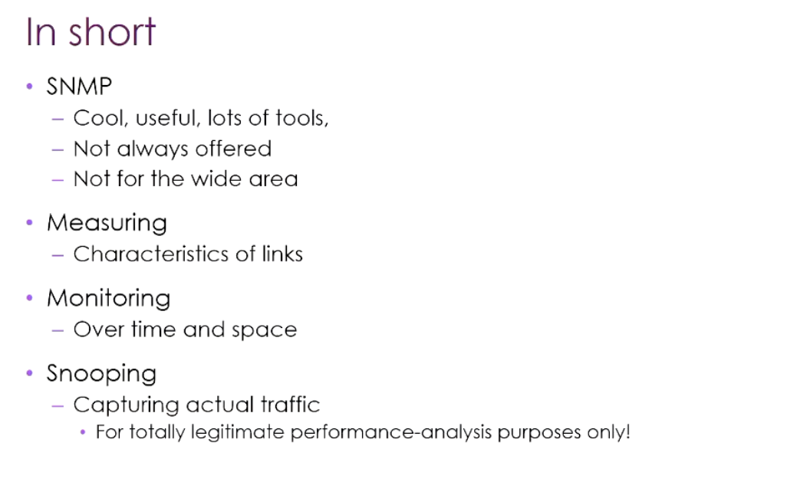

# COMP3310 Week 10：网络安全

> 本周分两次课：Mon = SNMP 收尾 + 安全 Part 1（攻击类型 + 加密基础）；Tue = 安全 Part 2（DNS/DNSSEC + 防火墙 + VPN）。

---

## Part A：SNMP 收尾



### GetNext vs GetBulk

ASN.1 没有"表"这种数据结构，只有 OID 树。不同设备的接口异质性极高（Ethernet 有 MTU/包计数，ATM 卡没有 IP 地址、计的是 cell 而非 packet），如果用表存，列爆炸或稀疏到离谱。

**解法**：每个"单元格"映射成唯一 OID，Manager 用 GetNext 按字典序在树上走，走到 interface 子树外面就知道走完了——不需要预先知道有多少接口、多少列。

| 方式 | 描述 | 限制 |
|------|------|------|
| **GetNext** | 每次一个 OID，来回流量大，Manager 需维护遍历状态 | 高频往返 |
| **GetBulk**（v2 引入） | 一次性把某节点下所有东西全要回来 | UDP 包 64KB 上限；接口多时 agent 返回 tooBig |

### 实用工具栈

| 工具 | 说明 |
|------|------|
| **MRTG** | 祖师爷，引入 RRD（Round-Robin Database）——老数据自动降采样，3 年前的数据只保留 5min/1h 粒度，节省磁盘 |
| **Cacti / Nagios** | MRTG 的现代套壳，类似"网络设备版 Home Assistant" |
| **Weathermap** | 基于 MRTG 数据，在地理/拓扑图上叠加流量染色 |
| **厂商专用工具** | 识别具体型号，直接渲染设备端口面板 |

### 跨域监控：SNMP 不适用，怎么办

SNMP 仅限自己的管理域内，跨域有以下替代方案：

| 方案 | 说明 |
|------|------|
| 设备端抓包 | 家用路由器大多支持，直接导出 pcap 给 Wireshark |
| Port Mirroring | 交换机把某端口流量镜像到另一端口，接监控机 |
| 光纤分光 | 棱镜反射 ~10% 光到传感器，A/B 无感知 |
| **Looking Glass** | 运营商公开查询界面，~700+ 站点，可从对方 POP 做 ping/traceroute/BGP lookup。解决"traceroute 只能看出向路径"问题——从远端 traceroute 回来能看到回程 |
| **perfSONAR / Beacon** | 一组对等节点互相 ping，生成 N×N 矩阵，某列/行集中变红说明该节点出问题 |

> **SNMP 一句话总结**：旧但仍主流，几乎所有设备都支持，仅限内部域。SNMPv1/v2 明文 community string 千万别暴露到公网。

---

## Part B：安全 Part 1

> "安全这门课放在最后，因为互联网协议本身就把安全放在最后才考虑——令人不安地一贯如此。" —— Markus

### 一、核心哲学

- 安全不能"证明不存在漏洞"，只能**降低概率**
- **不对称性**：防守方要堵所有洞，攻击方只要找到一个
- 关键变量：**成本 vs 风险 × 影响**。家庭网络 vs 商业银行 vs 国家级目标，投入完全不同等级
- 攻击者分层：从 script kiddies（下载工具全网扫）到 nation-state（顶级算力 + 专门团队）

### 二、攻击类型层次（按主动性递增）

| 类型 | 描述 |
|------|------|
| **Eavesdropping（被动）** | 读包内容。即使只读元数据——知道你什么时候和谁通信、流量多大，就能推出工作时间、服务依赖、生活习惯 |
| **Intrusion（主动）** | 入侵设备，改包 |
| **Impersonation** | 身份伪造，代替你发包 |
| **Extortion / DoS** | 不让你或别人正常服务。勒索软件是"商业化版本" |

### 三、包可信吗？——不

你收到的包是从路径上**最后一台设备**来的，不是从源主机。路径上每台路由器、交换机、AP 都会读包、改包（至少改 TTL/checksum；NAT 改地址；有些 ISP 路由器甚至改 TCP 拥塞窗口以减缓流速）。

**WiFi 是最弱环节**：用手机起一个假 AP 命名为"ANU"，受害者连上后做透明中转，察觉不到。

**物理层风险**：
- 芯片级嗅探（焊枪 + 几十刀读固件，里面一堆硬编码 IP/密码）
- 光纤分光监听（美国情报机构在海底光缆做过多年）
- 铜缆作为天线既泄漏又能注入
- **Tempest 攻击**：HDMI 线泄漏屏幕内容、键盘声音区分按键、VGA 线辐射——侧信道根本拦不住

### 四、具体攻击

#### DHCP Poisoning


```
1. 攻击者用不同 MAC 反复发 DHCP Discover → 耗尽 DHCP 地址池
2. 真 DHCP 服务器拒绝新设备
3. 攻击者自己当 DHCP 服务器
4. Offer 中把 Gateway/DNS 设为攻击者 IP
5. 受害者所有上行流量经过攻击者
```

**缓解**：交换机限制每端口 MAC 数量、仅信任特定端口的 DHCP Offer（DHCP Snooping）。
**问题**：廉价交换机根本没这功能。

#### ARP Poisoning


```
1. 攻击者发 Gratuitous ARP：
   - 对受害者说："Gateway IP = 我的 MAC"
   - 对 Gateway 说："受害者 IP = 我的 MAC"
2. 双方 ARP 缓存被覆盖
3. 流量全部经过攻击者（Man-in-the-Middle）
```

**缓解**：Dynamic ARP Inspection（依赖 DHCP Snooping，还是要求交换机本身支持）。

> "This is hard to protect against." —— 操作系统检测到 MAC 冲突时知道有问题，但没法告诉你冲突设备插在哪个端口、哪个房间。WiFi 环境下根本无法定位。

#### BGP 路由劫持

两种玩法：
- **More specific prefix**：宣告比真主人更精确的前缀，流量被抢走
- **Path injection**：在 AS path 中插入虚假 AS 号

**经典案例**：某国想屏蔽 YouTube，把 YouTube IP 段宣告通过本国 AS——本意是黑洞本国流量，结果广播泄漏到邻国，全球 YouTube 流量被吸走，YouTube 员工早上来发现没流量。Facebook 某次大宕机也是类似 BGP 误操作（欧洲某地手滑打错字）。

**缓解**：RPKI、Prefix Registries、BGPsec——存在但部署极难。

### 五、IDS vs IPS

| 类型 | 功能 | 说明 |
|------|------|------|
| **IDS**（Intrusion Detection） | 监控 + 告警 | 基于签名或启发式（现在都加 AI） |
| **IPS**（Intrusion Prevention） | 自动联动防火墙阻断或重定向 | 需要更高可信度才能自动响应 |

> 段子：以前作业要爬 Bureau of Met 的 HTTP 站点，前 90% 时间没事，临近 DDL 全班一起爬，直接触发了 BoM 的 IDS，所有 ANU 流量被封，作业交不上。

### 六、加密基础

#### 加密的四个属性

| 属性 | 解决什么 |
|------|---------|
| **Confidentiality（机密性）** | 防止偷看内容 |
| **Authentication（认证）** | 确认对方身份 / Non-repudiation |
| **Integrity（完整性）** | 内容没被中途篡改 |
| **Freshness（新鲜性）** | 防止重放攻击 |

#### 对称 vs 非对称（速览）

| 维度 | 对称加密 | 非对称加密 |
|------|---------|-----------|
| 密钥数量 | 双方共享 1 个 | 每人 1 对（pub + priv） |
| 速度 | 快（GB/s 级） | 慢（慢 100–10000 倍） |
| 密钥长度 | 128–256 bit 够用 | RSA 需 2048+，ECC 256+ |
| 主要解决 | 机密性 | 机密性 + 认证 + 不可抵赖 |
| 致命弱点 | 密钥怎么分发 | 公钥归属（需要 PKI） |
| 典型算法 | AES、ChaCha20 | RSA、ECC、DH |
| 实际用途 | 数据传输主力 | 握手、签名、密钥交换 |

**实际方案**：用非对称做握手 + 协商临时对称会话密钥，后续用对称加密跑数据。这就是 TLS 的本质。

#### PKI 与证书

公钥怎么知道是某人的？需要 CA 用 CA 私钥签名一份证书（X.509），把"身份元数据 + 公钥"绑定。

**为什么是层级而不是单一 CA**：单一 CA 太忙、太显眼（攻击目标）、垄断。浏览器内置 ~88 个 root CA 公钥，层层验证链追到 root。

**证书撤销是 PKI 的死穴**：
- 私钥泄漏 → 必须维护 CRL（Certificate Revocation List）——类似早期信用卡店家翻"作废卡号册"
- Let's Encrypt 每秒 10 万次撤销查询请求撑不住，撤销机制已名存实亡
- Geoff Huston 几个月前撤销了一张证书，至今全球仍认它有效

> "Yeah, this is a bit of a problem. Anyway, we're still gonna trust it for banking, voting and health records." —— Markus（冷笑）

#### SSL → TLS

- 1995 Netscape 引入 SSL，最初专为 HTTP → HTTPS
- 1999 起一般化为 TLS（当前 v1.3 / 2018）
- **位置**：夹在 Transport 和 Application 之间，加密 TCP payload；UDP 版本叫 DTLS
- TLS 握手在第一个 HTTP 请求**之前**完成：验证服务器证书 + 协商会话密钥 + 建立加密管道
- QUIC 的动机在此：TCP 握手 + TLS 握手 + 应用层握手 = round-trip 数量爆炸，Google 把它压到 ~2 个 RTT

#### 到底要在哪一层加密？

> "取决于你想防什么。" —— Markus

| 威胁模型 | 对应方案 |
|---------|---------|
| 防包内容被读 | TLS 够了 |
| 防"对方看到你在跟谁通信" | IPsec 或 VPN（IP header 仍会泄露） |
| 不信任 VPN 提供商 | 过了 VPN endpoint 就是明文，需要在更上层再加密 |
| 极端偏执 | 每一层都加密，代价是性能和复杂度 |

**思维框架**：没有银弹，先确定威胁模型，再挑层加密。

---

## Part C：加密深度展开

### 一、对称加密

```
明文 ──[加密算法 + 密钥 K]──> 密文
密文 ──[解密算法 + 密钥 K]──> 明文
```

两端用同一个 K。算法本身公开（Kerckhoffs 原则：安全性只依赖密钥，不依赖算法保密）。

**主流算法**：

| 算法 | 说明 |
|------|------|
| **AES** | 现代事实标准，128/192/256 位密钥；Intel AES-NI 硬件加速，速度极快 |
| **ChaCha20** | 无 AES 硬件加速时（早期 ARM 手机）比 AES 软件实现快；TLS 1.3 主力之一 |
| 3DES / RC4 / DES | 已废弃。RC4 是 WEP/早期 TLS 的痛点 |

**工作模式（mode of operation）**：

| 模式 | 描述 | 结论 |
|------|------|------|
| **ECB** | 每个块独立加密。相同明文块 = 相同密文块（"加密后还能看出企鹅图案"） | **永远不要用** |
| **CBC** | 每个块与前一个密文块 XOR 后再加密，需 IV | 曾是主力，有 padding oracle 攻击风险（POODLE） |
| **GCM** | 加密 + 认证合一（AEAD），既保机密性又保完整性 | TLS 1.3 强制要求，**现代首选** |

**致命问题：密钥分发**。N 个用户两两通信需要 N(N-1)/2 个密钥（1000 人 ≈ 50 万个密钥）。这就是为什么需要非对称加密。

### 二、非对称加密

每个人有一对密钥：
- **私钥（Private Key）**：严格自留，绝不外传
- **公钥（Public Key）**：公开，谁都可以拿

数学上是一对，但从公钥推不出私钥（在合理时间内）。

**两种用法（容易混淆）**：

| 用法 | 谁加密 | 谁解密 | 目的 |
|------|--------|--------|------|
| **加密传输** | 发送方用接收方**公钥**加密 | 接收方用自己**私钥**解密 | 机密性 |
| **数字签名** | 发送方用自己**私钥**签名 | 任何人用发送方**公钥**验证 | 认证 + 不可抵赖 |

**主流算法**：

| 算法 | 基础 | 说明 |
|------|------|------|
| **RSA** | 大整数因数分解困难 | 最经典；2048 位是当前最低安全线；慢 |
| **ECC** | 椭圆曲线离散对数 | 同等安全强度密钥短得多：256 位 ECC ≈ 3072 位 RSA |
| **ECDSA / EdDSA** | 基于 ECC | 签名算法 |
| **DH / ECDH** | 离散对数 | 密钥**协商**算法（不是加密算法） |

**致命问题：公钥归属**。中间人 Mallory 可以把"Bob 的公钥"换成"自己的公钥"，Alice 用 Mallory 的公钥加密，Mallory 直接解密。这就是为什么需要 PKI + CA。

### 三、混合加密（TLS 的本质）

只用对称：密钥分发死。只用非对称：速度死。

**解法：用非对称做"开局"，用对称做"主战"**：

```
建立连接（慢，只跑一次）：
1. Alice 拿 Bob 的公钥
2. Alice 生成随机对称会话密钥 K_session
3. Alice 用 Bob_pub 加密 K_session，发给 Bob
4. Bob 用 Bob_priv 解密拿到 K_session

数据传输（快，长时间）：
5. 此后所有数据用 K_session 做对称加密（AES-GCM）
```

#### 前向安全性（Forward Secrecy）

**问题**：若银行服务器五年后私钥泄露，攻击者可以用私钥解密当年那条"加密 K_session 的消息"，进而解密所有历史流量。

**前向安全的定义**：即使长期私钥未来泄露，过去的会话内容也不会被解密。

**现代方案：Diffie-Hellman 密钥交换**

```
公开参数：大质数 p，生成元 g（全网公开）

Alice：随机选 a（私有），计算 A = g^a mod p，发送 A → Bob
Bob：  随机选 b（私有），计算 B = g^b mod p，发送 B → Alice

各自计算：
  Alice：K = B^a mod p = g^(ab) mod p
  Bob：  K = A^b mod p = g^(ab) mod p
  → 双方都得到 K = g^(ab) mod p

窃听者只看到 g, p, A=g^a, B=g^b
要算出 g^(ab) 需要从 g^a 反推 a（离散对数问题，计算困难）
```

**为什么有前向安全**：a 和 b 是每次会话临时生成、用完就扔的（Ephemeral）。即使将来长期私钥泄露，攻击者也没法重建当年的 a 和 b。

**但 DH 单独有一个洞**：DH 本身不提供认证，中间人可以分别和 Alice、Bob 各做一次 DH。

#### TLS 1.3 完整图景（组合拳）

```
Client                                         Server
  │                                              │
  │── ClientHello (算法列表 + 客户端 DH 公钥 g^a) ──→│
  │                                              │
  │←── ServerHello (选定算法 + 服务器 DH 公钥 g^b)   │
  │←── 服务器证书 (含服务器长期公钥)                  │
  │←── 用服务器长期私钥签名整个握手过程               │
  │                                              │
  │  双方各自计算 K_session = g^(ab)               │
  │  客户端验证证书 + 签名，确认服务器身份            │
  │                                              │
  │←────── 此后所有数据 AES-GCM(K_session) ──────→│
```

三种加密原语各司其职：
1. **ECDHE**：协商 K_session，提供前向安全
2. **RSA/ECDSA 签名**：服务器身份认证
3. **AES-GCM / ChaCha20-Poly1305**：高速数据加密 + 完整性

#### 补充要点

- **客户端通常不认证**。TLS 默认只认证服务器，mTLS 才会双向认证（企业内网、API 网关常见）
- **私钥几乎是唯一真正需要严格保护的东西**。HSM（Hardware Security Module）让私钥永不离开硬件
- **后量子密码**：Shor 算法理论上能多项式时间破解 RSA 和 ECC；对称加密（AES）受 Grover 算法影响，把密钥长度翻倍就够（AES-256 仍然安全）。NIST 已经在标准化后量子算法（CRYSTALS-Kyber 等）

---

## Part D：安全 Part 2（Tue）

### 一、DNS 为什么不安全

每次访问新命名服务，客户端都要先查 DNS，且默认无条件相信回包。攻击 DNS 可以：
- 把用户引到伪造的银行/政府网站钓鱼
- 把 IoT 设备的流量重定向到本地服务器（"救砖"）

**攻击软柿子**：DNS 链上四类权威服务器（root → .au → .edu.au → anu.edu.au）防得很死，**边缘 resolver** 才是目标——它启动时几乎没缓存，会主动去问上游。

**Cache Poisoning 三步走**：

| 看似的难点 | 实际上 |
|-----------|--------|
| ① 攻击者怎么知道何时发包？ | 自己当客户端发查询，触发 resolver 去问上游 |
| ② 怎么让 resolver 信？ | resolver 只检查：来源 IP 是否已知 / ID 是否匹配 / 是否对应未完成查询——不看内容 |
| ③ 真回包到了怎么办？ | 已没有 outstanding query → 真回包被丢弃，毒数据已入缓存 |

绕过 header 检查的方法：
1. 伪造源 IP（DNS 用 UDP，无握手，可单向喷）
2. 暴力猜 16-bit ID（扔出几万个回包，总有一个撞上）
3. 洪泛式发，抢在真回包之前到

### 二、DNSSEC

**设计目标**（注意它不做什么）：

| 属性 | DNSSEC 做吗？ |
|------|-------------|
| Integrity（完整性） | ✅ 数据没被篡改 |
| Authenticity（来源真实性） | ✅ 确实来自权威源 |
| Confidentiality（机密性） | ❌ 不做，所有人都应该能查 DNS |

**关键新 Resource Records**：

| RR | 作用 |
|----|------|
| **RRSIG** | 对一组 records（A/AAAA/MX...合并成一个 set）的数字签名 |
| **DNSKEY** | 验证 RRSIG 的公钥，分两种：KSK 和 ZSK |
| └ KSK（Key Signing Key） | 重量级，签 ZSK，不常换 |
| └ ZSK（Zone Signing Key） | 轻量级，实际签 records，类似 session key，可频繁轮换 |
| **DS**（Delegation Signer） | 父区域指向子区域 KSK 的指针 |
| **NSEC / NSEC3** | 已签名的"不存在此名"应答 |

**为什么分 KSK/ZSK**：非对称加密很贵，DNS 又是所有 transaction 的起点。KSK 重但不常用，ZSK 轻可频繁轮换，降低 nameserver 验证负载。本质是 session key 的思路。

**信任链（Chain of Trust）**：


```
信任锚 = root 的公钥（硬编码在操作系统里）

1. 用 key(root)       验证 NS(.au) 的真实性
2. 用 key(.au)        验证 NS(.edu.au)
3. 用 key(.edu.au)    验证 NS(.anu.edu.au)
4. 用 key(.anu.edu.au) 验证 www.anu.edu.au 的 IP
```

**设计上的几个细节**：
- 加密算法可替换（为后量子做准备），key 可以 revoke / roll-over
- **NSEC 的信息泄露坑**：NSEC 回"不存在"时，顺便告诉你下一条存在的记录是什么（类似 SNMP GetNext）。攻击者随便扔字符串就能枚举整个 zone。NSEC3（hash）缓解此问题。
- 教训："Either lie, or don't trust DNS to hold your secrets." —— 别用 `super-valuable-finance-system.com.au` 这种暴露关键信息的名字，用 opaque names。

**部署现状**：

| 层级 | 启用率 |
|------|--------|
| Root servers | 2010 年起完成 |
| 高价值 gTLD（.gov / .mil 等） | ~90% |
| ccTLD | ~50% |
| Lower domains | 2%–90%，差距巨大 |
| 应用层 | 10–15% |
| IoT 设备 | 基本没有 |

### 三、TLS 解决了一切吗？远远没有

TLS 至少被攻破过 12+ 次，原因覆盖：
- 代码漏洞（OpenSSL 历年 CVE）
- 算法/数学缺陷
- 协议交互侧信道（利用 TCP 栈特性读到内存里的 key 残片）
- **三字母机构介入**：加密依赖大随机数，若 RNG 被有意削弱（可预测），暴力搜索可行。某些开源库的 RNG 被怀疑被动过手脚（Snowden 时代曝光）
- **量子威胁**：现有公钥体系所依赖的数学问题恰好对量子算法友好。3–10 年内现存体系会大面积失效

**TLS 的覆盖盲区**：

| 协议 | 状态 |
|------|------|
| DHCP | 完全没加密，没人考虑 |
| BGP | 有 BGPsec，实验室完美，真实硬件部署量为零 |
| IP header | 即使用 TLS，source/destination/流量模式仍然泄露 |

> "Use TLS. Don't reinvent the wheel. If you really want to reinvent it, get a PhD and then still use the libraries." —— Markus

### 四、防火墙

边缘 router / gateway / 进程，显式 drop 不想要的包。互联网默认 end-to-end：谁都能给你发包。防火墙的工作是只放"nice packets"。

#### 无状态防火墙（Stateless）


- 每个包独立看，不跨包记状态
- 基于 IP / TCP-UDP / Port number 的 allow-deny
- **Blacklist vs Whitelist**：坏人列不完 → 默认 deny all，只 allow 已知好的
- 例：`deny port 25 tcp`（email），`deny all, allow port 80 tcp`（http）
- ⚠️ Port 只是约定，不是强制：SMTP 可以跑在任意端口，意图绕过的人就这么做

#### 有状态防火墙（Stateful）


- 跟踪 flow，根据先前事件改规则
- 典型场景：NAT——内部 `10.0.0.2:39180` 主动向外部 `201.34.56.78:80` 发起 TCP，防火墙动态加一条规则：允许该外部 IP:port 回包到映射端口，空闲超时后自动清除
- 这就是为什么家用路由器不用配置，内→外+回包能走通，而外部主动连内部默认进不来（除非显式 port forwarding）

#### 应用层防火墙（Application Firewall / DPI）


- 理解 HTTP / SMTP / IMAP / POP 等应用协议
- 会重组多包消息、看内容、识别病毒和恶意附件
- **代价巨大**：跑在通用机器上会拖垮；加密流量基本看不了（或中间人解密重加密，性能爆炸）

#### 防火墙部署位置


| 位置 | 说明 |
|------|------|
| 专用设备（尤其 DPI） | 性能与价格成正比 |
| 边缘路由 / 调制解调器 | 最常见 |
| 内部 WAP / 交换机 | 防内部威胁 |
| 主机 OS（iptables / Windows Defender） | 防同网段邻居 |

> CERT 早期统计：~80% 的攻击来自组织**内部**。光防边界不够。
> "It's important to keep your employees gruntled."

**DMZ（Demilitarised Zone）**：

```
[Internal LAN] ←─firewall2─← [DMZ: web / mail server] ←─firewall1─← [Internet]
```

外部包先过 firewall1 进 DMZ，DMZ 服务再代访问内部核心（财务、HR、学生成绩）。ANU 的 reverse proxy 做的就是类似的事。

多重防火墙 = 更安全 + 更多维护点 + 更多潜在配置冲突。

### 五、VPN —— 跨公网构建"虚拟专线"

**问题动机**：公司在两地各有 LAN，中间要用公网通信，需要：
- 流量内容机密 ✅
- 连元数据（谁在和谁通信）都不想泄露 ← TLS 做不到（IP header 还在）

| 方案 | 描述 | 评价 |
|------|------|------|
| 公网裸跑 | 接受元数据泄露 | 视场景而定 |
| Leased line（专线） | 找运营商拉专用物理链路 | 攻击面小，但贵且不 scale |
| **VPN** | 用公网模拟专线 | 性价比赢家 |

**基本机制：IP-in-IP 封装**

```
原始包 [IP | TCP | TLS | HTTP]

VPN 再套一层：
[ New IP | ESP hdr | Old IP | TCP | Payload + padding | Auth Hdr ]
            ↑────────────── Encrypted ──────────────────↑
            ↑──────────── Authenticated ──────────────────────────↑
```

裸 IP-in-IP 没有安全保障，配合 IPsec 才有意义：加密整个 old IP packet（含原 source/dest/payload），ESP 头提供 authentication。

**三种工作模式**：

| 模式 | 端点 | 特征 |
|------|------|------|
| **Tunnel mode** | Router ↔ Router | 整个子网透明互联，看起来像同一个 LAN；NAT-friendly；最常见 |
| **Transport mode** | Host ↔ Host | 只加密 IP payload（不重新封装）；和 NAT 相性差 |
| **Mixed mode** | Host ↔ Router | 远程员工连公司 VPN gateway；日常 VPN 客户端就是这个 |

**Address Opacity 的双刃剑**：
- ✅ 原始 source/dest 被加密，中间人看不到真实通信对端
- ✅ 可利用：出口 IP 看起来是 VPN server 所在地理位置 → 绕过地理限制
- ⚠️ 破坏防火墙规则（无法看到内层 IP 与端口）、打乱最优路由

### 六、VPN 的致命漏洞：DHCP 路由注入

> 参考：Ars Technica 2024/05 — TunnelVision attack

VPN 启动时，系统转发表更新：

```
0.0.0.0/0    via vpn0   ← VPN 接口成为默认路由
→ 所有出站流量进 vpn0，加密后再通过物理 eth0 出去
```

看起来很安全。但 DHCP option 121 可以下发额外路由。攻击者控制 DHCP 服务器，下发：

```
0.0.0.0/1     via eth0   ← 覆盖 0.0.0.0–127.255.255.255
128.0.0.0/1   via eth0   ← 覆盖 128.0.0.0–255.255.255.255
```

两条 /1 合计覆盖整个互联网，且比 /0 更"具体"——longest-prefix-match 优先使用它们。

**结果**：VPN 接口形同虚设，流量明文走 eth0。这是 DHCP 阶段的攻击，VPN 本身加密/协议完全没问题，在 VPN 启动之前就埋好了。

**防御**：
- 主动查 `netstat -rn` / `ip route`，看是否有奇怪的 /1 路由项
- 不主动查，你不会知道
- 部分 VPN 客户端开始加入对抗逻辑（忽略 DHCP option 121 / 用防火墙规则强制流量走 vpn0）

---

## 本周速查总结

| 主题 | 攻击 | 防御 | 防御的局限 |
|------|------|------|-----------|
| **L2（ARP/DHCP）** | DHCP Poisoning → ARP Poisoning → MitM | DHCP Snooping；Dynamic ARP Inspection | 廉价交换机无能；L2 无身份体系 |
| **路由（BGP）** | More specific prefix 劫持；AS path injection | RPKI；BGPsec；Prefix Registries | 部署率极低；历史遗留设计 |
| **DNS** | Cache Poisoning（伪造源 IP + 猜 ID + 抢先回） | DNSSEC（RRSIG/DNSKEY/DS，PKI 信任链） | 部署率不均；NSEC 泄露 zone；IoT 基本没启用 |
| **传输层** | TLS 历年 CVE；量子计算；RNG 弱化 | TLS 现成库；后量子算法（标准化中） | DHCP/BGP 协议未普及加密；量子时代将失效 |
| **网络边界** | 端口扫描；应用层攻击；内部威胁 | Stateless/Stateful/Application firewall；DMZ 分层 | ~80% 攻击来自内部；DPI 性能高；加密流量看不了 |
| **跨地连接** | 公网中间人；元数据暴露 | IPsec VPN（Tunnel/Transport/Mixed） | DHCP option 121 路由注入可彻底架空 VPN |

---

## 附：BGP AS Path Prepending 纠正

Week 8/9 笔记中对此有误，以下是正确逻辑：

BGP 选路时，**AS path 越短越优**。因此：

- **Prepending（合法操作）**：某 AS 在通过链路 A 宣告的 path 上重复自己的 AS 号（如 `7575 7575 7575`），让这条路径看起来更长、更"贵"，从而让远端倾向走别的入口。常用于主备链路切换：让备用路径 path 更长，正常情况流量走主路径，主路径挂了再 fallback。

- **Path Injection Attack（攻击行为）**：在 AS path 中插入虚假 AS 号，是恶意行为，不是合法 prepending。

之前笔记中将"prepending 让路径变长"的方向描述反了，并将其与 path injection attack 混淆。

---

## 复习重点

**必须会：**
1. DHCP Poisoning / ARP Poisoning 的完整攻击流程 + 缓解措施 + 缓解措施为什么常常失败
2. BGP hijack 的两种类型（misorigination vs path injection）以及为什么产生全球性影响
3. 加密的 4 个属性（Confidentiality / Authentication / Integrity / Freshness）
4. 对称 vs 非对称各自的致命弱点，以及混合加密为什么是正确答案
5. PKI 撤销机制为什么 broken——CRL 不扩展
6. TLS 在协议栈中的位置 + 握手发生在第一个 HTTP 请求之前
7. 前向安全性的定义 + DH 密钥交换为什么能实现它
8. DNS Cache Poisoning 三步走 + DNSSEC 信任链
9. NSEC 信息泄露问题 + NSEC3 的缓解
10. 三种防火墙（Stateless/Stateful/DPI）的区别和适用场景
11. DMZ 的两层防火墙结构
12. VPN DHCP option 121 路由注入攻击（TunnelVision）

**理解即可：**
- AES 工作模式细节（ECB/CBC/GCM 的区别知道就行）
- DH 数学推导（知道原理，不需要背公式）
- DNSSEC 各 RR 类型的具体格式
- BGP AS Path Prepending 的合法场景
