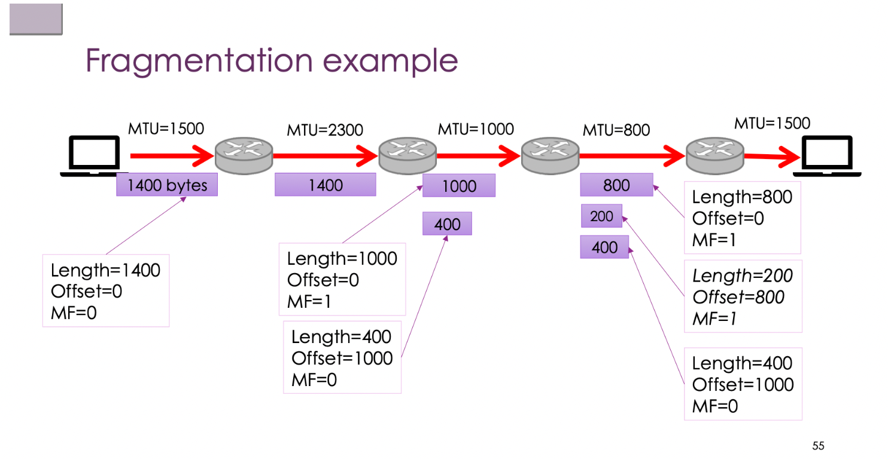

# Network Week 4 笔记

**本周主线：** 协议分层 → 封装机制 → IPv4 详解 → IP 分片 → IPv6 → 转发与路由

---

## 一、协议分层（Layering）

### 1.1 为什么要分层


分层的三个核心原则：

| 原则 | 含义 |
|------|------|
| Separation of concerns | 每一层只做一件事，降低复杂度 |
| Abstraction | 上层不关心下层实现细节 |
| Interoperability | 只要接口一致，可以替换任意层的实现 |

**三条设计规则：**

1. **用 Layer 分功能：** 每层专注于单一职责（应用逻辑 / 可靠传输 / 路由 / 局部传输）
2. **用 Protocol 在同一层通信：** 同层之间通过协议交换信息（逻辑通信）
3. **用 Service 接口调用下层：** 上层不直接操作底层，只调用接口

实际数据**不是横向直接传输**，而是：发送端逐层向下 → 通过网络 → 接收端逐层向上。

### 1.2 隐藏路径复杂性


从应用层视角看，Browser 和 Server 似乎"直接通信"（端到端逻辑通信）。

实际路径可能经过 20 个不同 LAN，例如：
```
你的电脑 → WiFi → 手机热点 → 5G 基站 → 运营商骨干网 → DSL → 家里路由器 → Ethernet → 服务器
```

每一段可能使用不同技术（WiFi / Ethernet / 光纤 / 铜线），但上层应用完全感知不到。

**关键结论：** 逻辑上是"端到端"，物理上是"多跳复杂路径"，分层将复杂性隐藏起来。

> **例外：** 只有出现性能问题（网慢、丢包、高延迟）时，才需要往下层排查。

### 1.3 协议栈（Protocol Stack）


**PDU（Protocol Data Unit）—— 每层的数据单位：**

| 层 | PDU 名称 | 典型协议 | 对应设备 |
|----|----------|----------|----------|
| Application（应用层）| Message / Data | HTTP, DNS | Proxy, Gateway |
| Transport（传输层）| Segment / Datagram | TCP, UDP | — |
| Network（网络层）| **Packet** | IP | Router |
| Link（链路层）| **Frame** | Ethernet, WiFi | Switch, Bridge |
| Physical（物理层）| Bits | — | Hub, Repeater |

**注意：Packet ≠ Frame ≠ Segment，不可混用。**

**SDU（Service Data Unit）：** 某层从上一层接收到的数据，作为自己的 payload。

> **例子：** TCP 的 SDU = HTTP data；IP 的 SDU = TCP segment。

---

## 二、OSI 参考模型与现实实现

### 2.1 OSI 七层模型


| 层 | 名称 | 核心作用 |
|----|------|----------|
| 7 | Application | 应用逻辑（HTTP、DNS、SMTP）|
| 6 | Presentation | 数据格式转换（编码、加密、压缩）|
| 5 | Session | 会话管理（连接状态、断线恢复）|
| 4 | Transport | 端到端传输（可靠性、流量控制）|
| 3 | Network | 跨网络路由（IP）|
| 2 | Link | 单跳传输（Frame）|
| 1 | Physical | 比特传输（信号）|

**现实情况：** OSI 是"伟大的标准——几乎从未被完整使用"。实际互联网更接近 **4 层模型**：
- Application（包含 OSI 5、6、7 层功能）
- Transport
- Network
- Link + Physical

### 2.2 现实中的分层

分层是设计**原则**，不是强制规则：

- **协议可以跨层：** 某些协议同时涉及多个层
- **层内部有子层：** Ethernet 的 Link 层拆分为 MAC 和 LLC（LLC 负责多路复用、流控、错误处理）
- **重要原则：** 用于**指导**协议设计，而非机械套用

**End-to-End Principle（端到端原则）：**
- Smart edges（端点聪明）：复杂逻辑放在 Client/Server
- Dumb core（网络简单）：中间网络只负责转发，少保存状态

> **例子：** 可靠传输（重传、顺序保证）由 TCP 在端点实现，而不是由中间路由器负责。这样路由器可以极高速转发，不需要为每个连接维护状态。

---

## 三、封装（Encapsulation）

### 3.1 封装机制


每一层将上层数据作为 payload，添加自己的 Header（有时还有 Trailer），传给下一层：

```
HTTP data
    ↓ + TCP header
TCP segment
    ↓ + IP header
IP packet
    ↓ + Ethernet header + trailer
Ethernet frame
    ↓
物理信号传输
```

嵌套结构（类比俄罗斯套娃）：
```
[ Ethernet frame                              ]
    [ IP packet                          ]
        [ TCP segment             ]
            [ HTTP request   ]
```

**每一层只看自己的 header，不解析内层数据。**

接收端执行反向的 **Decapsulation（解封装）**：逐层剥掉 header，将 payload 交给上层。

### 3.2 Frame 的关键特性

Frame 是**单跳（per-hop）**的数据单位，只在当前链路有效：

| 概念 | 范围 |
|------|------|
| Frame（Ethernet/WiFi）| 单跳（one hop）|
| Packet（IP）| 端到端（end-to-end）|
| Segment（TCP）| 端到端（end-to-end）|

**每经过一个 Router，Frame 会被拆掉并重新封装：**

```
WiFi frame → 到达 Router → 取出 IP packet → 重新封装成 Ethernet frame → 发出
```

IP packet 的内容基本不变（TTL 除外），但 Frame 在每一跳都会更换。

### 3.3 中间设备的处理原则

**理想：** 最小化报文检查（Minimal Packet Inspection）
- Switch → 只看 MAC address（Layer 2）
- Router → 只看 IP header（Layer 3）
- Hub → 什么都不看，纯转发电信号

**现实中有时需要更深层检查：**
- Firewall：需要看传输层端口或应用层内容
- VPN：需要封装/解封装整个 packet
- DPI（Deep Packet Inspection）：检查到应用层 payload

**代价：** DPI 增加显著延迟和设备负载。

---

## 四、IPv4

### 4.1 IP 层的职责

IP 层是**尽量薄的 glue layer（粘合层）**，只负责四件事：
1. 把 packet 送到目的地
2. 提供全球统一的地址体系
3. 应对网络拓扑变化
4. 尽可能运行在任何链路之上

设计原则：**Best-effort（尽力而为）**——不承诺强保证，丢包、乱序、重传由上层处理。

### 4.2 IPv4 Header 结构


每行 32 bits（4 bytes），标准 header 共 5 行 = 20 bytes：

**第 1 行（bits 0–31）：**

| 字段 | 位宽 | 含义 |
|------|------|------|
| Version | 4 bit | IP 版本（IPv4 = 4）|
| IHL | 4 bit | Header 长度，单位为 32-bit words（最小值 5 = 20 bytes）|
| DSCP / DiffServ | 6 bit | 服务质量（QoS）分类 |
| ECN | 2 bit | 显式拥塞通知 |
| Total Length | 16 bit | 整个 IP packet 的字节数（header + payload）|

**第 2 行（bits 32–63）：**

| 字段 | 位宽 | 含义 |
|------|------|------|
| Identification | 16 bit | 分片标识，同一 packet 的分片共享此值 |
| Reserved | 1 bit | 保留位（应为 0）|
| DF | 1 bit | Don't Fragment：禁止分片 |
| MF | 1 bit | More Fragments：后面还有更多分片 |
| Fragment Offset | 13 bit | 本分片在原 packet 中的偏移量（单位 8 bytes）|

**第 3 行（bits 64–95）：**

| 字段 | 位宽 | 含义 |
|------|------|------|
| TTL | 8 bit | Time To Live：每过一跳减 1，为 0 时丢弃，防止 packet 无限循环 |
| Protocol | 8 bit | 上层协议：6 = TCP，17 = UDP，1 = ICMP |
| Header Checksum | 16 bit | 仅校验 header（TTL 每跳改变，因此 checksum 也需路由器更新）|

**第 4、5 行（各 32 bits）：**
- Source Address：源 IP（32 bit）
- Destination Address：目标 IP（32 bit）

**第 6 行（可选）：** Options + Padding（如有，IHL > 5）

> **例子：** IHL = 5 → header = 5 × 4 = 20 bytes（无 Options）；IHL = 6 → header = 24 bytes（含 4 bytes Options）

> **注意：** TTL 在每跳减少，因此路由器**必须同时更新 Header Checksum**，这是 IPv4 与 IPv6 的重要区别之一（IPv6 去掉了 Header Checksum）。

### 4.3 IPv4 地址

**地址本质：** IP 地址标识的是**网络接口（interface）**，而非整台主机。一台有多个网卡的路由器会有多个 IP 地址。

**地址表示：** 32-bit，点分十进制（Dotted Quad）：
```
192.168.1.10 = 11000000.10101000.00000001.00001010
```

**前缀（Prefix）/ CIDR 表示：**
- `192.168.1.0/24` 表示前 24 位是网络部分，后 8 位是主机部分
- 前缀越长 → 网络范围越小 → 主机数越少
- 目的：路由表**聚合（Aggregation）**，一条表项代表一批地址

**特殊地址：**

| 地址 | 含义 |
|------|------|
| `0.0.0.0` | 未知/任意接口（DHCP 请求时使用）|
| `127.0.0.1`（/8）| Loopback，发给自己，不出网卡 |
| `169.254.0.0/16` | Link-local，DHCP 失败时自动分配，通常意味着网络配置异常 |
| `10.0.0.0/8` `172.16.0.0/12` `192.168.0.0/16` | 私有地址（RFC 1918），不在公网路由 |
| `224.0.0.0/4` | Multicast |
| `255.255.255.255` | Limited broadcast |

**旧的 Classful 地址体系（历史语言）：**

| 类别 | 前缀 | 地址范围 |
|------|------|----------|
| Class A | /8 | 1.0.0.0 – 126.0.0.0 |
| Class B | /16 | 128.0.0.0 – 191.255.0.0 |
| Class C | /24 | 192.0.0.0 – 223.255.255.0 |
| Class D | — | 224.0.0.0/4，Multicast |
| Class E | — | 240.0.0.0+，实验用途 |

现代路由使用 **CIDR（Classless Inter-Domain Routing）**，不依赖 classful 边界。

### 4.4 转发表（Forwarding Table）与最长前缀匹配

**Forwarding Table：** 目标网络前缀 → 下一跳（next hop）或出接口的映射规则表。

主机的 forwarding table 很简单，通常只有两条规则：
```
192.168.1.0/24  →  on-link（直接在本 LAN 发送）
0.0.0.0/0       →  192.168.1.1（发给默认网关）
```

**Longest Prefix Match（最长前缀匹配）：** 当多条表项都能匹配目标 IP 时，选择**前缀最长（最具体）**的那条。

> **例子：**
> ```
> 表项 A: 150.203.0.0/16  → Router 5
> 表项 B: 150.203.10.0/24 → Router 4
>
> 目标 150.203.10.200：
>   匹配 A（/16）✓  匹配 B（/24）✓
>   → 选 /24（更长、更具体）→ 走 Router 4
>
> 目标 150.203.8.99：
>   匹配 A（/16）✓  不匹配 B
>   → 选 /16 → 走 Router 5
> ```

**为什么允许表项重叠？** 这是特性，不是 bug——可以用短前缀做默认路由，再用更长前缀"挖出"特定子网走不同路径（更快/更便宜/更安全/符合 policy）。

**Forwarding vs Routing（重要区分）：**

| 概念 | 层面 | 作用 |
|------|------|------|
| Forwarding（转发）| 单个路由器，本地动作 | 收到 packet → 查表 → 决定 next hop |
| Routing（路由）| 全局过程 | 所有路由器如何学习、建立、更新转发表 |

对应 **Data Plane（数据平面）** 和 **Control Plane（控制平面）** 的分离。

### 4.5 ARP（Address Resolution Protocol）

**问题：** Network Layer 知道目标 IP，但 Link Layer 只认识 MAC 地址，需要将 IP 映射到 MAC。

**工作流程：**
```
主机 A 想发给 192.168.1.20（同一 LAN）
  ↓
A 发送 ARP Request（广播：FF:FF:FF:FF:FF:FF）
  "Who has 192.168.1.20? Tell 192.168.1.10"
  ↓
192.168.1.20 回复 ARP Reply（单播给 A）
  "192.168.1.20 is at AA:BB:CC:DD:EE:FF"
  ↓
A 缓存此映射（ARP Cache），后续直接使用
```

- ARP Cache 有老化时间，过期后重新查询
- **Gratuitous ARP：** 主机主动广播自己的 IP-MAC 映射，用于提前通告或检测 IP 地址冲突

> **例子：** 你第一次 ping 同一网络的某台机器时，OS 会先发 ARP 请求，可以用 `arp -a` 命令查看本机 ARP 缓存表。

---

## 五、IP Multicast 与 ICMP

### 5.1 IP Multicast

**Multicast 地址：** `224.0.0.0/4`（Class D）

| 类型 | 行为 |
|------|------|
| Unicast | 发给一个特定主机 |
| Broadcast | 发给链路上所有主机 |
| **Multicast** | 发给一个组，只有**加入该组的主机**收到 |

发送者只发**一份** packet，路由器按需复制并分发给组成员路径，不在组里的主机不会收到，不需要处理该流量。

**IGMP（Internet Group Membership Protocol）：** 主机用于告知本地路由器"我想加入/退出某个 multicast 组"的协议。

> **例子：** 视频会议系统或 IPTV 使用 multicast，发送方只发一次，多个接收者同时收看。若用 unicast，服务器需为每个接收者单独发一份副本，带宽消耗与接收者数量成正比。

**注意：** Multicast 要求路由器维护"组成员状态"，某种程度上与互联网 end-to-end 无状态原则相悖。

### 5.2 ICMP（Internet Control Message Protocol）

ICMP 是互联网的**控制/错误反馈协议**，本身封装在 IP packet 的 payload 中（Protocol = 1）。

**常见 ICMP 类型：**

| Type | 名称 | 用途 |
|------|------|------|
| 0 | Echo Reply | ping 的响应 |
| 3 | Destination Unreachable | 目的不可达（各种 Code 区分原因）|
| 8 | Echo Request | ping 的请求 |
| 11 | Time Exceeded | TTL 减为 0（traceroute 利用此消息）|

**Ping：**
```
发送方 → ICMP Echo Request → 目标主机
目标主机 → ICMP Echo Reply → 发送方
```
用途：测试主机可达性，粗略测量 RTT（Round Trip Time）。

注意：管理员可能屏蔽 ICMP，ping 不通不代表主机一定宕机。

**Traceroute：**

利用 **TTL 递增 + ICMP Time Exceeded** 逐跳探测路径：

```
发 TTL=1 → 第1跳路由器丢弃，返回 Time Exceeded（含路由器 IP）
发 TTL=2 → 第2跳路由器返回 Time Exceeded
...
发 TTL=N → 到达目标，返回 Echo Reply 或 Port Unreachable
```

每一跳通常探测 3 次，显示各跳 RTT 和 IP。RTT 大幅跳升通常意味着物理距离突然增大（如跨越大洋）。

> **例子：** `traceroute bbc.co.uk` 可以观察路径是经过澳洲 → 美国 → 欧洲还是直接到欧洲，RTT 跳变大约对应跨洋光缆节点。

---

## 六、IP 分片（Fragmentation）

### 6.1 MTU（Maximum Transmission Unit）

**MTU：** 某条链路能承载的最大 IP payload 字节数。

| 链路类型 | 典型 MTU |
|----------|----------|
| Ethernet | 1500 bytes |
| WiFi（802.11）| ~2300 bytes |
| Jumbo Ethernet | 9000 bytes |
| PPPoE | 1492 bytes |

当 packet 大小超过出接口 MTU，路由器必须处理。

### 6.2 分片机制



路由器将大 packet 切成多个 **fragment**，每个 fragment 都是独立的 IP packet（含自己的 IP header）：

```
原始 packet: Total Length=1400, DF=0, MF=0, Offset=0

经过 MTU=1000 的链路后分片：

Fragment 1: Length=1000, MF=1, Offset=0
            （前 980 bytes payload，标记"后面还有"）
Fragment 2: Length=400,  MF=0, Offset=980
            （后 380 bytes payload，标记"这是最后一片"）
```

**关键字段：**
- **Identification：** 同一原始 packet 的所有分片共享此值
- **MF（More Fragments）：** 1 = 后面还有分片；0 = 这是最后一片
- **Fragment Offset：** 本分片在原 packet 中的字节偏移量（单位：8 bytes）
- **DF（Don't Fragment）：** 禁止分片，若 packet 过大则路由器丢弃并返回 ICMP

**重组：** fragment 可能走不同路径、乱序到达，由**接收端**统一重组，路由器不负责重组。

### 6.3 分片的代价

| 问题 | 说明 |
|------|------|
| 路由器/接收端负担增加 | 切片和重组都消耗资源 |
| 丢包概率上升 | 任意一片丢失，整个上层数据都废弃 |
| 无单独重传机制 | fragment 没有自己的 ACK，整体需上层重传 |
| 安全风险 | 攻击者可将恶意内容拆成多片，中途设备每片看起来都正常，重组后才暴露攻击 payload（Teardrop 攻击等）|
| DPI 困难 | 无法在 fragment 级别做完整应用层检测 |

### 6.4 Path MTU Discovery（PMTUD）

**更好的方案：** 主动探测整条路径上的最小 MTU，直接按该大小发送，避免中途分片。

**流程：**
```
1. 发送方发较大 packet，设置 DF=1（禁止分片）
2. 若某路由器发现 packet > 出接口 MTU，无法分片
3. 路由器丢弃该 packet，返回 ICMP Destination Unreachable (Code 4: Fragmentation Required)
   并告知 next-hop MTU
4. 发送方得知瓶颈，调小 packet 大小后重发
5. 重复直到找到整条路径最小 MTU
```

现代系统越来越倾向于让**主机**执行 PMTUD，而不是依赖中间路由器分片。

---

## 七、IPv4 耗尽与 IPv6

### 7.1 地址分配体系

```
IANA / ICANN
     ↓
RIR（区域互联网注册机构）
     ↓
ISP
     ↓
最终用户
```

五大 RIR：

| 机构 | 覆盖区域 |
|------|----------|
| ARIN | 北美 |
| RIPE NCC | 欧洲、中东、中亚 |
| APNIC | 亚太（含澳洲）|
| AFRINIC | 非洲 |
| LACNIC | 拉丁美洲、加勒比 |

全球 IP 地址必须通过此层级体系保证唯一性，同时兼顾路由聚合和地区治理。

### 7.2 IPv4 耗尽

各 RIR 在 2011–2015 年间相继耗尽新 IPv4 地址池。

**问题不只是"地址不够"，还包括：**
- 路由表膨胀（地址切割越来越细碎，难以聚合）
- 骨干路由器需对接近百万条表项做 Longest Prefix Match，压力极大
- 管理复杂度持续上升

**临时解决方案（延后问题，未从根本解决）：**

| 方案 | 机制 |
|------|------|
| NAT（Network Address Translation）| 内部大量用私有地址，共享少量公网 IP |
| CGN（Carrier-Grade NAT）| 运营商级 NAT，多个用户共享一个公网 IP |
| CIDR | 更灵活的地址分配，避免 classful 浪费 |

**NAT 是"IPv6 killer"：** 因为 NAT 让大家没有迫切的压力必须上 IPv6，从而大幅延缓了 IPv6 部署。但 NAT 带来的副作用（端到端透明性破坏、P2P 困难、应用层复杂）并未消失。

### 7.3 IPv6

**核心变化：**

| 对比项 | IPv4 | IPv6 |
|--------|------|------|
| 地址长度 | 32 bit | 128 bit |
| Header 长度 | 可变（20–60 bytes）| 固定 40 bytes |
| Header Checksum | 有（每跳需更新）| 无（降低路由器负担）|
| 分片 | 路由器可分片 | 只有源主机可分片 |
| Broadcast | 有 | **无**（改用 Multicast/Anycast）|
| 地址自动配置 | DHCP（有状态）| SLAAC（无状态，自动配置）|

**IPv6 地址表示（128-bit，冒号分隔十六进制）：**

```
完整格式：3018:0ae8:0000:0000:0000:ae00:0098:8ac2
压缩规则：
  1. 每组前导 0 可省略
  2. 连续全 0 组可压缩为 ::（只能用一次）
压缩结果：3018:ae8::ae00:98:8ac2
```

**IPv6 地址类型（注意：没有 Broadcast）：**

| 类型 | 含义 |
|------|------|
| Unicast | 发给一个主机 |
| Multicast | 发给一个组的所有成员 |
| **Anycast** | 发给一个组中**最近的一个**成员 |

IPv6 还引入了 **Scope（作用域）** 概念：Link-local（链路本地，以 `fe80::` 开头）/ Site-local / Global。

> **例子（Anycast 应用）：** DNS 根服务器使用 Anycast 地址，全球多个物理服务器共享同一 IP，DNS 请求自动路由到"最近"的一台。CDN 节点分配也常用 Anycast。

### 7.4 IPv6 迁移方案

| 方案 | 原理 |
|------|------|
| Dual Stack | 设备同时运行 IPv4 和 IPv6 |
| Tunnelling | 将 IPv6 packet 封装在 IPv4 packet 中传输 |
| Translation（NAT64）| 在 IPv4/IPv6 边界做地址和协议转换 |

**为什么迁移这么慢：**
- 旧系统、旧设备太多（特别是嵌入式设备、工业系统）
- 无法像 1983 年 ARPANET 那样一夜切换
- NAT 等补丁方案让 IPv4 继续可用，缺乏强商业动机
- IPv6 使用率持续增长（Google 统计约 40%+），但仍长期与 IPv4 共存

---

## 八、LAN 为什么不能直接扩展成互联网

LAN 技术（Ethernet/WiFi）无法直接组成全球网络，原因有四：

| 问题 | 说明 |
|------|------|
| **Media 异构** | 铜线、光纤、无线、移动、低功耗各自适合不同 LAN 技术 |
| **Scaling 问题** | LAN 的地址表（MAC table）、广播域、STP 拓扑更新，全球规模下完全撑不住 |
| **Traffic control** | STP 只求"无环路"，不求"最优路径"；真实网络还受成本、政策、地理约束 |
| **协议不兼容** | 各种 LAN 的地址格式、帧格式、服务模型不统一，应用不可能为每种 LAN 各写一版 |

**解决方案：** 在各种 LAN 之上再加一个**共同层（IP 层）**，将"互联"抽象出来，隐藏底层异构性。

---

## 九、Packet Switching vs Circuit Switching

| 对比项 | Circuit Switching | Packet Switching |
|--------|-------------------|------------------|
| 资源预留 | 建立时预留专用通路 | 无需预留，统计复用 |
| 丢包恢复 | 无（通路中断则全断）| 单 packet 丢失，不影响其他 |
| 支持多用户共享 | 否 | 是（Statistical Multiplexing）|
| 延迟保证 | 是（稳定）| 否（jitter，乱序）|
| 带宽利用 | 低（空闲时浪费）| 高 |
| 适合 | 语音通话 | 数据通信（HTTP/视频/文件）|

**Packet 的代价：** 可能乱序到达、时延变化（jitter）、无强保证，这些必须由接收端/上层协议（TCP）处理。

**"Packet 世界里的 Circuit"：** MPLS（Multi-Protocol Label Switching）——在 packet 网络上建立预配置路径（Label Switched Paths），在保留统计复用优势的同时，提供更可控的路径和 QoS。

---

## 十、核心知识点总结

| 考点 | 要点 |
|------|------|
| 分层原则 | Separation of concerns / Abstraction / Interoperability |
| PDU 命名 | Message / Segment / **Packet** / **Frame** / Bits（不可混用）|
| Encapsulation | 每层加 header，每层只看自己 header |
| End-to-end | 复杂逻辑在端点，核心网络尽量简单（smart edges, dumb core）|
| Forwarding vs Routing | 转发=本地查表决定 next hop；路由=全局学习建表（Data Plane / Control Plane）|
| Longest Prefix Match | 多条匹配选前缀**最长**（最具体）的 |
| ARP | 同一 LAN 内将 IP 地址解析为 MAC 地址 |
| TTL | 每跳减 1，防止 packet 无限循环；traceroute 利用此机制 |
| IP Fragmentation | 路由器按 MTU 切片，接收端重组；代价高，推荐用 PMTUD 替代 |
| Path MTU Discovery | DF=1 + ICMP Fragmentation Required，主机主动探测路径最小 MTU |
| IPv4 特殊地址 | 127.0.0.1（loopback）/ 169.254.x.x（link-local，配置失败）/ 10/172.16/192.168（私有）|
| Multicast vs Broadcast | Multicast 只送到组成员；IPv6 **没有 Broadcast** |
| ICMP | 控制/错误协议；ping = Echo Request/Reply；traceroute = TTL + Time Exceeded |
| IPv6 核心变化 | 128-bit 地址 / 固定 header / 无 Broadcast / 无路由器分片 / Anycast |
| NAT 是 IPv6 killer | NAT 延缓了 IPv6 部署，但带来端到端透明性破坏等副作用 |
