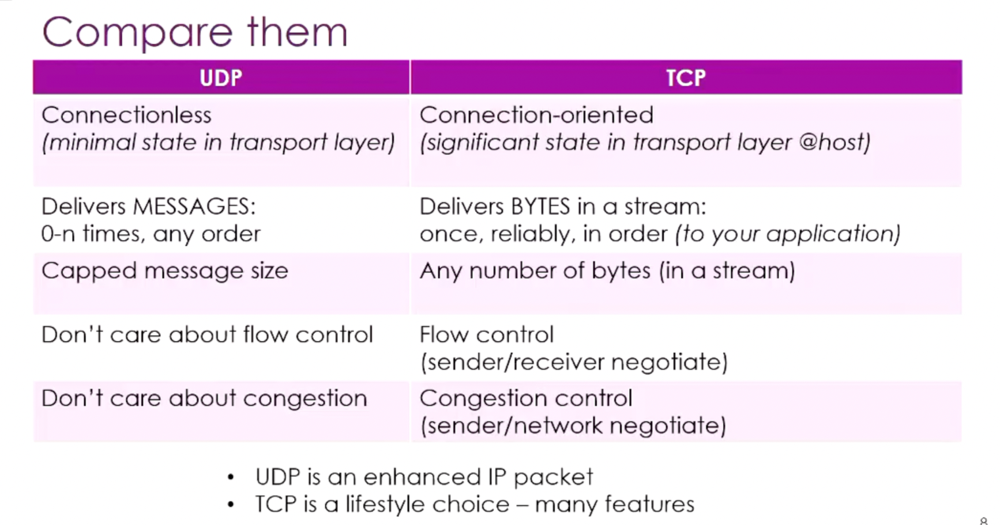
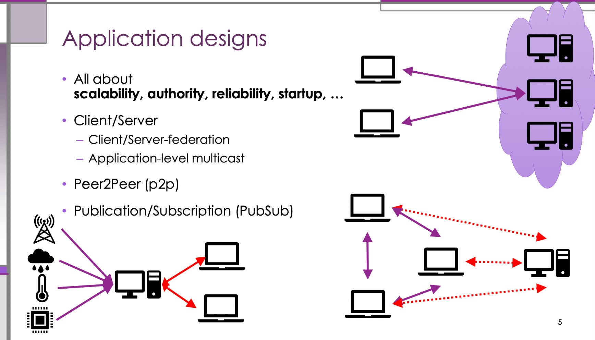
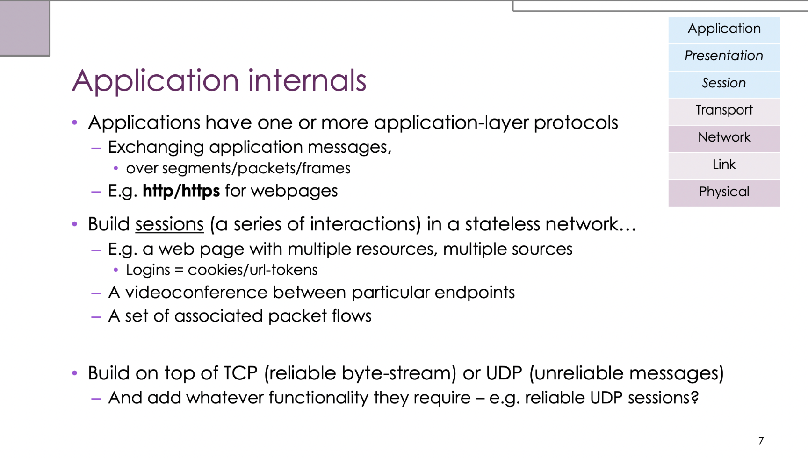
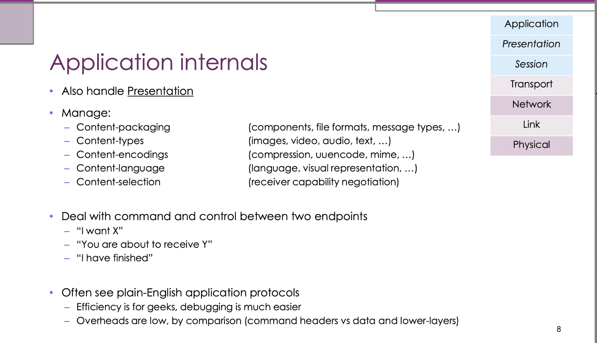
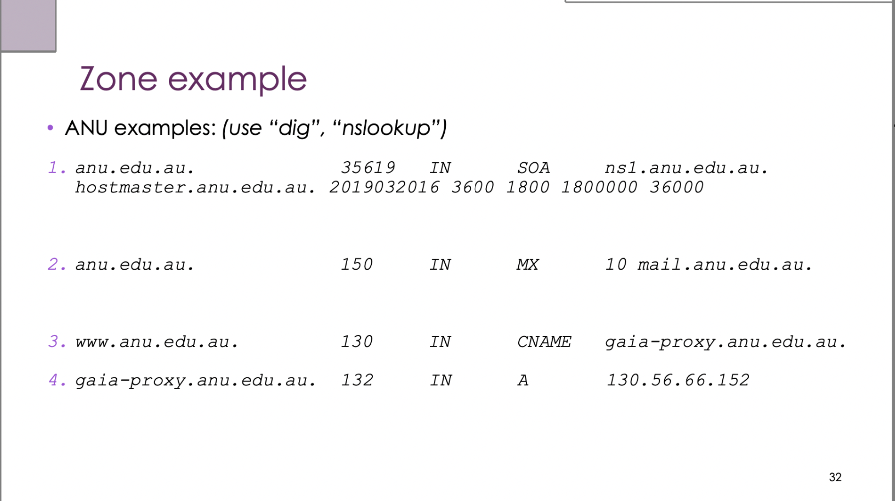
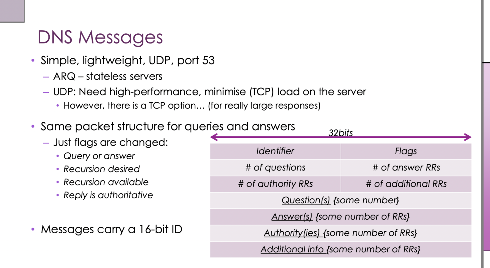

# Network Week 5 笔记

---

## 一、IPv6 迁移方式（延续 Week 4）

IPv4 → IPv6 是一个渐进过程，三种主要过渡技术：

| 策略 | 原理 | 适用场景 |
|------|------|----------|
| **Dual Stack** | 设备同时运行 IPv4 和 IPv6 | 过渡期两套协议共存 |
| **Tunneling** | 把 IPv6 包封装进 IPv4 包传输 | IPv6 孤岛穿越 IPv4 网络 |
| **Translation（NAT64）** | 在网关做 IPv4/IPv6 协议转换 | IPv6-only 网络访问 IPv4 服务器 |

**NAT 是"IPv6 杀手"的原因**：NAT 让大量设备共享一个 IPv4 地址，掩盖了 IPv4 耗尽的紧迫性，大幅降低了迁移 IPv6 的动力。

---

## 二、传输层（Transport Layer）概述

### 传输层的职责

- 提供**端到端（end-to-end）**通信服务
- 网络层（IP）负责主机到主机的路由；传输层负责**进程到进程**的通信
- 多路复用（multiplexing）：一台主机上多个应用可以同时使用网络

### UDP vs TCP 对比



| 特性 | UDP | TCP |
|------|-----|-----|
| 连接 | 无连接（connectionless）| 有连接（connection-oriented）|
| 可靠性 | 不保证送达 | 可靠传输（ACK + 重传）|
| 顺序 | 不保证顺序 | 保证顺序 |
| 流量控制 | 无 | 有 |
| 拥塞控制 | 无 | 有 |
| 开销 | 小（8 字节头部）| 大（20+ 字节头部）|
| 延迟 | 低 | 高（三次握手、确认等）|
| 适用场景 | DNS、视频流、游戏、VoIP | HTTP、文件传输、邮件 |

**核心原则**：UDP 把可靠性决策权留给应用层；TCP 在传输层保证可靠性。

> **例子**：视频会议（Zoom/Teams）用 UDP：偶尔丢一帧没关系，但卡顿 2 秒重传才会影响体验。网页下载用 TCP：每个字节都必须完整到达，否则 HTML/JS 会损坏。

---

## 三、端口、套接字与 NAT

### 端口号（Port Numbers）

- 端口号是 **16 位整数**（0–65535）
- 区分同一主机上不同应用/进程
- 知名端口（Well-known ports）：
  - 80 = HTTP，443 = HTTPS
  - 53 = DNS，25 = SMTP，22 = SSH

### 套接字（Socket）

一个连接由五元组唯一标识：

```
(协议, 源IP, 源端口, 目的IP, 目的端口)
```

> **例子**：浏览器同时开 10 个 TCP 连接到 `93.184.216.34:443`，每个连接的源端口不同（如 50001–50010），五元组各不相同，操作系统据此区分每个连接的数据。

### NAPT（Network Address and Port Translation）

NAT 最常见的形式是 NAPT（也叫 PAT）：

```
内网设备              路由器（NAT）           外网服务器
192.168.1.2:5000  →  203.0.113.1:40001  →  93.184.216.34:443
192.168.1.3:5000  →  203.0.113.1:40002  →  93.184.216.34:443
```

- 路由器维护一张 **NAT 转换表**，记录内外端口映射
- 外网只看到路由器的公网 IP，内部设备被隐藏
- **问题**：外网无法主动发起到内网设备的连接（P2P 应用需要打洞技术）

---

## 四、TCP 机制详解

### 4.1 序列号与确认号

- TCP 传输字节流，每个字节都有编号（**序列号 Sequence Number**）
- 接收方回复 **ACK**，表示"我已收到序号 X 之前的所有字节，期待下一个是 X"
- ACK 是**累积确认（cumulative ACK）**

```
发送方发: SEQ=0, 数据="Hello"(5字节)
接收方回: ACK=5 (表示已收到0-4，期待从5开始)
发送方发: SEQ=5, 数据="World"(5字节)
接收方回: ACK=10
```

### 4.2 三次握手（Three-Way Handshake）

建立 TCP 连接需要三步：

```
客户端                          服务器
  |  ------ SYN (seq=x) ------>  |   第1步：客户端发起
  |  <-- SYN-ACK (seq=y, ack=x+1) --  |   第2步：服务器确认并发起
  |  ----- ACK (ack=y+1) ------>  |   第3步：客户端确认
  |      连接建立完成              |
```

**为什么需要三次而不是两次？**  
双方各需确认自己的发送能力和对方的接收能力都正常。两次握手无法让客户端确认服务器"确认了客户端的序列号"。

**四次挥手（关闭连接）**：

```
主动关闭方发 FIN → 对方 ACK → 对方发 FIN → 主动方 ACK
```

### 4.3 滑动窗口（Sliding Window）

滑动窗口让发送方不必等每个 ACK 才发下一包，可以连续发送多个包：

```
窗口大小 = 4 个包：
发送: [1][2][3][4]  等待ACK
收到 ACK=1 → 窗口滑动：
发送: [2][3][4][5]  等待ACK
```

- **窗口大小** = 网络中"飞行中"的未确认数据量上限
- 更大的窗口 → 更高的吞吐量（但也增加缓冲区压力）

### 4.4 流量控制（Flow Control）

接收方告诉发送方自己的缓冲区还有多少空间（**接收窗口 rwnd**）：

```
接收方 ACK 时携带: rwnd = 8192 字节
发送方每次发送量 ≤ rwnd
```

防止发送方把接收方的缓冲区打爆。

### 4.5 拥塞控制（Congestion Control）

TCP 会探测网络容量，避免撑爆路由器队列：

| 阶段 | 行为 |
|------|------|
| **慢启动（Slow Start）** | 指数增长窗口，直到阈值或丢包 |
| **拥塞避免（Congestion Avoidance）** | 线性增长，谨慎探测 |
| **丢包响应** | 检测到丢包 → 窗口缩小 |

> **形象比喻**：TCP 就像在高速公路上开车，先慢慢加速（慢启动），然后稳定巡航（拥塞避免），遇到堵车（丢包）就踩刹车（窗口减小）。

---

## 五、应用层（Application Layer）概述

应用层是用户真正"使用"网络的地方，负责：
1. 定义应用协议（HTTP、DNS、SMTP 等）
2. 在无状态网络（IP）上构建有状态交互（Session）
3. 承担部分表示层职责（数据格式、编码、压缩）

### 应用架构设计



| 架构 | 原理 | 优点 | 缺点 | 例子 |
|------|------|------|------|------|
| **Client/Server** | 中心化服务器响应请求 | 易管理、数据一致 | 单点瓶颈 | HTTP、邮件 |
| **Client/Server Federation** | 多服务器协同 | 可扩展 | 复杂协调 | Google 搜索集群 |
| **P2P** | 节点直接通信 | 高扩展、无中心 | 难管理、不稳定 | BitTorrent、区块链 |
| **Pub/Sub** | 发布者/订阅者解耦 | 异步、松耦合 | 需要消息中间件 | Kafka、MQTT（IoT）|

### 应用内部机制





**在无状态网络上构建有状态 Session：**

- IP 网络本身是 **stateless**（每个包独立路由，互不知道）
- 应用需要 **session**：一系列相关交互（如登录后浏览多个页面）
- 实现方式：cookie、token、会话 ID 等

**应用层承担的表示层职责：**

| 职责 | 技术 |
|------|------|
| 数据格式 | JSON、HTML、protobuf |
| 内容类型 | MIME types（text/html, image/png）|
| 压缩编码 | gzip、base64 |
| 内容协商 | HTTP `Accept`、`Accept-Encoding` 头 |
| 内容选择 | 手机返回小图、PC 返回高清图 |

**为什么许多协议是"纯文本"？**  
HTTP 请求是人类可读的文本（`GET /index.html HTTP/1.1`），牺牲一些效率换来易于调试和理解。高性能场景改用二进制协议（如 gRPC/protobuf）。

---

## 六、DHCP（动态主机配置协议）

### 作用

当设备接入网络时，自动获取：
- IP 地址
- 子网掩码
- 默认网关
- DNS 服务器地址

### DORA 流程（四步握手）

```
客户端                              DHCP 服务器
  |  --Discover (广播, src:0.0.0.0)-->  |   "有 DHCP 服务器吗？"
  |  <------- Offer ----------------   |   "给你这个 IP：192.168.1.50"
  |  --Request (广播, 选择该offer)-->   |   "我要这个 IP！"
  |  <------- Acknowledge ----------   |   "好的，租用 24 小时"
```

| 步骤 | 名称 | 方向 | 说明 |
|------|------|------|------|
| D | Discover | 客户端广播 | 寻找 DHCP 服务器 |
| O | Offer | 服务器单播 | 提供 IP 地址 |
| R | Request | 客户端广播 | 确认接受该 offer |
| A | Acknowledge | 服务器单播 | 确认并下发配置 |

> **为什么 Request 也是广播？** 网络中可能有多个 DHCP 服务器都发了 Offer，广播 Request 可以让没被选中的服务器知道并收回它们的 Offer。

**租约（Lease）**：IP 分配有时间限制，到期前客户端需续租（`DHCPREQUEST` + `DHCPACK`），或重新执行 DORA 流程。

---

## 七、DNS（域名系统）

### DNS 的作用

将人类可读的域名（`www.google.com`）解析为网络地址（`142.250.190.36`）。

**三大设计思想：**
1. **Distributed**（分布式）：没有单点，全球数千台服务器
2. **Hierarchical**（分层）：从根到叶的树状结构
3. **Automated**（自动化）：无需人工干预，自动查询

### DNS 命名空间层次结构

```
.（根）
├── com
│   ├── google.com
│   │   ├── www.google.com
│   │   └── mail.google.com
│   └── amazon.com
├── org
│   └── wikipedia.org
├── edu
│   └── mit.edu
└── au
    └── edu.au
        └── anu.edu.au
```

- **根域（Root）**：`.`，树的顶点
- **顶级域（TLD）**：`.com`、`.org`、`.edu`、`.au` 等
- **二级域**：`google.com`、`anu.edu.au` 等（由组织注册）
- **子域/主机名**：`www`、`mail` 等（由组织自行管理）

**TLD 的政治性**：`.com/.org/.net` 由 ICANN 管理；国家码 TLD（`.au`、`.cn`）由各国机构管理，各有不同注册规则。

### Domain vs Zone 的区别

| 概念 | 含义 |
|------|------|
| **Domain（域）** | 命名空间中的一个子树（管理/责任边界）|
| **Zone（区）** | 实际存储的 DNS 数据文件（技术实现）|
| **Delegation（委派）** | 把子域的管理权移交给另一个组织 |

> **例子**：`anu.edu.au` 是一个 domain，但 `cs.anu.edu.au` 可能被委派给计算机学院单独管理，形成独立的 zone。

### 资源记录（Resource Records）

DNS zone 文件中存储 RR（Resource Record）：

| 类型 | 作用 | 例子 |
|------|------|------|
| **SOA** | 区的起始记录，包含主 NS 信息、刷新参数 | 每个 zone 必须有一条 |
| **A** | 域名 → IPv4 地址 | `www.google.com → 142.250.190.36` |
| **AAAA** | 域名 → IPv6 地址 | `www.google.com → 2607:f8b0:4004::200e` |
| **CNAME** | 别名 → 规范名 | `mail.google.com → googlemail.l.google.com` |
| **MX** | 邮件服务器（带优先级）| `google.com → smtp.google.com (priority 10)` |
| **NS** | 该域的权威 nameserver | `google.com → ns1.google.com` |

### DNS 解析流程



以查询 `www.cs.anu.edu.au` 为例：

```
1. 客户端问 本地 Resolver（通常是路由器或 ISP）
2. 本地 Resolver 问 根服务器：".au 在哪？"
3. 根服务器回："问 .au 的 TLD nameserver"
4. 本地 Resolver 问 .au TLD：".edu.au 在哪？"
5. .au TLD 回：".edu.au 的 nameserver"
6. 本地 Resolver 问 .edu.au NS："anu.edu.au 在哪？"
7. .edu.au NS 回："anu.edu.au 的 nameserver（ns.anu.edu.au）"
8. 本地 Resolver 问 anu.edu.au NS："cs.anu.edu.au 在哪？"
9. anu.edu.au NS 回："cs.anu.edu.au 的 nameserver"
10. 本地 Resolver 问 cs.anu.edu.au NS："www 的 IP？"
11. 权威 NS 回：IP 地址
12. 本地 Resolver 把结果返回客户端
```

### 递归 vs 迭代查询

| 模式 | 谁做查询 | 常见场景 |
|------|----------|----------|
| **递归（Recursive）** | Resolver 负责所有查询，把最终结果返回客户端 | 客户端 → 本地 Resolver |
| **迭代（Iterative）** | 每个 NS 只返回"下一步去问谁"，查询方自己继续 | 本地 Resolver → 各级 NS |

> **实际流程**：客户端发送**递归查询**给本地 Resolver；本地 Resolver 用**迭代查询**逐级问各 NS，汇总后把结果返回客户端。

### 根服务器与 Anycast

- 全球只有 **13 个根服务器 IP（A–M）**，但每个 IP 背后有数百台物理服务器
- 使用 **Anycast**：同一个 IP 地址在多个地点广播，路由器把请求送到"最近"的那台
- Anycast 让根服务器既具备全球可用性，又保持低延迟

### 缓存与 TTL

- 每条 DNS 记录都有 **TTL（Time To Live）**，单位为秒
- Resolver 可以缓存查询结果到 TTL 到期
- TTL 短（如 300s）→ 变更传播快，但查询量大
- TTL 长（如 86400s）→ 缓存效率高，但更新慢

> **例子**：换服务器 IP 前，先把 TTL 降到 300s，等旧缓存过期后再切换，可以减少停机时间。

### Nameserver 复制与冗余

一个 domain 配置多个 NS 记录，这些 nameserver 通过 **zone transfer** 同步同一份 zone 数据：

- 防止单点故障：某台 NS 挂了，其他继续服务
- 可以是跨机构备份（例如 ANU 和 Adelaide 互相为对方做 secondary NS）

> **关键区分**：被列为 NS 的外部机构并不"拥有"该域，只是被授权**托管 zone 数据并回答查询**，管理责任仍在原机构。

### DNS 消息格式



DNS 使用 **UDP 端口 53**（默认）：
- 查询和响应格式相同（头部 Flags 区分 QR 位）
- 响应超过 512 字节（或启用 EDNS0 时超过协商大小）→ 改用 **TCP 端口 53**

### Dynamic DNS（动态 DNS）

**场景**：家庭宽带的公网 IP 会定期变化，但想从外网访问家里的服务器。

**解决方案**：
1. 向 DDNS 服务商注册一个固定域名（如 `myserver.ddns.net`）
2. 路由器上运行 agent，定期检测公网 IP 并更新 DNS 记录
3. 外部用户访问固定域名，DDNS 服务商返回当前 IP

本质：**用稳定域名追踪变化的公网 IP**。

---

## 八、知识点速查

### 传输层核心概念

| 概念 | UDP | TCP |
|------|-----|-----|
| 端口 | 有 | 有 |
| 握手 | 无 | 3次握手 |
| 可靠性 | 无 | ACK + 重传 |
| 流量控制 | 无 | rwnd |
| 拥塞控制 | 无 | 慢启动 + 拥塞避免 |
| 头部大小 | 8 字节 | 20+ 字节 |

### DNS 考点速查

| 考点 | 要点 |
|------|------|
| DNS 作用 | 域名 → IP 地址解析 |
| 三大设计 | 分布式、分层、自动化 |
| 命名空间 | 根 → TLD → 二级域 → 主机名 |
| Domain vs Zone | 管理边界 vs 数据文件 |
| 常见 RR | SOA、A、AAAA、CNAME、MX、NS |
| 解析路径 | 根 → TLD → 权威 NS |
| 递归 vs 迭代 | 客户端用递归，Resolver 用迭代 |
| 传输协议 | UDP/53（默认），TCP/53（大响应）|
| 根服务器 | 13个IP，Anycast 实现全球分布 |
| 缓存 TTL | 控制记录有效期，影响更新传播速度 |
