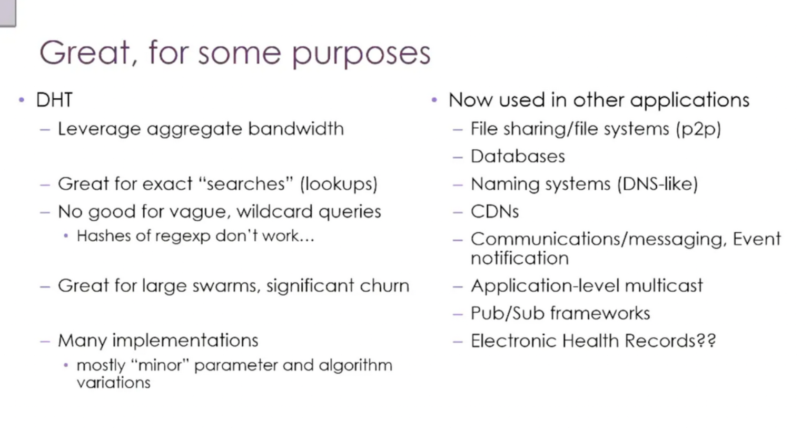
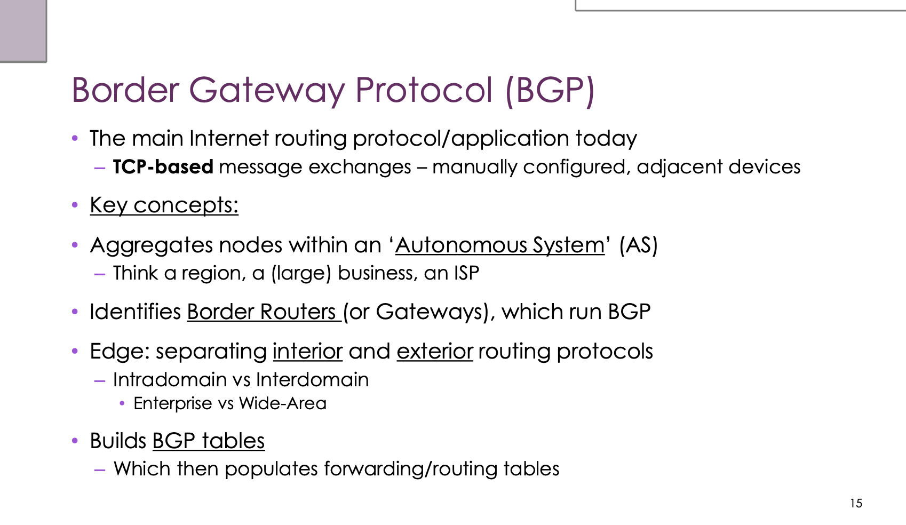
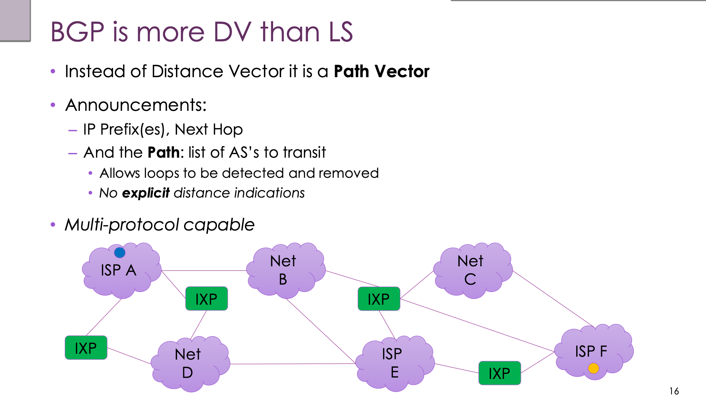
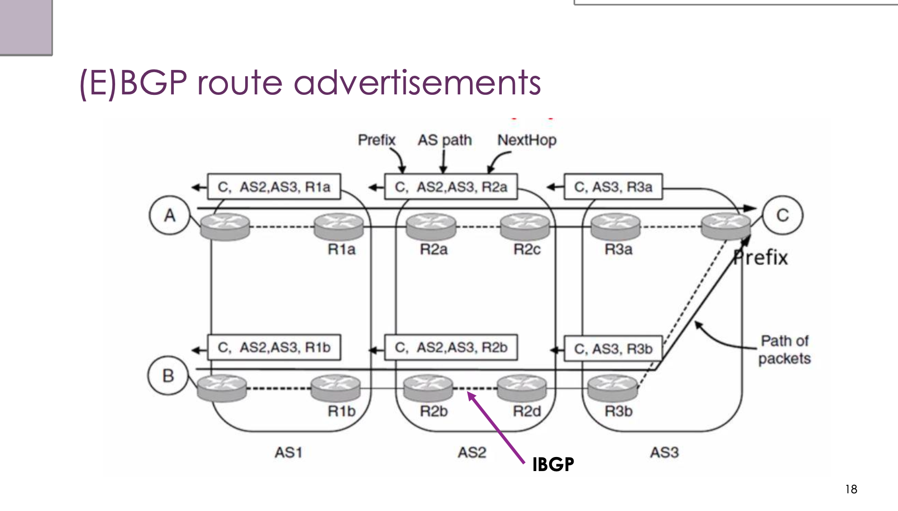
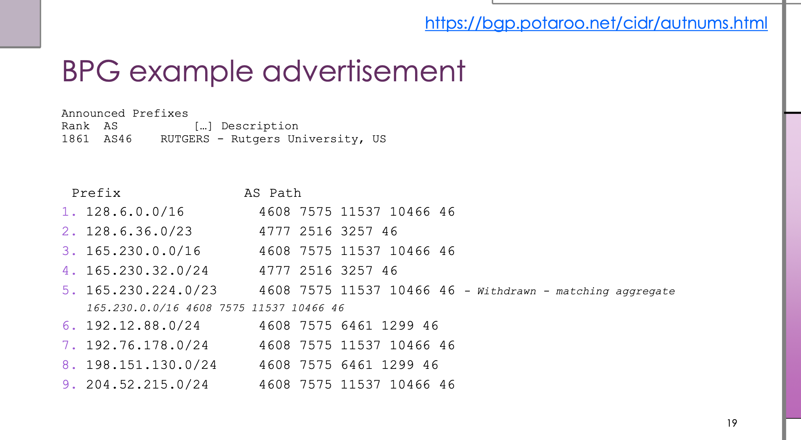

# COMP3310 Week 8：路由（Routing）

## 一、定位

第八周从应用层（DHT 收尾）切回网络层，核心问题是：**IP 包怎么从 A 跨越整个互联网到 B**。

路由是 Internet 上规模最大、运行时间最长、24/7 不停的"应用"——跑在数百万台路由器上。

---

## 二、DHT 收尾（上周尾巴）



### 能力与短板

| 特性 | 说明 |
|------|------|
| 聚合带宽优势 | 没有中心服务器，1000 个节点存储 = 1000 个节点同时服务查询 |
| 精确查找强 | 给定 key，O(log N) 跳定位，这是 DHT 的设计目的 |
| 模糊/通配符查询不行 | `hash("pirates_*")` 和 `hash("pirates_of_caribbean")` 完全无关，落在不同节点 |
| 大规模 + 高流失率场景强 | 复制 + 心跳检测 + 加入/离开协议专为 churn 设计 |

### 核心判断

1. DHT 解决"键值精确查找 + 去中心化 + 抗节点流失"，仅此而已。
2. 它不解决**搜索**问题——带模糊匹配、范围查询、正则的需求必须配合外部索引。
3. BitTorrent 世界里 DHT 只解决"谁有这块"，"这块是什么"还得靠外部索引站。

### DHT 的实际应用范围

- **文件共享**：BitTorrent、IPFS
- **数据库**：Cassandra、DynamoDB、Riak 内部用一致性哈希做数据分片（工业界最常见落地）
- **命名系统**：有人尝试替代 DNS（Namecoin、ENS），"kind of works"，但 DNS 层级化+缓存优势太强
- **CDN**：边缘节点选择算法与 DHT 路由思想相通
- **通信/消息**：Tox、早期 Skype supernode 网络
- **Pub/Sub**：发布订阅系统的 broker 联邦

> DHT 是"路由 + 存储"的分布式**原语**，不是产品。工业界真正大规模部署的不是 BitTorrent，而是 NoSQL 数据库的分片机制（Cassandra/DynamoDB 内部的一致性哈希环，和 Chord 几乎是同一套东西）。

---

## 三、Forwarding vs Routing（必须分清）

| 概念 | 层面 | 描述 |
|------|------|------|
| **Forwarding（转发）** | 数据平面（per-packet） | 路由器的本地决策——包来了，查表，出哪个口 |
| **Routing（路由）** | 控制平面（建表） | 全局问题——所有路由器对网络拓扑达成一致视图，否则出现环路或黑洞 |

### 时间尺度的分层

| 层面 | 时间尺度 | 触发原因 |
|------|---------|---------|
| Forwarding / 拥塞自适应 | 秒 | 突发、congestion |
| Routing | 分钟 | 链路/节点故障 |
| Traffic Engineering | 小时 | 长期负载 |
| Provisioning | 月 | 客户需求增长 |

---

## 四、为什么全球路由难

- IPv4 已用尽，地址空间被切碎出售，地理聚合性丧失——同一个 /16 的 /24 可能在地球两端
- 路由表 **1M+ 条目**，每天 17 万次更新
- 100 Gbps 链路意味着每 **5ns** 处理一个最小 IP 包——要在 5ns 内对 32 位地址做百万行最长前缀匹配，是芯片设计极限
- 运营商级路由器：单个机箱 50 万美元起，单张线卡 25 万美元，4Tbps+ 背板

---

## 五、最优路径

- 度量可以选：latency / bandwidth / cost / hops，每条链路给一个 cost，端到端求和最小化
- cost 可以**不对称**（卫星下行/电话上行是经典例子）

**Optimality Property（最优性原理）**：最短路径的所有子路径也都是最短路径。这是后续算法能 work 的基础。

**Sink tree / Source tree**：以某节点为目的地（或源）的所有最短路径的并集，构成一棵树。cost 对称时二者一致；不对称时会分叉。

---

## 六、两大路由算法家族

### 1. Link-State（LS）—— Dijkstra

**算法三步走：**

1. **Flood**：每个节点把自己的 LSP（链路状态包，含邻居列表 + cost + seq#）广播给整个网络
2. **学拓扑**：每个节点听 LSP，本地拼出完整拓扑图
3. **跑 Dijkstra**：每个节点本地独立计算最短路径树

**关键点：**
- 每个节点都需要完整拓扑
- 收敛快（flood 完就算完）
- 用洪泛 + 序列号防风暴；老化机制处理 seq# 错乱和节点抖动（flapping）
- 代表协议：**OSPF、IS-IS**

### 2. Distance-Vector（DV）—— Distributed Bellman-Ford

**算法：**
- 每个节点存一个向量：到各目的地的距离 + next hop
- 初始：自己 0，其他 ∞
- 周期性把向量发给**邻居**（仅邻居）
- 收到邻居向量后：对每个目的地取 `min(自己, 邻居距离 + 到该邻居的 cost)`
- 重复直到收敛

**Count to Infinity 问题：** 好消息传得快，坏消息传得慢。链路断开后，B 看到 C 还宣告能到 A（其实 C 是经过 B 的），ping-pong 来回加 1 直到 ∞。

**缓解手段：**
- **Split Horizon**：从某邻居学到的路由，不回头宣告给它
- **Poison Reverse**：回头宣告但 cost 设为 ∞
- 把 ∞ 定义为 16（RIP 的做法）

代表协议：**RIP**（1988，至今还在用，简单但脆弱）

### LS vs DV 对比


| 期望 | Distance Vector | Link State |
|------|----------------|-----------|
| Correctness | ✓ Distributed Bellman-Ford | ✓ Replicated Dijkstra |
| Efficiency | 向量小，合理 | LSP 较大，合理 |
| Fairness | 合理（最短路） | 合理（最短路） |
| Convergence | **慢**（多轮交换） | **快**（flood + compute） |
| Scalability | **优**（只需知道邻居） | 一般（数据量大） |

> 结论：LS 用在**域内**（企业、校园），DV 用在**域间**（互联网骨干）。

---

## 七、ECMP（Equal-Cost Multipath）

不是协议，是扩展。允许一组等价路径并存（变成 DAG 而非 tree）：

| 策略 | 优点 | 缺点 |
|------|------|------|
| 按包随机/轮询 | 负载均衡好 | 抖动 + 乱序差 |
| 按源-目的 IP 哈希 | 每个流路径稳定 | 负载可能不均 |
| 按 flow label（IPv6） | 不必读 128 位地址来做流分类 | 仅 IPv6 |

IPv6 引入 32 位 flow label 字段就是为了方便流分类，不必读完整 128 位地址。

---

## 八、分层路由（Hierarchical Routing）

**Aggregation** 是缩表的核心——把整个区域当作一个聚合节点对外宣告，外面的路由器只需要知道"去 region X 走哪个 border router"。

**代价：** 路径不再最优。课件例子：full table 5 跳，分层后变 6 跳。

注意：这里的"跳"单位从"路由器数"变成了"region 数"——不是同一个量纲，不能直接比较。

**权衡：** 路由人选**短表**而不是短路径。

---

## 九、Policy Routing 与 BGP

### Layer 8+ 进场

Internet 是商业系统。当钱、政治、信任、安全、法律进来后，纯技术最优就靠不住了。

每个 ISP 是一个区域——叫 **Autonomous System (AS)**。AS 之间通过 **Internet Exchange Point (IXP)** 互联。

### Hot Potato Routing

ISP 的本地策略：流量越早扔出我的网络越好。结果：
- 路径次优
- 入向出向**不对称**——traceroute 看到的是出向路径，回程可能完全不同
- 层级被有意打破，是商业理性的结果

### 两种主要商业关系

| 关系 | 描述 |
|------|------|
| **Transit（中转）** | 你付钱给我，我把你的流量送到整个互联网。家庭宽带是这个模型。 |
| **Peering（对等）** | 双方互通，通常不付钱。CDN、云服务商、NREN 走这个。Peering 不传递。 |


---

## 十、BGP 深度解析

### Slide 1：BGP 是什么



BGP 是当今互联网的主路由协议，既是协议（定义消息格式）也是应用（运行在路由器上的程序）。从 1989 年第一版起 24/7 运行，是有史以来运行时间最长、规模最大的应用。

**三个关键信息：**

**① TCP-based（基于 TCP，端口 179）**

反直觉——路由协议居然跑在 TCP 之上（OSPF 用 IP 协议号 89，RIP 用 UDP）。原因：BGP 要传完整路由表（几十万到上百万条目），必须保证可靠传输、有序、流控、分段重组。副作用：BGP 邻居关系是"会话"概念，TCP 一断就要重建。

**② Manually configured（手工配置）**

BGP 不会自动发现邻居。每条会话都要在两端显式配置对端 IP 和 AS 号——因为谁跟谁建立邻居是商业合同决定的，不能让设备自己乱认亲戚。这也是 BGP 安全问题的根源：连接是手工建的，但一旦建立，对方宣告什么基本只能选择信或不信。

**③ Adjacent devices（相邻设备）**

BGP 邻居是点对点会话，不一定物理直连（可以 multi-hop eBGP）。

**核心概念：**

- **Autonomous System (AS)**：由单一管理实体控制、对外呈现统一路由策略的网络集合。AS 编号全球唯一，16 位已用完，现在用 32 位，已分配约 50 万个。
- **Border Router / Gateway**：AS 内部只有边界路由器跑 BGP，内部路由器只需把包送到出口边界路由器。
- **BGP table（RIB）→ FIB**：BGP 先建 RIB（所有从邻居学到的路由），经策略过滤后挑出最优路径灌进 FIB（实际转发表）。BGP 知道的 ≠ 实际用于转发的。

### Slide 2：BGP 是 Path Vector，不是 Distance Vector



DV（如 RIP）只告诉你距离，不告诉你路径经过谁，所以会 count-to-infinity。BGP 的改进：宣告里带**完整 AS 路径列表**，不带距离。

**宣告（Announcement）的三个核心字段：**

```
Prefix           AS Path              Next Hop
128.6.0.0/16     4608 7575 ... 46     <某个IP>
```

| 字段 | 说明 |
|------|------|
| IP Prefix | 这一整块地址都可通过这条路径到达 |
| AS Path | 从你这里出发到目的地依次穿越的 AS 列表——灵魂所在 |
| Next Hop | 收到流量后第一步把包送给这个 IP 的路由器 |

**为什么 Path Vector 比 DV 强：**

① **环路检测**：收到宣告时看到 AS Path 里有自己的 AS 号，直接丢弃。Count-to-infinity 在 BGP 里根本不会发生。

② **没有显式距离**：怎么解读、怎么排序由接收方基于自己的商业逻辑决定——这是策略路由的基础。

**Multi-protocol capable**：通过 MP-BGP 扩展，同一套协议可承载 IPv6 前缀、VPN 路由、多播路由、MPLS 标签等。

### Slide 3：eBGP 与 iBGP 的协同



**场景**：三个 AS（AS1、AS2、AS3），目的地 C（Prefix）在 AS3 最右端，源 A/B 在 AS1。

**eBGP（External BGP）—— AS 之间**

宣告链（从右往左传播，每跨一个 AS 加上自己的 AS 号）：

```
R3a 告诉 R2c：Prefix=C, AS Path=[AS3],        NextHop=R3a
R2a 告诉 R1a：Prefix=C, AS Path=[AS2,AS3],    NextHop=R2a
R1a 告诉 A：  Prefix=C, AS Path=[AS2,AS3],    NextHop=R1a
```

两条核心规则：
1. **AS Path Prepend**：每当宣告跨越 AS 边界，新 AS 必须把自己的 AS 号 prepend 到路径头部
2. **Next Hop 改写**：eBGP 向外宣告时，next hop 改成自己

**iBGP（Internal BGP）—— AS 内部**

AS 内部为什么还要跑 BGP？OSPF/IS-IS 只携带 AS 内部拓扑信息，不携带外部 BGP 路由。如果边界路由器 R2a 从 AS3 学到了到 C 的路径，AS2 内部的 R2b、R2d 不知道——iBGP 就是解决这个问题的。

不能把 BGP 路由重分发进 OSPF（几十万条路由会压垮 OSPF），所以 AS 内所有边界路由器之间建立 iBGP 会话互相同步。

**iBGP 关键规则：** 从 iBGP 学到的路由不能再通过 iBGP 转发出去（防环）。后果：iBGP 默认要求**全互联（full mesh）**——N 台路由器需要 N(N-1)/2 条会话。大型 ISP 用 Route Reflector 或 Confederation 来打破这个约束。

**三者分工：**

| 协议 | 作用 |
|------|------|
| eBGP | AS 之间，承载所有外部路由 |
| iBGP | AS 内部 BGP 路由器之间，同步外部路由信息 |
| OSPF/IS-IS | AS 内部拓扑，让 iBGP 的 next hop 能被解析 |

iBGP 携带"到 C 的下一跳是 R3b"，OSPF 告诉"到 R3b 走哪个内部接口"，两者结合才能转发包。

> 控制平面（BGP 宣告从右往左流）和数据平面（数据包从左往右流）方向相反，这是路由协议的普遍特征。

### Slide 4：真实 BGP 宣告例子（Rutgers 大学）



数据来源：[bgp.potaroo.net](https://bgp.potaroo.net/cidr/autnums.html)（Geoff Huston，研究 BGP 全球状态的标准数据源）

```
Rank  AS    Description
1861  AS46  RUTGERS - Rutgers University, US

 #  Prefix              AS Path
 1. 128.6.0.0/16        4608 7575 11537 10466 46
 2. 128.6.36.0/23       4777 2516  3257       46
 3. 165.230.0.0/16      4608 7575 11537 10466 46
 4. 165.230.32.0/24     4777 2516  3257       46
 5. 165.230.224.0/23    4608 7575 11537 10466 46  [Withdrawn - matching aggregate]
 6. 192.12.88.0/24      4608 7575  6461  1299 46
 7. 192.76.178.0/24     4608 7575 11537 10466 46
 8. 198.151.130.0/24    4608 7575  6461  1299 46
 9. 204.52.215.0/24     4608 7575 11537 10466 46
```

**AS Path 怎么读：从右往左**，最右是目的地（AS46 = Rutgers），最左是你（观察点）。

以第 1 行 `4608 7575 11537 10466 46` 为例：

```
[观察点（澳大利亚）] → AS4608(APNIC R&E) → AS7575(AARNet) → AS11537(Internet2) → AS10466 → AS46(Rutgers)
```

全程跑在 NREN 上——从澳大利亚学术网通过 AARNet 出境，跨太平洋到美国 Internet2，再到 Rutgers，没有经过商业互联网骨干。

**几个观察重点：**

① **多个上游**：同一观察点对 Rutgers 的不同前缀看到完全不同的路径（第 1 行走 4608，第 2 行走 4777）——策略路由的典型表现。

② **More-specific 前缀**：128.6.36.0/23（子集）走了与 128.6.0.0/16 不同的 AS Path，原因可能是流量工程（负载分担）或防止 prefix hijacking。最长前缀匹配规则保证 /23 优先于 /16 被命中。

③ **Withdrawn + matching aggregate**（第 5 行）：165.230.224.0/23 被撤回，因为其 AS Path 和包含它的 165.230.0.0/16 完全相同，单独宣告是冗余的——路由表瘦身的具体例子。

④ **路径差异反映业务关系**：第 6、8 行经过 AS6461（Zayo）和 AS1299（Telia）商业 Tier-1 骨干，而不走 NREN——这些 IP 块对应面向公众的服务，需要商业互联网可达性。

---

## 十一、Interior vs Exterior

| 类型 | 协议 | 目标 | 特点 |
|------|------|------|------|
| IGP（域内） | OSPF、IS-IS（LS）| 最短路径 | 信息完整，追求最优 |
| EGP（域间） | BGP（Path Vector）| 策略灵活性 | 扩展性优先，信息不完整 |

二者在 **border router** 上衔接——它一只脚踩在 OSPF 里，一只脚踩在 BGP 里。

> BGP 没有真正的安全机制。RPKI、BGPsec 是后来打的补丁，但 RPKI 部署率到 2024 年才刚过 50%，BGPsec 几乎没人部署。

---

## 十二、路由期望总结


| 期望 | 含义 |
|------|------|
| **Correctness** | 必须把包从 A 送到 B |
| **Efficiency** | 别用太多带宽和 CPU 来跑路由本身 |
| **Fairness** | 有可用链路就别浪费 |
| **Convergence** | 故障后快速恢复 |
| **Scalability** | 应对越来越大的网络 |

---

## 十三、个人评注

1. **DHT 与 BGP 的精神纽带**：DHT 那段（讲座开头收尾的）和本周路由主题看似无关，但 finger table（log N 跳）、replication、bootstrap node 这些套路与 BGP 的"邻居 + 渐进式信息扩散"哲学一脉相承——分布式系统都在解同一类问题。

2. **分层路由的量纲陷阱**：课件里"hops 在 hierarchical table 里含义变了"那个点容易看漏。看似 6 > 5 是变差了，实际是 hop 的单位从"路由器数"变成了"region 数"，不是同一个量纲。

3. **BGP 安全要记牢**：RPKI、BGPsec 是后来打补丁的，部署率仍然很低。**Pakistan Telecom 2008 事件**是经典案例（巴基斯坦想屏蔽 YouTube，宣告了更具体的前缀，结果泄漏到全球，YouTube 全球宕机约 2 小时）；**2018 Amazon Route 53 劫持**通过 BGP 重定向 DNS 流量，偷走约 15 万美元 ETH。

4. **BGP 不只是 DV 的变体**：BGP 是 path vector（DV 的变体），但它的"距离"信息几乎被策略覆盖，本质更像"可达性宣告 + 人类偏好打分"。把 BGP 简单归类为 DV 会漏掉一半的故事。

5. **BGP 选路决策远不止 AS Path 长度**：工业实践中有 13 步决策树，AS Path 长度只是其中一步。**Local Preference** 才是策略路由的主战场——AS 内部通过给不同上游设置 LocalPref 值，统一控制整个 AS 的出向偏好。

**一句话总结 BGP：**

> BGP 是一个基于 TCP、手工配置的 Path Vector 协议，运行在 Autonomous System 的边界路由器之间，通过宣告 `(prefix, AS path, next hop)` 三元组让全球 70 万+ AS 互相找到对方。AS Path 同时提供防环机制和策略决策依据——最终的路径选择不是"最短"，而是"AS 老板想让你走哪条"。
