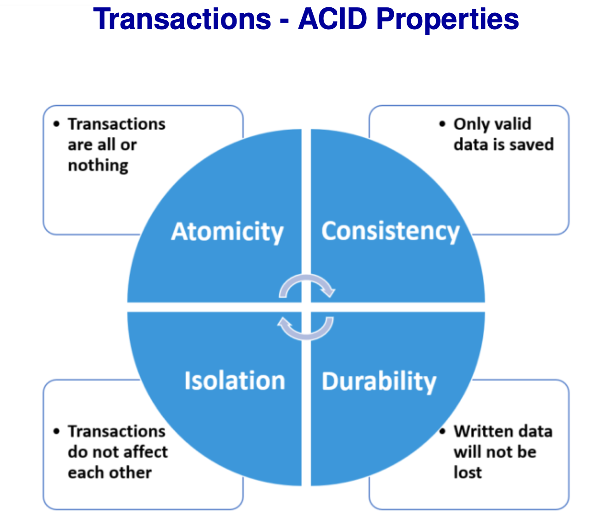
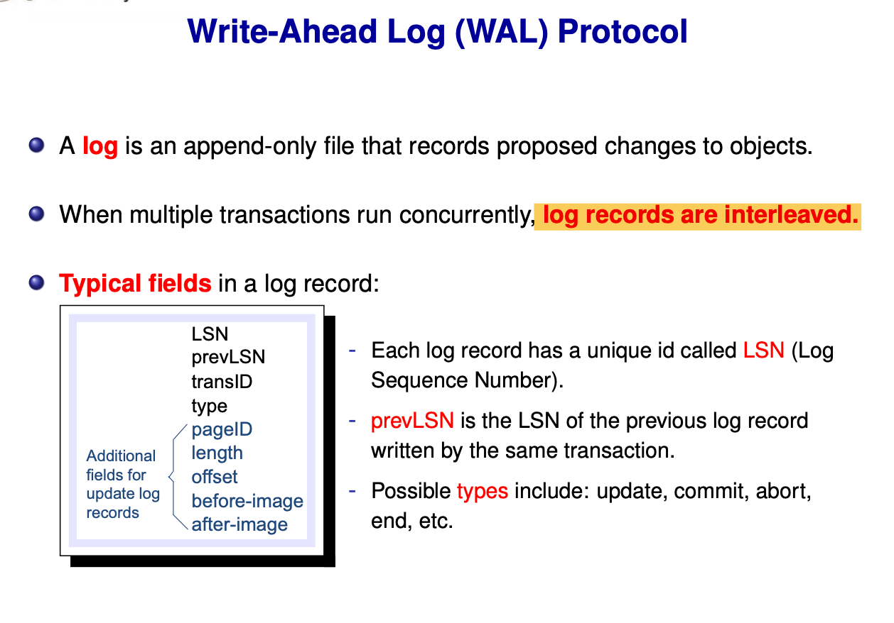

# Transactions and Concurrency Notes

Goal: understand ACID, logging/recovery, locking and anomalies, plus isolation-level tradeoffs.

---

## 1. Transaction
Definition: **a sequence of database operations executed as one logical unit** — all succeed or all roll back.

Typical transfer:
```sql
BEGIN;
UPDATE account SET balance = balance - 500 WHERE name = 'Steve';
UPDATE account SET balance = balance + 500 WHERE name = 'Bob';
COMMIT;
```

---

## 2. ACID (Core Concepts)
- **Atomicity**: all or nothing
- **Consistency**: constraints hold before and after  
  *application ensures business consistency; DBMS ensures A/I/D*
- **Isolation**: concurrent transactions do not interfere
- **Durability**: committed results persist



---

## 3. Logging and Recovery (A + D)
**WAL (Write-Ahead Logging) rules:**
1. **Log before data**
2. **Commit log must be on disk before commit**

During recovery:
- **UNDO** uncommitted transactions
- **REDO** committed updates not yet on disk



---

## 4. Concurrency Control: Locks and 2PL
### Lock types
- **Shared lock** (read)
- **Exclusive lock** (write)

### Two-Phase Locking (2PL)
- **Growing phase**: acquire locks only
- **Shrinking phase**: release locks only

Pros: guarantees serializability  
Cons: can cause deadlocks, reduces concurrency

---

## 5. Serializability
Definition: a concurrent schedule is equivalent to some serial order.

Reasoning:
- If it matches `T1 -> T2` or `T2 -> T1`, it is serializable
- Otherwise, not serializable

---

## 6. Concurrency Anomalies (Exam Focus)
- **Lost Update**: write-write conflict, later write overwrites earlier
- **Dirty Read**: read uncommitted data
- **Unrepeatable Read**: same row, different values on re-read
- **Phantom Read**: same query returns a different set of rows

---

## 7. Isolation Levels (SQL)
Common levels:

| Isolation Level | Dirty Read | Unrepeatable Read | Phantom Read |
| --- | --- | --- | --- |
| READ UNCOMMITTED | ✔ | ✔ | ✔ |
| READ COMMITTED | ✘ | ✔ | ✔ |
| REPEATABLE READ | ✘ | ✘ | ✔ |
| SERIALIZABLE | ✘ | ✘ | ✘ |

Tradeoff: higher isolation is safer but slower.

---

## One-Sentence Summary
Transactions guarantee ACID; logging and recovery ensure A/D; locks and 2PL enforce isolation; isolation levels trade correctness for performance.
