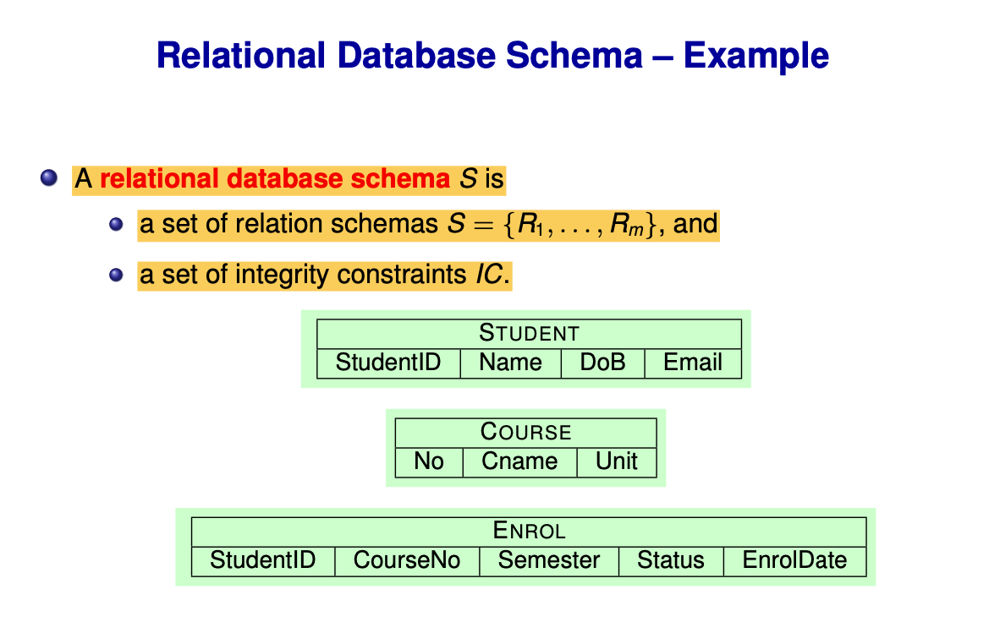

# Week 2：关系数据模型与 SQL DDL

> 目标：用数学方式精确定义“表”，并用 SQL DDL 落地键与完整性约束。

---

## 1. 数学基础：集合、元组、笛卡尔积、关系
- **集合（Set）**：无序、元素不重复，有基数（元素个数）。
- **元组（Tuple）**：有序元素序列，允许重复值。
- **笛卡尔积（Cartesian product）**：两个集合所有可能配对。


- **关系（Relation）**：**笛卡尔积的子集**，本质是“元组的集合”。


要点：
- 关系是集合，因此**不允许重复元组**。
- 元组顺序不重要；属性名决定含义。

---

## 2. 关系 vs 表（术语对照）
- Table → **Relation**
- Column → **Attribute**
- Row → **Tuple**
- Data type → **Domain**
- Table definition → **Relation schema**

补充：
- 数学关系强调“集合语义”，而 SQL 表默认允许重复行（bag 语义），需靠约束控制唯一性。

---

## 3. Schema 与 State
- **Relation schema**：关系的结构定义（属性 + 域）。
- **Relational database schema**：一组关系模式 + 完整性约束。
- **Relational database state**：某一时刻所有关系的实际数据，且**每个模式只对应一个关系**，必须满足约束。



---

## 4. 键（Keys）
- **Superkey**：能唯一标识元组的属性集合。
- **Candidate key**：最小 superkey。
- **Primary key**：从 candidate keys 中选一个。
- 一个关系可有多个 candidate key，但**只能有一个 primary key**。
- 复合键常见，如 `{StudentID, CourseNo, Semester}`。

---

## 5. 完整性约束（Integrity Constraints）
1. **Domain constraints**：值必须来自属性域（类型、NOT NULL、CHECK 等）。
2. **Key constraints**：唯一性（UNIQUE / PRIMARY KEY）。
3. **Entity integrity**：主键**不能为 NULL**。
4. **Referential integrity（外键）**：子表值必须存在于父表；复合外键要**整体匹配**。

---

## 6. SQL DDL（定义结构）
常用命令：**CREATE / ALTER / DROP TABLE**。

示例（结构定义 + 约束）：

```sql
CREATE TABLE Student (
  StudentID CHAR(8) PRIMARY KEY,
  Name TEXT NOT NULL,
  DoB DATE,
  Email TEXT UNIQUE
);

CREATE TABLE Course (
  No TEXT PRIMARY KEY,
  Cname TEXT NOT NULL,
  Unit INTEGER CHECK (Unit > 0)
);

CREATE TABLE Enrol (
  StudentID CHAR(8),
  CourseNo TEXT,
  Semester TEXT,
  Status TEXT CHECK (Status IN ('enrolled', 'withdrawn')),
  EnrolDate DATE,
  PRIMARY KEY (StudentID, CourseNo, Semester),
  FOREIGN KEY (StudentID) REFERENCES Student(StudentID),
  FOREIGN KEY (CourseNo) REFERENCES Course(No)
);
```

注意：
- 含外键的表需在被引用表之后创建。
- PostgreSQL 默认不区分大小写（除非用双引号）。

---

## 7. 索引（了解即可）
- **CREATE INDEX** 用于性能优化（如 B-tree、Hash）。
- 本周重点在模型与约束，不是性能调优。

---

## 一句话总结
Week 2 建立了关系数据库的形式化基础：用集合与关系定义“表”，用键与完整性约束保证正确性，并用 SQL DDL 将规则落地。
