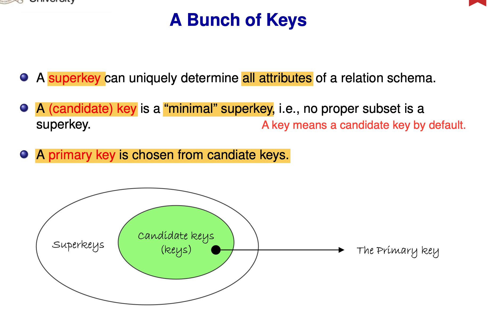

# Functional Dependencies (FD) Notes

Focus: why redundancy/anomalies happen, what FD means, how to find keys, and how FD guides decomposition.

---

## 1. Why Study FD
A seemingly fine big table (e.g., ENROLMENT) often shows:
- **Redundancy**: repeated student info
- **Inconsistency**: same StudentID with different DoB
- **Update anomalies**: update/insert/delete causes unintended effects

FDs explain **why these issues are inevitable** and provide a formal basis for splitting tables.

---

## 2. What Is an FD (Core Definition)
**X → Y** means: if two rows agree on X, they must agree on Y.  
X is the **determinant**, Y is the **dependent**.

How to check if an FD holds:
- Look for two rows with the **same X but different Y**.
- If such rows exist, the FD is violated; otherwise it holds (for that relation).

---

## 3. Where FDs Come From
1. **Business/semantic rules (most reliable)**  
   Example: `StudentID → Name, DoB`
2. **Sample data (only a hint)**  
   Holding in data ≠ holding in reality.

---

## 4. FDs and Keys
- **X⁺ (closure) includes all attributes** ⇒ X is a superkey  
- **Minimal superkey** ⇒ candidate key



---

## 5. Armstrong’s Axioms (FD Inference)
Basic rules:
- **Reflexivity**: if Y ⊆ X, then X → Y  
- **Augmentation**: if X → Y, then XZ → YZ  
- **Transitivity**: if X → Y and Y → Z, then X → Z


Common derived rules:
- **Union**: X → Y and X → Z ⇒ X → YZ
- **Decomposition**: X → YZ ⇒ X → Y and X → Z
- **Pseudotransitivity**: X → Y and WY → Z ⇒ WX → Z


---

## 6. Why FDs Cause Redundancy and Anomalies
If a **non-key attribute depends on a non-key**:
-> redundancy is unavoidable  
-> anomalies are unavoidable  
This is the root cause that **normalization** aims to fix.

---

## 7. Using FDs to Decompose (Intuition)
Original table:
```
ENROLMENT(StudentID, Name, DoB, CourseNo, Unit, Semester)
```
Common FDs:
- `StudentID → Name, DoB`
- `CourseNo → Unit`

Decompose into:
- `STUDENT(StudentID, Name, DoB)`
- `COURSE(CourseNo, Unit)`
- `ENROL(StudentID, CourseNo, Semester)`

Decomposition should be based on **FD constraints**, not on intuition alone.

---

## One-Sentence Summary
Functional dependencies formalize which attributes determine others, help identify keys, explain redundancy and anomalies, and guide normalization.
