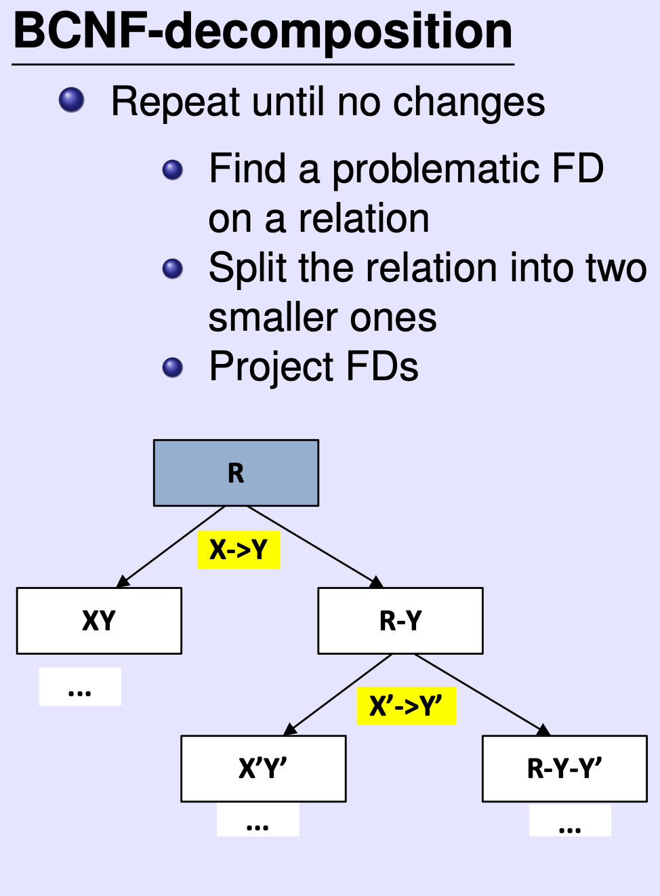
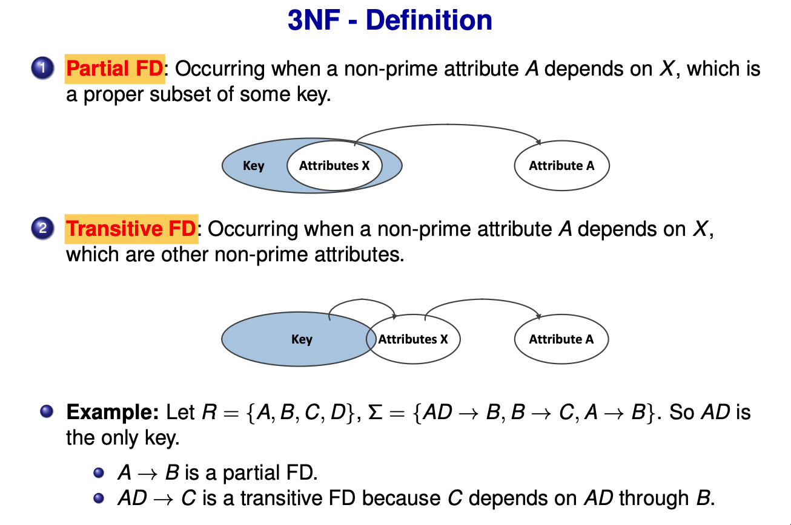
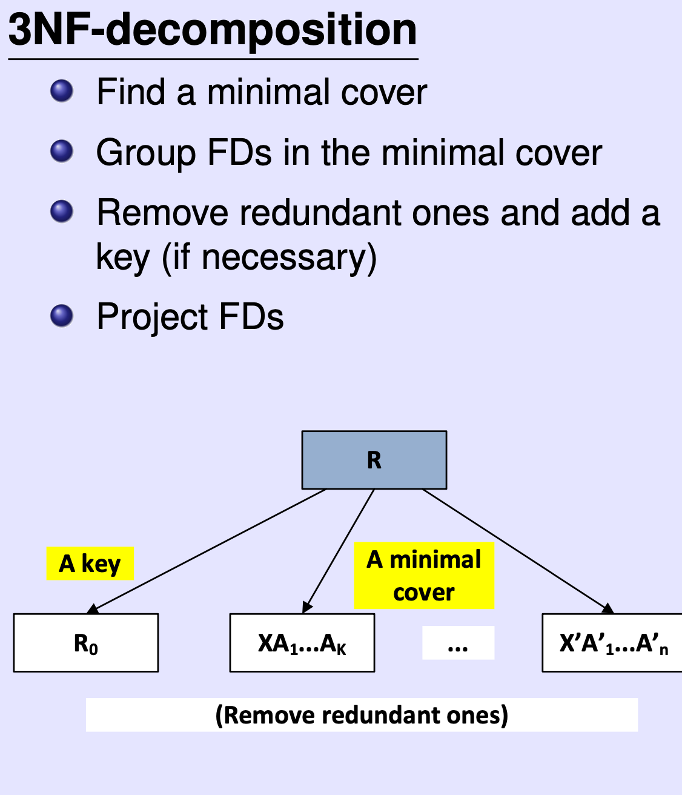

# Normal Forms（规范化）整理

本节聚焦：**1NF/3NF/BCNF 的定义与直觉、分解时的两大性质、以及常用算法**。

---

## 1. 规范化整体框架
规范化回答三个问题：
- **好设计是什么**（Normal Forms）
- **如何拆表**（Normalisation Algorithms）
- **为什么这样拆**（Functional Dependencies）

要点：
- **BCNF ⊂ 3NF ⊂ 2NF ⊂ 1NF**
- 1NF 不基于 FD，2NF/3NF/BCNF 依赖 FD
- 实务最常用：3NF 或 BCNF

---

## 2. 1NF（原子性）
定义：**属性必须是原子值**，不能是集合/数组/多值。

常见错误做法：
- 拆成 `Course1, Course2`（大量 NULL）
- 多行重复记录（产生冗余）

结论：**1NF 只是最低要求，不代表好设计**。

---

## 3. 分解的两大性质（生死线）
1. **Lossless Join（无损连接）**  
   拆完 JOIN 回来，**既不多也不少**。
2. **Dependency Preservation（依赖保持）**  
   原有 FD 仍能在子表内检查。

判定直觉：
- **Lossless**：公共属性是某个子表的 superkey
- **Dependency Preservation**：分解后 FD 的闭包能推出原 FD

---

## 4. BCNF（更“干净”）
定义：对任意非平凡 FD **X → A**，**X 必须是 superkey**。

直觉：
- 消除所有基于 FD 的冗余
- 但可能**破坏依赖保持**

BCNF 分解算法要点：
1. 找违反 BCNF 的 FD
2. 沿该 FD 拆表
3. 重复直到满足 BCNF

---

## 5. 3NF（工程上最常用）
定义：若 FD **X → A** 成立，则：
- X 是 superkey，**或**
- A 是 **prime attribute**（属于某个 candidate key）

3NF 解决的问题：
- 消除 **partial FD**
- 消除 **transitive FD**

---

### 5.1 Minimal Cover（3NF 的关键工具）
四步法：
1. RHS 单属性
2. LHS 去冗余
3. 删除冗余 FD
4. 合并同 LHS

---

### 5.2 3NF 分解算法（简版）
1. 计算 FD 的 minimal cover
2. 按 LHS 分组建表
3. 删除被包含的表
4. 若无表包含任一 candidate key，则补一个 key 表

---

## 6. BCNF vs 3NF
| 对比点 | BCNF | 3NF |
| --- | --- | --- |
| 冗余 | 更少 | 可能有 |
| 依赖保持 | 可能丢失 | 保留 |
| 使用场景 | 理论最干净 | 工程最常用 |

---

## 一句话总结
规范化通过 FD 把“冗余与异常”形式化，并在 **无损连接** 与 **依赖保持** 的约束下，将关系分解到 3NF/BCNF。
